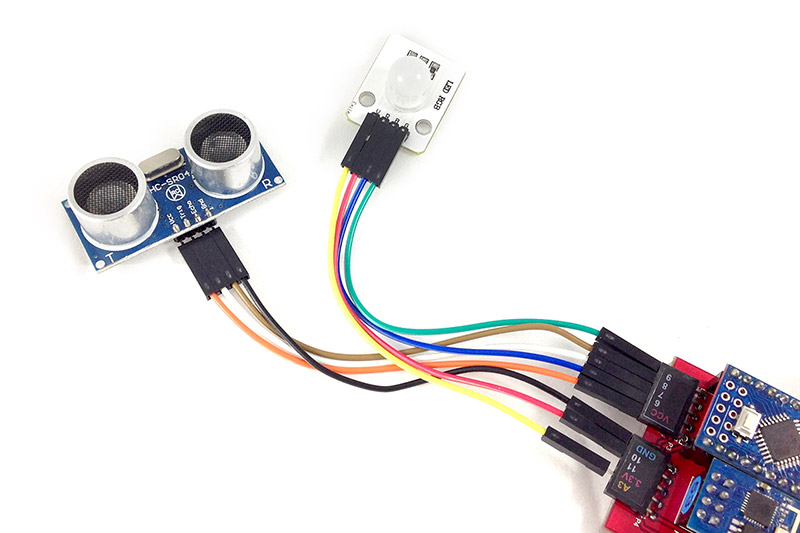
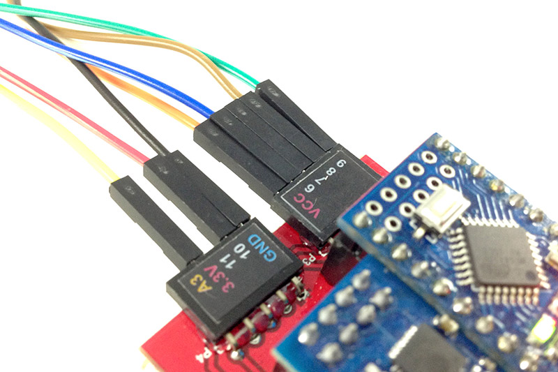

<!-- @@master  = ../../_layout.html-->

<!-- @@block  =  meta-->

<title>範例教學 8：超音波傳感器控制三色 LED 燈 :::: Webduino = Web × Arduino</title>

<meta name="description" content="當我們由上一個範例學會了用超音波傳感器控制 LED 燈之後，這個範例應該就輕鬆不少，這個 webduino 範例最主要是希望能藉由三色 LED 燈顏色上的變化，對應距離的改變，如此一來我們就可以藉由燈號來判斷距離。">
<meta itemprop="description" content="當我們由上一個範例學會了用超音波傳感器控制 LED 燈之後，這個範例應該就輕鬆不少，這個 webduino 範例最主要是希望能藉由三色 LED 燈顏色上的變化，對應距離的改變，如此一來我們就可以藉由燈號來判斷距離。">
<meta property="og:description" content="當我們由上一個範例學會了用超音波傳感器控制 LED 燈之後，這個範例應該就輕鬆不少，這個 webduino 範例最主要是希望能藉由三色 LED 燈顏色上的變化，對應距離的改變，如此一來我們就可以藉由燈號來判斷距離。">

<meta property="og:title" content="範例教學 8：超音波傳感器控制三色 LED 燈" >
<meta property="og:url" content="http://webduino.io/tutorials/tutorial-08-ultrasonic-rgbled.html">

<meta property="og:image" content="http://webduino.io/img/tutorials/tutorial-08-01s.jpg">
<meta itemprop="image" content="http://webduino.io/img/tutorials/tutorial-08-01s.jpg">

<!-- @@close-->

<!-- @@block  =  tutorials-->
#範例教學 8：超音波傳感器控制三色 LED 燈

當我們由上一個範例學會了用超音波傳感器控制 LED 燈之後，這個範例應該就輕鬆不少，這個範例最主要是希望能藉由三色 LED 燈顏色上的變化，對應距離的改變，如此一來我們就可以藉由燈號來判斷距離。

##範例影片展示

<iframe class="youtube" src="https://www.youtube.com/embed/vV5e17Xc8CM" frameborder="0" allowfullscreen></iframe>

##接線與實作

- ###1. 接上超音波傳感器與三色 LED 燈

	雖然超音波傳感器與三色 LED 可以分別用 webduino 的兩個排插來接，但因為體積的關係，所以我們必須要用到麵包板和電線，用電線引出腳位，把超音波傳感器的 VCC 接在 3.3v，Trig 接在 11，Echo 接在 10，GND 就接在 GND 的腳位，三色 LED 的 VCC 接在 VCC 的腳位，紅色 R 接 6，藍色 B 接 7，綠色 G 接 8。

	

- ###2. 完成後的實際長相

	因為超音波傳感器和三色 LED 在實際的接線會朝外，所以實際的照片電線會有反轉的情形，不要接錯了。

	

	

	

##範例解析 ([快速體驗](http://webduinoio.github.io/samples/content/ultrasonic-rgbled/index.html)、[jsbin 範例](http://jsbin.com/latexi/4/edit?html,css,js,output)、[檢查連線狀態](http://webduino.io/device.html))

一開始要先引入相關的 js 與 WebComponents，因為這個範例會用到超音波傳感器和三色 LED 這兩個傳感器，所以必須要引入這兩個元件的 WebComponent：`wa-ultrasonic`、`wa-rgbled`。

	
	<link rel='import' href='//webduino.io/components/webduino/web-arduino.html' />
	<link rel='import' href='//webduino.io/components/webduino/wa-ultrasonic.html' />
	<link rel='import' href='//webduino.io/components/webduino/wa-rgbled.html' />

HTML 裡頭放上一個文字說明現在幾公分，同時用一個 div 來顯示顏色，凸顯三色 LED 燈與網頁是顯示同樣的顏色。

	

	

	<web-arduino id='board' device="你的 device 名稱">
	  <wa-ultrasonic id='ultrasonic' trig='11' echo='10'></wa-ultrasonic>
	  <wa-rgbled id='rgb' red='6' blue='7' green='8'></wa-rgbled>
	</web-arduino>

稍微調整一下 CSS。

	#color {
	  width: 100%;
	  max-width: 250px;
	  height:100px;
	  border:1px solid #000;
	  background:#000;
	  margin-top: 15px;
	  margin-left: 5px;
	  }
	#show {
	  font-size: 30px;
	  }
	#show::before {
	  content: '距離: ';
	  }
	#show::after {
	  content: ' cm';
	  }

和上一個範例「利用超音波傳感器控制 LED」燈一樣，在 javascript 裡頭加入判斷式，當距離在某個區間的時候，利用三色 LED 的 `setColor` api 來調整出特定的顏色，這個範例只秀出三種顏色，你也可以利用 `setColor`，做出各種不同距離對應的各種不同顏色喔！

	window.addEventListener('WebComponentsReady', function () {
	  var board = document.getElementById('board');

	  board.on('ready',function() {
	    var ultrasonic = document.getElementById('ultrasonic'),
	      show = document.getElementById('show'),
	      color = document.getElementById('color'),
	      rgb = document.getElementById('rgb');

	    ultrasonic.ping(function (cm) {
	      show.innerHTML = cm;
	      if (cm < 10) {
	        rgb.setColor(255, 0, 0); // red , green , blue
	        color.style.backgroundColor = 'rgba(255, 0, 0, 255)';
	      } else if (cm > 10 && cm < 20) {
	        rgb.setColor(0, 255, 0); // red , green , blue
	        color.style.backgroundColor = 'rgba(0, 255, 0, 255)';
	      } else {
	        rgb.setColor(0, 0, 255); // red , green , blue
	        color.style.backgroundColor = 'rgba(0, 0, 255, 255)';
	      }
	    }, 1000);
	  });

	}, false);

如果還有不清楚的，不妨利用這個 [快速體驗範例](http://webduinoio.github.io/samples/content/ultrasonic-rgbled/index.html)，填入自己 Webduino 開發板的 device 名稱，按下設定，訊息處出現 ready 的話，就可以開始利用超音波傳感器感測不同的距離，亮起不同顏色的光，亦或是也可以參考這個 [jsbin 範例](http://jsbin.com/latexi/4/edit?html,css,js,output)，實際在上面填入 device 名稱並且修改體驗相關效果。

<!-- @@close-->