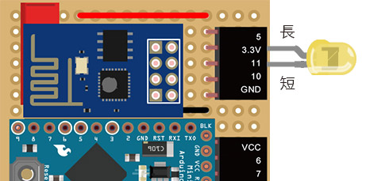
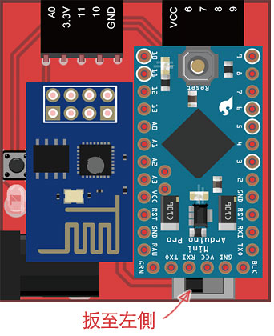
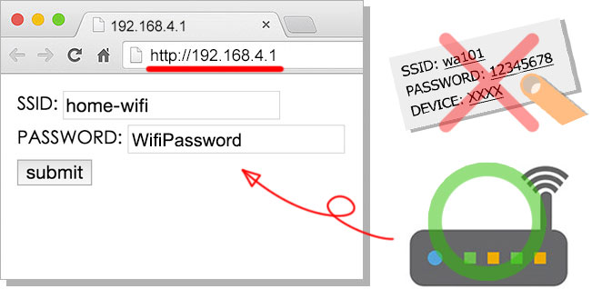
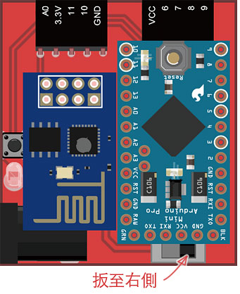
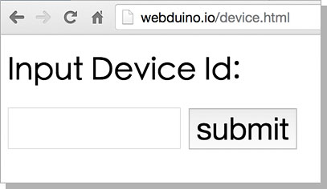
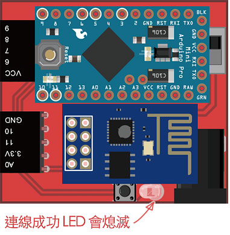
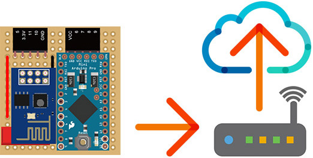

<!-- @@master  = ../../_layout.html-->

<!-- @@block  =  meta-->

<title>Webduino 初始化設定 :::: Webduino = Web × Arduino</title>

<meta name="description" content="實作 Webduino 之前，最重要的就是進行初始化設定，初始化設定的目的在於讓 Webduino 開發板可以自動上網，就如同我們買了一支手機回家，要設定手機的 wifi，才能夠讓手機連結家裡的 Wifi 上網，Webduino 開發板也是如此。">

<meta itemprop="description" content="實作 Webduino 之前，最重要的就是進行初始化設定，初始化設定的目的在於讓 Webduino 開發板可以自動上網，就如同我們買了一支手機回家，要設定手機的 wifi，才能夠讓手機連結家裡的 Wifi 上網，Webduino 開發板也是如此。">

<meta property="og:description" content="實作 Webduino 之前，最重要的就是進行初始化設定，初始化設定的目的在於讓 Webduino 開發板可以自動上網，就如同我們買了一支手機回家，要設定手機的 wifi，才能夠讓手機連結家裡的 Wifi 上網，Webduino 開發板也是如此。">

<meta property="og:title" content="Webduino 初始化設定" >

<meta property="og:url" content="http://webduino.io/tutorials/info-02-setup.html">

<meta property="og:image" content="http://webduino.io/img/tutorials/info-02-01s.jpg">

<meta itemprop="image" content="http://webduino.io/img/tutorials/info-02-01s.jpg">

<!-- @@close-->

<!-- @@block  =  tutorials-->
#Webduino 初始化設定

實作 Webduino 之前，最重要的就是進行初始化設定，初始化設定的目的在於讓 Webduino 開發板可以自動上網，就如同我們買了一支手機回家，要設定手機的 wifi，才能夠讓手機連結家裡的 Wifi 上網，Webduino 開發板也是如此。

 

以下的步驟將會介紹如何進行設定，閱讀過程請注意**橘黃色**的文字，這些文字描述了大家在設定的時候，比較容易犯的錯誤。

 
 

- ###1. 組合 Webduino 開發板

	將「Arduino Pro Mini 晶片」與「ESP8266 Wifi 晶片」組合至底板，就成為「Webduino 開發板」。

	

- ###2. 開始進行初始化

	如果是使用封測版的 Webduino 開發板 ( 底板為淺褐色，並有孔洞 )，必須先把單色 LED 燈的「長腳接在 3.3V」，「短腳接在 11」，完成後接上電源，**當 LED 亮起，表示可以開始進行初始化**，若 LED 遲遲沒有亮起，移除電源與 LED，重新進行此步驟，若使用電阻代替 LED，則可直接進行步驟 3。

	

	如果是使用 Webduino 開發板馬克一號 ( 底板為紅色 PCB 板 )，上面會有一顆可以左右扳動的小案鈕，將按鈕扳動至下圖的位置 ( 左側 )，就可以開始進行初始化設定。

	

- ###3. 使用 wifi 搜尋 Webduino 開發板

	使用電腦或行動裝置，打開 wifi 搜尋對應的 Webduino 開發板 SSID 名稱，點選之後輸入密碼，即可讓電腦或行動裝置與 Webduino 開發板連線，**開發板的 SSID 與密碼會寫在「裝置說明卡」裡頭，通常為「wa」開頭**。( 範例名稱為 wa101 )

	

- ###4. 連線 Webduino 開發板進行設定

	打開 Chrome 或 Safari 瀏覽器，於網址列輸入「<b>http://192.168.4.1</b>」，即可打開 Webduino 開發板的設定頁面，在設定頁面輸入家裡、公司場所或行動裝置分享的網路基地台 SSID 與 PASSWORD。( 此處的 SSID 為「網路基地台」的 SSID，並非 Webduino 開發板，**不要填成裝置說明卡上頭的 SSID 與 PASSWORD**，且 SSID 與 PASSWORD 有限制 14 個字元，只能大小寫的英文字母與數字的組合，要特別注意！ )

	

- ###5. 重啟 Webduino 開發板

	輸入完 SSID 與 PASSWORD 之後，點選送出，若出現「OK」的字樣，表示 Webduino 開發板已經初始化成功，並且可以和家裡、公司場所或行動裝置分享的網路基地台連線 ( 若遲遲沒有出現「OK」字樣，表示初始化設定不成功，返回步驟 3 重新開始 )，此時如果是使用封測版的 Webduino 開發板，**移除 Webduino 開發板的電源以及 LED**，重新再接上電源即可進行重啟。

	

	如果是使用 Webduino 開發板馬克一號，則先移除開發板電源，再將按鈕扳至右側，重新接上電源即可進行重啟。

	

- ###6. 確認連線是否成功

	Webduino 開發板重啟後，便可將電腦或行動裝置切回正常的網路連線，並連結 [http://webduino.io/device.html](http://webduino.io/device.html) 確認是否連線成功，**連線成功後即可開始玩轉 Webduino**。( 若在網頁上沒有對應 Webduino 開發板，則需重啟 Webduino 開發板或返回步驟 3 重新初始化設定 )

	

	如果是使用 Webduino 開發板馬克一號還有一個更簡單的判斷方式，在板子上有一個紅色的小 LED 燈，正在連線的時候紅色 LED 會發亮，**連線成功後就會熄滅**，若 LED 燈持續閃爍，表示沒有連線成功，這時請重啟 Webduino 開發板，或返回步驟 3 重新初始化設定。

	

- ###7. Webduino 開發板已經可以連線網路基地台

	進行到此步驟，表示 Webduino 開發板已經可以自行連上家裡、公司場所或行動裝置分享的網路基地台，並自動連結上雲端的伺服器，我們就可以開始透過 wifi 去控制 Webduino 開發板囉！ (  立刻用第 [第一個範例](tutorial-01-led.html) 體驗看看吧 )

	

<!-- @@close-->