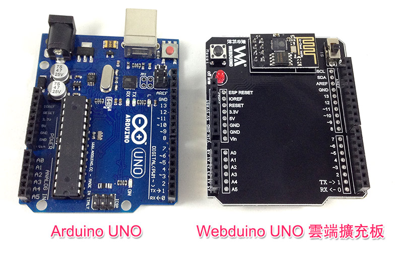
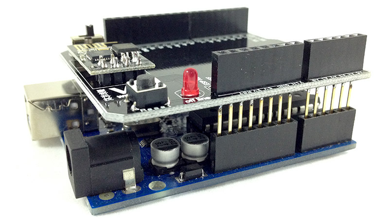
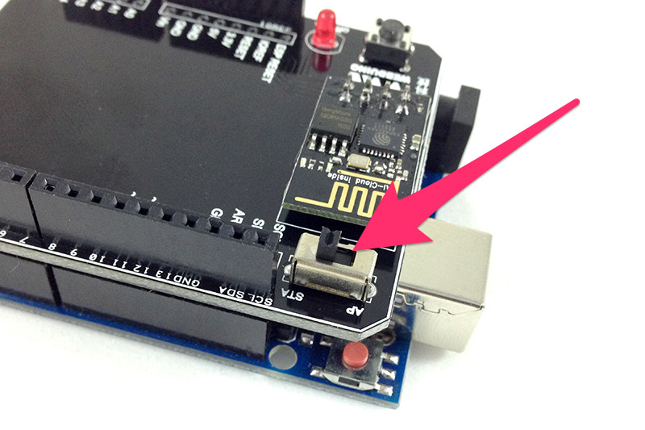
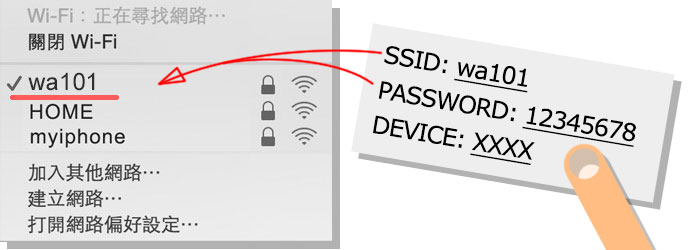
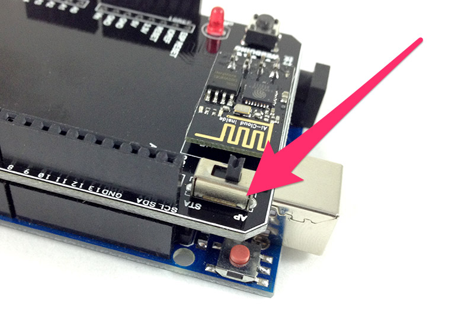
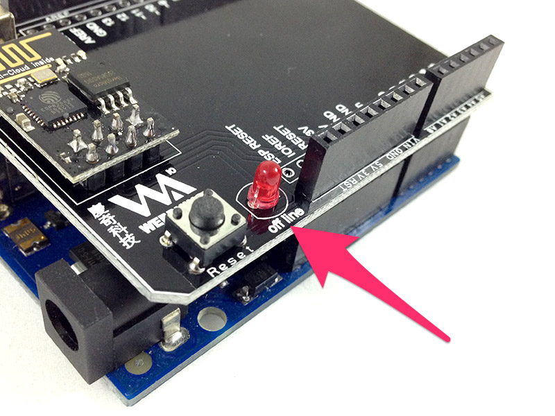
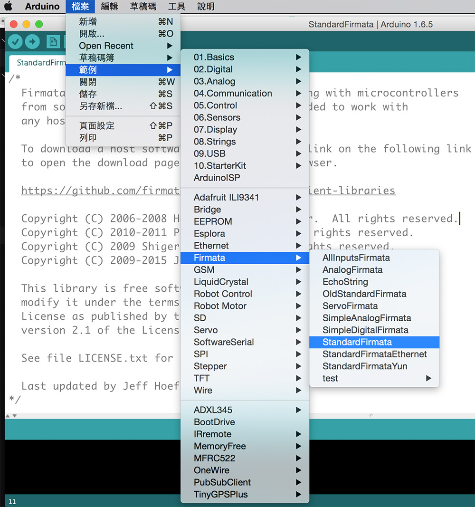
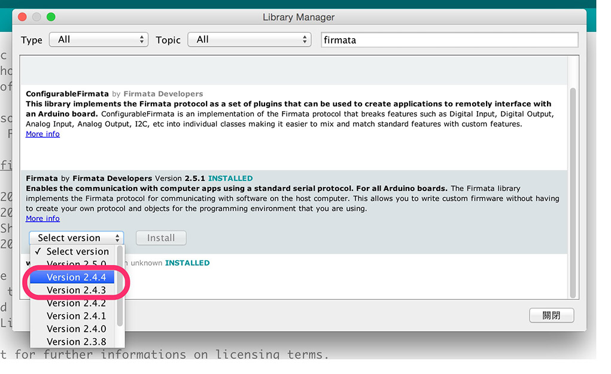

<!-- @@master  = ../../_layout.html-->

<!-- @@block  =  meta-->

<title>Webduino Fly 初始化設定 :::: Webduino = Web × Arduino</title>

<meta name="description" content="使用 Webduino Fly ( NUO 雲端擴充板 )，可以讓你手邊的 Arduino UNO 變成 Webduino，具備完整的 Webduino 功能，然而使用 UNO 雲端擴充板之前，最重要的就是進行初始化設定，初始化設定的目的在於讓Webduino UNO 雲端擴充板可以自動上網，就如同我們買了一支手機回家，要設定手機的 wifi，才能夠讓手機連結家裡的 Wifi 上網，Webduino 開發板也是如此。">

<meta itemprop="description" content="使用 Webduino Fly ( NUO 雲端擴充板 )，可以讓你手邊的 Arduino UNO 變成 Webduino，具備完整的 Webduino 功能，然而使用 UNO 雲端擴充板之前，最重要的就是進行初始化設定，初始化設定的目的在於讓Webduino UNO 雲端擴充板可以自動上網，就如同我們買了一支手機回家，要設定手機的 wifi，才能夠讓手機連結家裡的 Wifi 上網，Webduino 開發板也是如此。">

<meta property="og:description" content="使用 Webduino Fly ( NUO 雲端擴充板 )，可以讓你手邊的 Arduino UNO 變成 Webduino，具備完整的 Webduino 功能，然而使用 UNO 雲端擴充板之前，最重要的就是進行初始化設定，初始化設定的目的在於讓Webduino UNO 雲端擴充板可以自動上網，就如同我們買了一支手機回家，要設定手機的 wifi，才能夠讓手機連結家裡的 Wifi 上網，Webduino 開發板也是如此。">

<meta property="og:title" content="Webduino Fly 初始化設定" >

<meta property="og:url" content="https://webduino.io/tutorials/info-04-uno-setup.html">

<meta property="og:image" content="https://webduino.io/img/tutorials/info-04-01s.jpg">

<meta itemprop="image" content="https://webduino.io/img/tutorials/info-04-01s.jpg">

<include src="../_include-tutorials.html"></include>

<!-- @@close-->

<!-- @@block  =  tutorials-->
# Webduino Fly 初始化設定

使用 Webduino Fly ( UNO 雲端擴充板 )，可以讓你手邊的 Arduino UNO 變成 Webduino，具備完整的 Webduino 功能，然而使用 UNO 雲端擴充板之前，最重要的就是進行初始化設定，初始化設定的目的在於讓Webduino UNO 雲端擴充板可以自動上網，就如同我們買了一支手機回家，要設定手機的 wifi，才能夠讓手機連結家裡的 Wifi 上網，Webduino 開發板也是如此。

## 初始化步驟說明

- ### 1. 組合 Webduino 開發板

	將「Webduino Fly」與「Arduino UNO」組合，就成為「Webduino UNO 開發板」。

	

	

- ### 2. 開始進行初始化

	在 Webduino Fly 上面會有一顆可以左右扳動的小開關，將開關扳動至 STA 模式，就可以開始進行初始化設定。

	

- ### 3. 使用 wifi 搜尋 Webduino 開發板

	使用電腦或行動裝置，打開 Wi-Fi 搜尋對應的 Webduino 開發板 SSID 名稱，點選之後輸入密碼，即可讓電腦或行動裝置與 Webduino 開發板連線，**開發板的 SSID 與密碼會寫在「裝置說明卡」裡頭，通常為「wa」開頭**。( 範例名稱為 wa101 )

	

- ### 4. 連線 Webduino 開發板進行設定

	打開 Chrome 或 Safari 瀏覽器，於網址列輸入「<b>http://192.168.4.1</b>」，即可打開 Webduino 開發板的設定頁面，在設定頁面輸入家裡、公司場所或行動裝置分享的網路基地台 SSID 與 PASSWORD。( 此處的 SSID 為「網路基地台」的 SSID，並非 Webduino 開發板，**不要填成裝置說明卡上頭的 SSID 與 PASSWORD**，且 SSID 與 PASSWORD 有限制 14 個字元，只能大小寫的英文字母與數字的組合，要特別注意！ )

	

- ### 5. 重啟 Webduino UNO 開發板

	輸入完 SSID 與 PASSWORD 之後，點選送出，若出現「OK」的字樣，表示 Webduino 開發板已經初始化成功，並且可以和家裡、公司場所或行動裝置分享的網路基地台連線 ( 若遲遲沒有出現「OK」字樣，表示初始化設定不成功，返回步驟 2 重新開始 )

	

	當出現 OK 之後，就可以**移除 Webduino UNO 開發板的電源，再將開關扳至 AP 模式**，重新接上電源進行重啟。

	

- ### 6. 確認連線是否成功

	Webduino 開發板重啟後，便可將電腦或行動裝置切回正常的網路連線，並連結 [https://webduino.io/device.html](https://webduino.io/device.html) ，輸入對應的 device 名稱確認是否連線成功，如果連線成功則會出現 OK 的顯示，**連線成功後即可開始玩轉 Webduino**。( 若在網頁上沒有對應 Webduino 開發板，則需重啟 Webduino 開發板或返回步驟 2 重新初始化設定 )

	

	此外還有一個更簡單的判斷方式，在板子上有一個紅色的小 LED 燈，正在連線的時候紅色 LED 會發亮，**連線成功後就會熄滅**，若 LED 燈持續閃爍，表示沒有連線成功，這時請重啟開發板，或返回步驟 2 重新初始化設定。

	

- ### 7. Webduino 開發板已經可以連線網路基地台

	進行到此步驟，表示 Webduino 開發板已經可以自行連上家裡、公司場所或行動裝置分享的網路基地台，並自動連結上雲端的伺服器，我們就可以開始透過 Wi-Fi 去控制 Webduino 開發板囉！ ( 立刻用第 [第一個範例](tutorial-01-led.html) 體驗看看吧 )

- ### 8. 注意事項

	由於 Webduino 要走 Arduino Firmata 的通訊協定，Arduino 本身**要燒錄具有 Firmata 通訊協定的韌體**，建議可使用 Arduino 官方提供的範例燒錄，便可做基本的應用。( Arduino IDE > 範例 > Firmata > StandardFirmata ) 

	

## Arduino IDE 1.6.7 編譯錯誤

最近發現某些使用者在使用 Arduino IDE 1.6.7 的版本會編譯錯誤，是因為升級後的 Arduino 並沒有提供向下相容，導致 Firmata 2.4.4 和 2.5.1 不相容而產生錯誤，解決的方法除了安裝回 1.6.6 或 1.6.5 的版本之外 ( 載點：[https://www.arduino.cc/en/Main/OldSoftwareReleases#previous](https://www.arduino.cc/en/Main/OldSoftwareReleases#previous) )，還可以使用以下的解決方式，**把 Firmata 的版本轉回 2.4.4 或 2.4.3**。

第一步，打開 Library Manager ( 草稿碼 -> include Library -> Library Manager )

第二步，搜尋 firmata，看看你的版本是不是跑到 2.5.1 了。

第三步，選擇** 2.4.4 或 2.4.3 **的 firmata 版本，按下 install，把 Firmata 裝回 2.4.4 的版本，如此一來，應該又可以順利的進行燒錄的動作了！

<!-- @@close-->