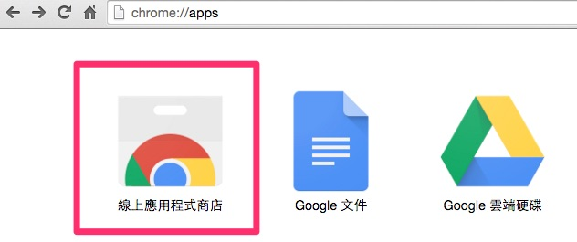
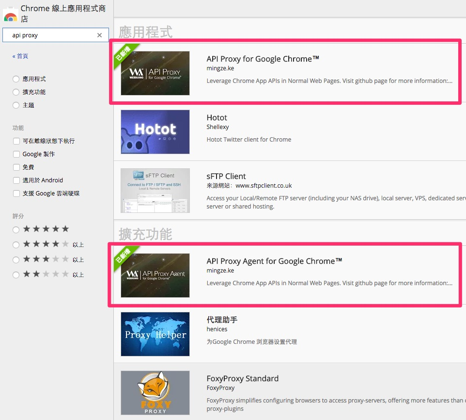
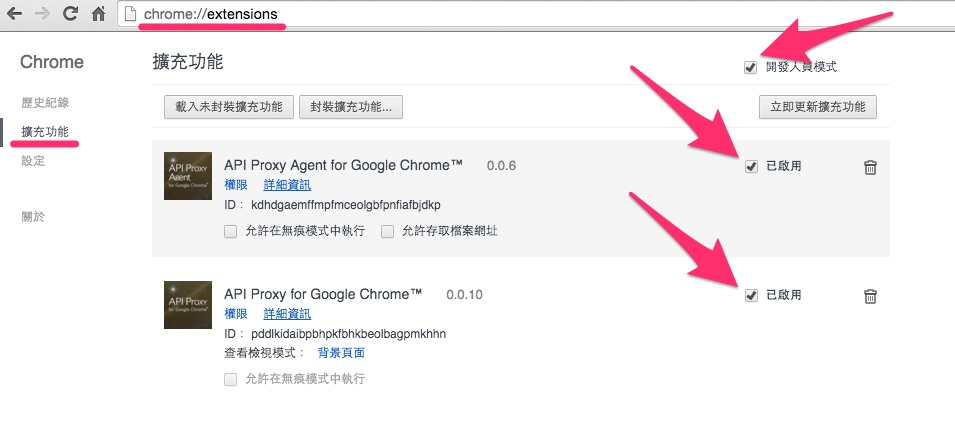
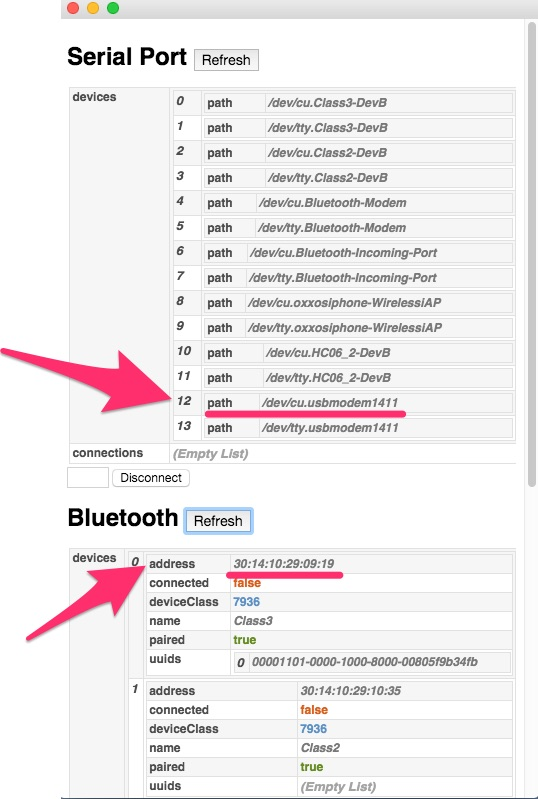
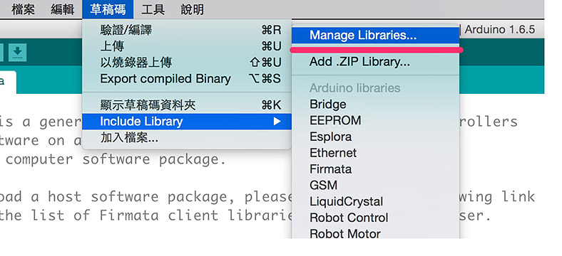

<!-- @@master  = ../../_layout.html-->

<!-- @@block  =  meta-->

<title>Chrome API Proxy 安裝設定 :::: Webduino = Web × Arduino</title>

<meta name="description" content="透過由 Webduino 開發的 Chrome 的 API Proxy 程式，可以讓 Arduino UNO 在沒有 Wifi 的情況下，藉由序列埠或藍芽的方式，操控各種電子零件與傳感器，感受方便美好的 Webduino 開發體驗。">

<meta itemprop="description" content="透過由 Webduino 開發的 Chrome 的 API Proxy 程式，可以讓 Arduino UNO 在沒有 Wifi 的情況下，藉由序列埠或藍芽的方式，操控各種電子零件與傳感器，感受方便美好的 Webduino 開發體驗。">

<meta property="og:description" content="透過由 Webduino 開發的 Chrome 的 API Proxy 程式，可以讓 Arduino UNO 在沒有 Wifi 的情況下，藉由序列埠或藍芽的方式，操控各種電子零件與傳感器，感受方便美好的 Webduino 開發體驗。">

<meta property="og:title" content="Chrome API Proxy 安裝設定" >

<meta property="og:url" content="https://webduino.io/tutorials/info-05-chrome-api-proxy.html">

<meta property="og:image" content="https://webduino.io/img/tutorials/info-05-01s.jpg">

<meta itemprop="image" content="https://webduino.io/img/tutorials/info-05-01s.jpg">

<include src="../_include-tutorials.html"></include>

<!-- @@close-->

<!-- @@block  =  preAndNext-->

<include src="../_include-tutorials-content.html"></include>

<!-- @@close-->

<!-- @@block  =  tutorials-->
# Chrome API Proxy 使用說明

透過由 Webduino 開發的 Chrome 的 API Proxy 程式，可以讓 Arduino UNO 在沒有 Wifi 的情況下，藉由序列埠或藍芽的方式，操控各種電子零件與傳感器，感受方便美好的 Webduino 開發體驗。

 

## 安裝

將「Arduino UNO 雲端擴充板」與「Arduino UNO」組合，就成為「Webduino UNO 開發板」。

 

 

在左上角「搜尋店內商品」的欄位輸入搜尋：「api proxy」，就會出現一些應用程式，這裏需要安裝的是「API Proxy for Google Chrome」和「API Proxy Agent for Google Chrome」這兩個。

 

 

## 啟用應用程式

安裝好了之後，就可以從 Chrome 的擴充功能 ( chrome://extensions/ ) 看到相關程式資訊，確認狀態都是「啟用」。

 

 

接著回到 Chrome 應用程式，會發現多了一個名為「API Proxy for Google Chrome」的 app，點選執行這個 app，執行後就會打開一個應用程式的視窗。

 

 

## 如何使用

如果是使用序列埠，可以從 Serial port 的地方看到路徑 ( path )，Windows 作業系統通常是 class 多少，Mac 作業系統則是 /dev 多少，如果是藍芽，則必須要「先讓電腦先和開發板配對」，配對後就可以在應用程式的視窗內看到藍芽的位址 ( address )。

 

 

如果是序列埠，在 Webduino Blockly ( http://blockly.webduino.io/ )編輯工具的開發板程式積木，選擇「序列埠」，將路徑貼在後方，如果是藍芽，程式積木選擇「藍芽」，將位址貼在後方。

 

 

每次執行時，就會重新和開發板配對並初始化開發板 ( 走序列埠，板子上面的 LED 燈會閃爍，停止閃爍就完成初始化，如果是走藍芽，當藍芽上的 LED 燈停止閃爍，就是配對完成 )，完成後就可以開始使用了。

 

## 燒錄韌體

由於要使用 JavaScript 操控 Arduino 開發板，因此要走 Arduino Firmata 的通訊協定，Arduino 本身要燒錄具有 Firmata 通訊協定的韌體，建議可使用 Arduino 官方提供的範例燒錄，便可做基本的應用。( Arduino IDE > 範例 > Firmata > StandardFirmata )

 

 

## 簡易問題處理

- 如果無法操控，關閉 Chrome 瀏覽器與 API Proxy 應用程式，重新啟動 Chrome 和應用程式，再度執行
- 檢查是否同時啟用 Arduino IDE，如果同時啟用則無法順利運作

## Arduino IDE 1.6.7 編譯錯誤

最近發現某些使用者在使用 Arduino IDE 1.6.7 的版本會編譯錯誤，是因為升級後的 Arduino 並沒有提供向下相容，導致 Firmata 2.4.4 和 2.5.1 不相容而產生錯誤，解決的方法除了安裝回 1.6.6 或 1.6.5 的版本之外 ( 載點：[https://www.arduino.cc/en/Main/OldSoftwareReleases#previous](https://www.arduino.cc/en/Main/OldSoftwareReleases#previous) )，還可以使用以下的解決方式，**把 Firmata 的版本轉回 2.4.4 或 2.4.3**。

第一步，打開 Library Manager ( 草稿碼 -> include Library -> Library Manager )

第二步，搜尋 firmata，看看你的版本是不是跑到 2.5.1 了。

第三步，選擇** 2.4.4 或 2.4.3 **的 firmata 版本，按下 install，把 Firmata 裝回 2.4.4 的版本，如此一來，應該又可以順利的進行燒錄的動作了！

<!-- @@close-->