<!-- @@master  = ../../_layout.html-->

<!-- @@block  =  meta-->

<title>Webduino Blockly 基礎教學 :::: Webduino = Web × Arduino</title>

<meta name="description" content="Webduino Blockly 線上編輯工具是 Webduino 所研發出來的圖像化編輯工具，採用 Google Blockly 設計而成，讓一些對於網頁程式語言比較陌生，或者希望快速實現效果的朋友，可以利用 Webduino Blockly 線上編輯工具極速的實現各式各樣的創意。">

<meta itemprop="description" content="Webduino Blockly 線上編輯工具是 Webduino 所研發出來的圖像化編輯工具，採用 Google Blockly 設計而成，讓一些對於網頁程式語言比較陌生，或者希望快速實現效果的朋友，可以利用 Webduino Blockly 線上編輯工具極速的實現各式各樣的創意。">

<meta property="og:description" content="Webduino Blockly 線上編輯工具是 Webduino 所研發出來的圖像化編輯工具，採用 Google Blockly 設計而成，讓一些對於網頁程式語言比較陌生，或者希望快速實現效果的朋友，可以利用 Webduino Blockly 線上編輯工具極速的實現各式各樣的創意。">

<meta property="og:title" content="Webduino Blockly 基礎教學" >

<meta property="og:url" content="https://webduino.io/tutorials/info-08-blockly-tutorial.html">

<meta property="og:image" content="https://webduino.io/img/tutorials/info-08-01s.jpg">

<meta itemprop="image" content="https://webduino.io/img/tutorials/info-08-01s.jpg">

<include src="../_include-tutorials.html"></include>

<!-- @@close-->

<!-- @@block  =  tutorials-->
# Webduino Blockly 基礎教學

Webduino Blockly 線上編輯工具是 Webduino 所研發出來的圖像化編輯工具，採用 Google Blockly 設計而成，讓一些對於網頁程式語言比較陌生，或者希望快速實現效果的朋友，可以利用 Webduino Blockly 線上編輯工具極速的實現各式各樣的創意。

以下將會介紹 Webduino Blockly 的基本操作，如果已經熟悉相關介面或開發模式，可以直接點選「[Webduino Blockly 實作範例](http://blockly.webduino.io/index-tutorials.html)」，練習六十個以上的精彩應用。

## 工具介面說明

Webduino Blockly 的介面主要分成三個部分，第一個部分是最上方的選單列，裏頭有「程式積木」與「產生程式碼」兩個互相切換的頁籤，以及「程式碼編輯器」、「查看裝置狀態」、「網頁互動測試」、「清空」和「執行」這幾個按鈕，畫面最左側區域就是「程式積木」的選單，中間空白的區域則是編輯區域。

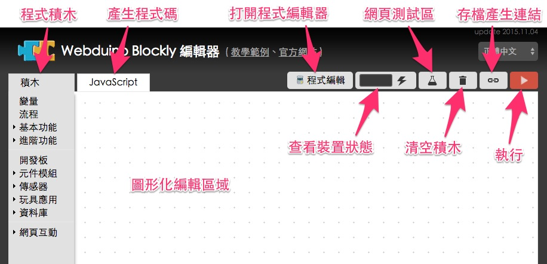

## Webduino 擁有的程式積木

Webduino Blockly 擁有各式各樣功能的程式積木，這些積木也都預先歸類在左側的選單裡，選單分成以下幾個主要區塊：

**變量**：就是程式碼裡常見的「變數」，可以命名變數與使用變數。  
**流程**：就是程式碼裡的「函式 function」，可以命名流程與呼叫流程。  
**基本功能**：包含基本的邏輯、迴圈、文字、數學式、列表 ( 陣列 ) 和顏色設定。  
**進階功能**：包含控制台、延遲、重複、文字邏輯、數值轉換、鍵盤和聲控。  
**開發板**：Webduino 的開發板以及私有雲的積木，可以偵測腳位與上線狀態。  
**元件模組**：電子零組件模組。  
**傳感器**：傳感器相關模組。  
**玩具應用**：可以控制飛天魚或車子的積木。  
**資料庫**：串接 Firebase 的積木。  
**網頁互動**：和右側「網頁互動測試」區域相關的控制積木。  

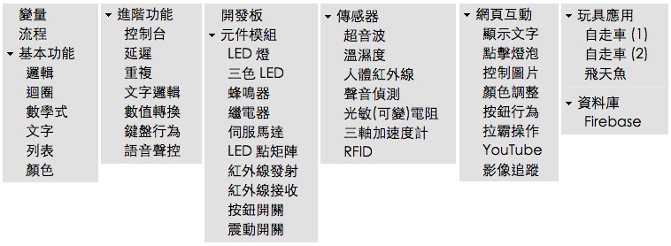

## 彈出個 Hello World

點選「基本功能」的「文字」，把「印出」的積木和「填入文字」的積木拉到畫面中組合，在「填入文字」的積木裡寫上 Hello World。

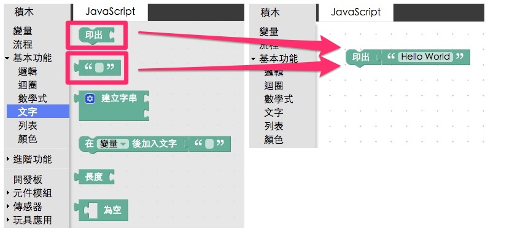

點選右上角紅色的「執行」按鈕，就會執行我們剛剛組合好的積木程式，瀏覽器就會彈出 Hello World 的對話視窗。

## 在網頁裡顯示文字或數字

只是會彈出視窗還不夠，接著我們要在網頁裡面顯示文字或數字 ( 這樣就可以用電子零件或傳感器和網頁互動了 )，因為要和網頁互動，所以我們要用到左下角「網頁互動」的積木，這裏我們使用「顯示文字」的「顯示」，文字或數字將會出現在右側的「網頁測試區」裡面。( 網頁測試區可以點選右上角的按鈕打開 )

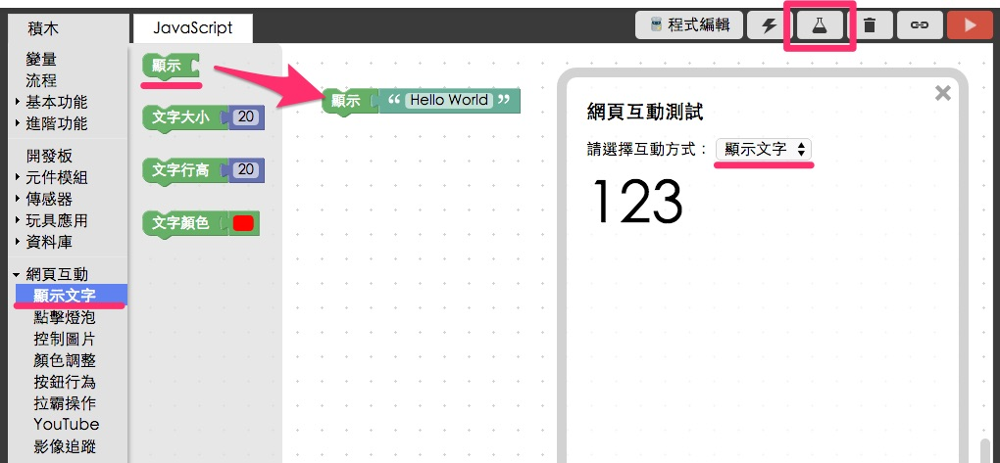

完成後點選右上角紅色的「執行」按鈕，就會看到文字出現在網頁測試區裡面，同樣的方式不僅限於文字，數字也是可以的。

## 點選網頁按鈕後，彈出文字

當我們可以和網頁互動後，再來我們點選網頁上的按鈕，來彈出對話視窗，這裏會用到「網頁互動」的「按鈕行為」，表示當我們按下某顆按鈕，就會執行某件事情，而「網頁互動測試」裡面，同樣要選擇「按鈕行為」，這裏設定點選按鈕 1 會彈出 Hello World，點選按鈕 2 會彈出 Webduino，點選按鈕 3 則會彈出 Blockly。

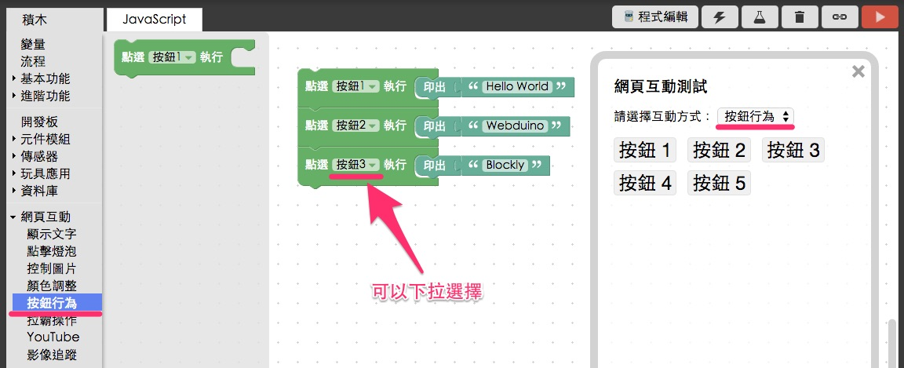

完成後點選右上角紅色的「執行」按鈕，點擊網頁上面的按鈕，就會彈出對應的文字對話視窗了。

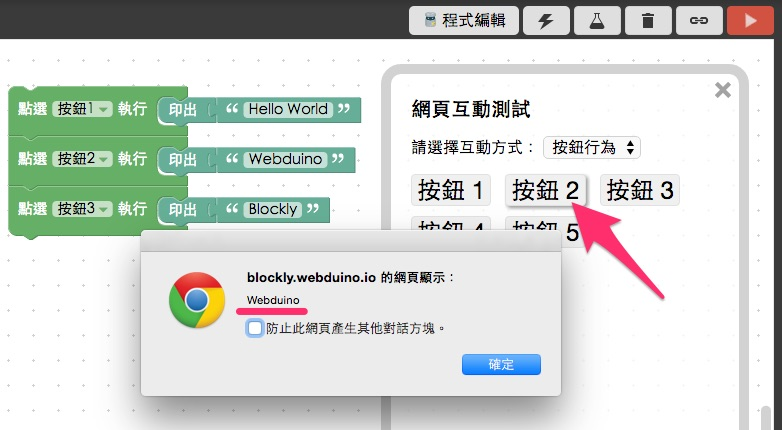

## 控制 Webduino 開發板

從以上幾個例子大概就能了解 Webduino Blockly 的運作原理，接著要來控制開發板，這裏我們把開發板的積木拉到畫面中，可以選擇開發板要使用「Wi-Fi」、「序列埠」還是「藍芽」進行控制，如果選擇「Wi-Fi」則要和 Webduino 的開發板搭配 ( 馬克 1 號或 Webduino Fly )，如果「序列埠」和「藍芽」則必須在安裝 Chrome Proxy API ( 參考「[Chrome API Proxy 使用說明](https://webduino.io/tutorials/info-05-chrome-api-proxy.html)」和「[Arduino 韌體下載與燒錄](https://webduino.io/tutorials/info-07-arduino-ino.html)」 )

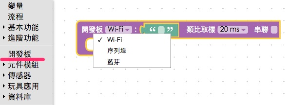

選擇「Wi-fi」就要填入開發板的名字 ( 出廠時每塊開發板都會有個獨一無二的 device 名字 )，同時我們也可以從右上方的「裝置狀態」( 閃電圖案 )，觀看現在開發板有沒有上線，有上線就會是綠燈，沒有上線就會是紅燈，一定要有上線才能用 Wi-Fi 進行控制。

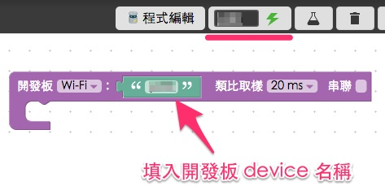

再來我們就可以把要控制的電子元件或傳感器，放到開發板的缺口內，就類似我們把實體的電子零件或傳感器接到實體的開發板上頭，街上去的腳位都可以從電子零件或傳感器的積木選擇，接著就可以開始控制這些元件了。( 詳細教學請見官網的[教學文章](https://webduino.io/tutorials.html) )

## 產生程式碼

點選 JavaScript 的頁籤，就會自動幫我們將程式積木轉換為標準的 JavaScript。( 如果你遇到專出來一片空白，很大的可能性是你的程式積木排列錯誤，造成產生的程式碼是錯誤的 )

轉換為程式碼後，我們可以點選「複製」的按鈕，把程式碼全部複製起來，貼到自己常用的網頁編輯器去進行編輯。

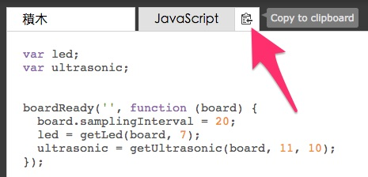

## 打開程式編輯器

如果自己沒有網頁編輯器，也可以點選右上方的「程式碼編輯器」，會開啟 Webduino Bin 編輯器。( 使用 JsBin opensource )

打開編輯器後，會發現剛剛我們積木所組合的程式碼，已經自動帶入編輯器的 JavaScript 區域，這時就可以完全使用 JavaScript 來編輯囉！

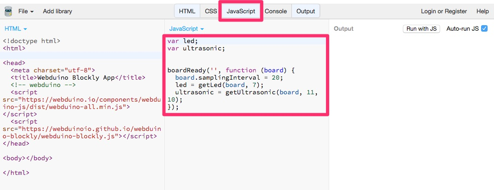

如果是像上面有網頁畫面的程式，網頁的畫面元素與樣式也都會一併帶入程式編輯器內，相當的方便。

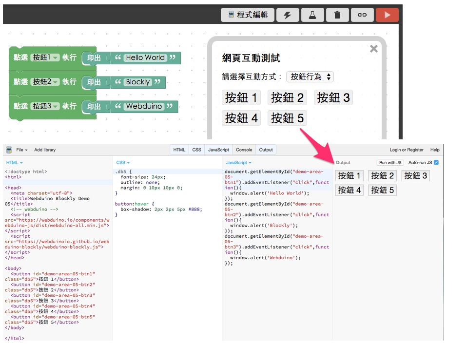

## 儲存檔案

當我們編輯完之後，可以點選 Webduino Blockly 右上方的「連結」圖示，會產生一組連結網址，這組連結網址代表的是當前畫面，只要把這組網址記到瀏覽器的「我的最愛」或「書籤」內，下次再打開就會出現一模一樣的畫面了。

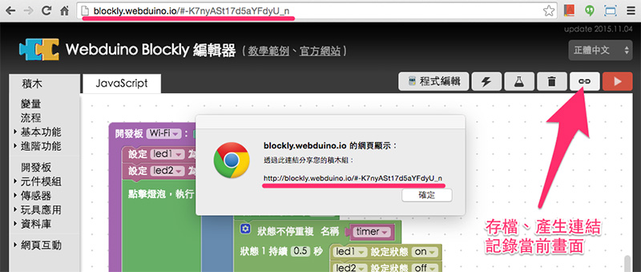

## 開始玩轉 Webduino Blockly 吧！

到這個步驟，應該大致上對 Webduino Blockly 的操作都有了基礎的認識，接下來就可以利用一系列的教學，熟悉 Webduino 的操控方式，正式踏入物聯網的領域囉！

官方網站教學範例：https://webduino.io/tutorials.html  
Blockly 實作範例：http://blockly.webduino.io/index-tutorials.html

<!-- @@close-->