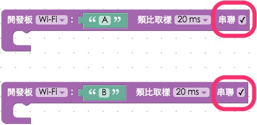
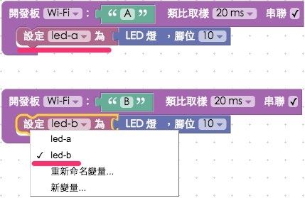
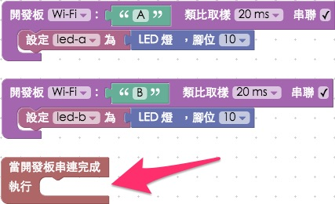
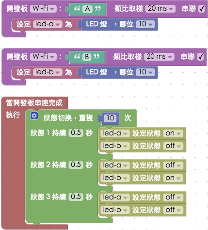
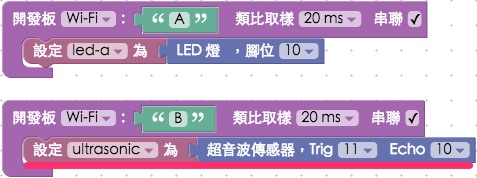
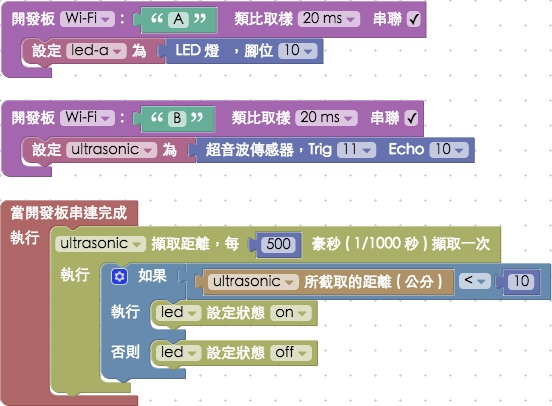

<!-- @@master  = ../../_layout.html-->

<!-- @@block  =  meta-->

<title>連動多塊 Webduino 開發板 :::: Webduino = Web × Arduino</title>

<meta name="description" content="Webduino 的開發板 ( 馬克 1 號或 Webduino Fly )，以 Web 的思維來看的話，可看作是一段函式，當開發板上線之後就會進行 ready 的行為，而各個電子零件或是傳感器在程式碼內也都化作「變數」，所以我們就可以透過很簡單的判斷與控制，確認各個開發板是否上線，並進一步讓各個開發板與電子零組件彼此連動。">

<meta itemprop="description" content="Webduino 的開發板 ( 馬克 1 號或 Webduino Fly )，以 Web 的思維來看的話，可看作是一段函式，當開發板上線之後就會進行 ready 的行為，而各個電子零件或是傳感器在程式碼內也都化作「變數」，所以我們就可以透過很簡單的判斷與控制，確認各個開發板是否上線，並進一步讓各個開發板與電子零組件彼此連動。">

<meta property="og:description" content="Webduino 的開發板 ( 馬克 1 號或 Webduino Fly )，以 Web 的思維來看的話，可看作是一段函式，當開發板上線之後就會進行 ready 的行為，而各個電子零件或是傳感器在程式碼內也都化作「變數」，所以我們就可以透過很簡單的判斷與控制，確認各個開發板是否上線，並進一步讓各個開發板與電子零組件彼此連動。">

<meta property="og:title" content="連動多塊 Webduino 開發板" >

<meta property="og:url" content="https://webduino.io/tutorials/info-09-multi-webduino-board.html">

<meta property="og:image" content="https://webduino.io/img/tutorials/info-09-01s.jpg">

<meta itemprop="image" content="https://webduino.io/img/tutorials/info-09-01s.jpg">

<include src="../_include-tutorials.html"></include>

<!-- @@close-->

<!-- @@block  =  preAndNext-->

<include src="../_include-tutorials-content.html"></include>

<!-- @@close-->

<!-- @@block  =  tutorials-->
# 連動多塊 Webduino 開發板

Webduino 的開發板 ( 馬克 1 號或 Webduino Fly )，以 Web 的思維來看的話，可看作是一段函式，當開發板上線之後就會進行 ready 的行為，而各個電子零件或是傳感器在程式碼內也都化作「變數」，所以我們就可以透過很簡單的判斷與控制，確認各個開發板是否上線，並進一步讓各個開發板與電子零組件彼此連動。

以下將會使用 Webduino Blockly 來進行操作，操作網址：[http://blockly.webduino.io/](http://blockly.webduino.io/)。

## 電子零件與傳感器教學參考：

這篇範例會使用到 LED 以及超音波傳感器，相關教學可以參考以下兩篇文章：

1) [教學範例 1：控制單顆 LED 燈](https://webduino.io/tutorials/tutorial-01-led.html)
2) [教學範例 5：控制超音波傳感器](https://webduino.io/tutorials/tutorial-05-ultrasonic.html)

## 步驟教學

首先我們把開發板的積木放到畫面當中，注意在開發板的積木後方有個可勾選的項目「**串聯**」，將有需要連動的開發板，就勾選串連。

在開發板內放入對應的元件，記得變數名稱要不同，因為是不同的元件，名稱也得不同。

接著放入「**當開發板串連完成後執行**」的積木，我們將要執行的事件放在缺口內，如此一來就可以確保開發板都上線完成後才會執行。

這裏我們使用「狀態切換」的積木，就可以控制兩塊板子上面的 LED 燈閃爍，這個閃爍會遵照我們的設定進行。

完成後，確認開發板上線 ( 點選「[檢查連線狀態](https://webduino.io/device.html)」查詢 )，點選紅色的執行按鈕，就可以看到兩塊板子的 LED 開始閃爍 ( 解答：[http://blockly.webduino.io/#-K8T4D5zQG4k89bumBM6](http://blockly.webduino.io/#-K8T4D5zQG4k89bumBM6) )。

不過光是 LED 地閃動其實看不太出來「連動」的效果，接著我們把其中一塊開發板的 LED 換成超音波傳感器，利用開發板 B 偵測到距離的變化，來控制開發板 A 上頭 LED 的明暗。

同樣的，把偵測距離的邏輯積木放在「串連完成後執行」的缺口內，當距離小於 10 公分，LED 就會亮起，當距離大於 10 公分，LED 就會熄滅。

完成後，確認開發板上線 ( 點選「[檢查連線狀態](https://webduino.io/device.html)」查詢 )，點選紅色的執行按鈕，就可以用手或紙板去遮蔽超音波傳感器，當遮蔽的距離小於 10 公分，LED 就會亮起，如此一來輕輕鬆鬆就完成了開發板連動的程式了。 ( 解答：[http://blockly.webduino.io/#-K8T5iPk4z7mHPqM0-Wh](http://blockly.webduino.io/#-K8T5iPk4z7mHPqM0-Wh) )。

<!-- @@close-->