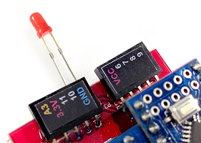
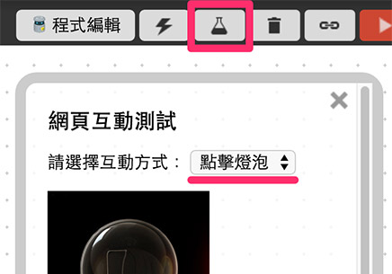
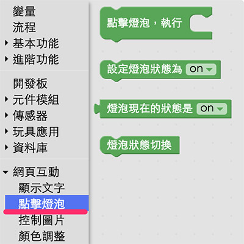
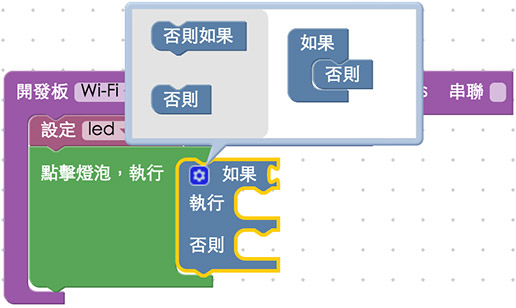
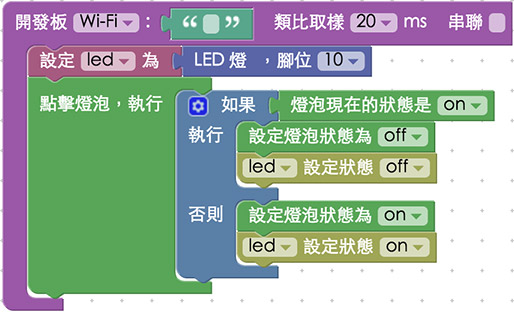

<!-- @@master  = ../../_layout.html-->

<!-- @@block  =  meta-->

<title>教學範例 1：控制單顆 LED 燈 :::: Webduino = Web × Arduino</title>

<meta name="description" content="在基本的 Arduino 傳感器控制範例裡頭，控制單顆 LED 燈通常都是作為第一個範例使用，為什麼呢？因為這個範例最容易上手，也最容易藉由 LED 的明暗來測試程式是否有寫錯，因此進入了 Webduino 的世界之後，同樣也使用 LED 來作為第一個範例，而撰寫的程式也更為簡單，就像控制一張網頁圖片切換一樣的容易。">

<meta itemprop="description" content="在基本的 Arduino 傳感器控制範例裡頭，控制單顆 LED 燈通常都是作為第一個範例使用，為什麼呢？因為這個範例最容易上手，也最容易藉由 LED 的明暗來測試程式是否有寫錯，因此進入了 Webduino 的世界之後，同樣也使用 LED 來作為第一個範例，而撰寫的程式也更為簡單，就像控制一張網頁圖片切換一樣的容易。">

<meta property="og:description" content="在基本的 Arduino 傳感器控制範例裡頭，控制單顆 LED 燈通常都是作為第一個範例使用，為什麼呢？因為這個範例最容易上手，也最容易藉由 LED 的明暗來測試程式是否有寫錯，因此進入了 Webduino 的世界之後，同樣也使用 LED 來作為第一個範例，而撰寫的程式也更為簡單，就像控制一張網頁圖片切換一樣的容易。">

<meta property="og:title" content="教學範例 1：控制單顆 LED 燈" >

<meta property="og:url" content="https://webduino.io/tutorials/tutorial-01-led.html">

<meta property="og:image" content="https://webduino.io/img/tutorials/tutorial-01-01s.jpg">

<meta itemprop="image" content="https://webduino.io/img/tutorials/tutorial-01-01s.jpg">

<include src="../_include-tutorials.html"></include>

<!-- @@close-->

<!-- @@block  =  tutorials-->
# 教學範例 1：控制單顆 LED 燈

在基本的 Arduino 傳感器控制範例裡頭，控制單顆 LED 燈通常都是作為第一個範例使用，為什麼呢？因為這個範例最容易上手，也最容易藉由 LED 的明暗來測試程式是否有寫錯，因此進入了 Webduino 的世界之後，同樣也使用 LED 來作為第一個範例，而撰寫的程式也更為簡單，就像控制一張網頁圖片切換一樣的容易。

## 教學影片

<iframe class="youtube" src="https://www.youtube.com/embed/8k6Lqu-aqVM" frameborder="0" allowfullscreen></iframe>

## 接線與實作

只有一顆 LED 燈的接線方式很簡單，首先，LED 燈有「長短腳」之分，長腳接「高電位」( 帶有數字的腳位 )，短腳接「低電位」( GND、接地 )，因此我們只要直接將 LED 插到腳位上即可，或使用麵包板與麵包線外接出來，在這裡**長腳接 10，短腳接 GND**。

接線示意圖：

實際接線照片：

## Webduino Blockly 操作解析

打開 Webduino Blockly 編輯工具 ( [http://blockly.webduino.io](http://blockly.webduino.io) )，在第一個範例裡頭，我們將會點選網頁「燈泡圖案」來控制 LED 燈的切換，所以要先點選右上方「網頁互動測試」的按鈕，打開內嵌測試的網頁，用下拉選單選擇「點擊燈泡」，就會出現讓我們可以點選燈泡的網頁。

從編輯工具左側的積木選單中選擇「開發板」，將開發板放到畫面當中，填入對應的 Webduino 開發板名稱 ( Device 名稱，不要勾選串連 )，接著選擇「LED 燈」的積木，將 LED 燈的積木放到開發板積木的缺口內，腳位設定為 10 ( 因為剛剛把長腳接在 10 號腳 )。

因為要和網頁互動，所以我們要從積木選單的最下方「網頁互動」，點選「點擊燈泡」，就會看到很多點擊網頁燈泡圖片互動的選項。

把「點擊燈泡執行」的積木放到編輯畫面裡，代表點擊燈泡時要做些什麼事情。

在執行的內容放入「邏輯」的積木，判斷點擊燈泡時，依據當時的狀態做出相對的反應，而我們也可以利用邏輯積木上面「藍色小齒輪」，添增邏輯選項。

根據邏輯，判斷「當燈泡是 on」的話，點擊燈泡就會變成「off」，反之就是「on」。

完成後，確認開發板上線 ( 點選「[檢查連線狀態](https://webduino.io/device.html)」查詢 )，點選紅色的執行按鈕，就可以開始。

點擊內嵌網頁裡的燈泡圖片，就可以輕鬆地控制 LED 燈的明暗，然而我們也可以點選「JavaScript 頁籤」，就可以看到完整的程式碼邏輯，同時也可以複製這些代碼，貼到自己的網頁原始碼當中，就可以在自己的網頁裡實現一模一樣的行為囉！
( 解答：[http://blockly.webduino.io/#-K4pR8RaEF6IkiWdAYk7](http://blockly.webduino.io/#-K4pR8RaEF6IkiWdAYk7) )

## 程式碼解析 ( [看完整程式碼](http://bin.webduino.io/duso/edit?html,output)、[檢查連線狀態](https://webduino.io/device.html) )

一開始先在 HTML 的 header 引入 `webduino-all.min.js`，目的在讓瀏覽器可以支援 WebComponents 以及 Webduino 所有的元件，如果是用 Blockly 編輯工具產生的程式碼，則要額外引入 `webduino-blockly.js`。

	
	

接著看到 HTML 的 body 裡頭，放入一個 id 為 demo-area-02-light 的圖片區域，裡面含有兩張分別是亮起的燈泡與不亮的燈泡圖片，目的在於點選的時候，圖片也會從不亮的燈泡轉變為亮起的燈泡。

	

	  
	  
	

控制燈泡圖片亮暗的是使用 CSS 的方式，用圖片顯示的切換 `display:none;` 來達到相關效果，下面是 CSS 的程式碼。

	#demo-area-02-light img{
	  height:200px;
	  display:none;
	}
	#demo-area-02-light.on #demo-area-02-on{
	  display:inline-block;
	}
	#demo-area-02-light.off #demo-area-02-off{
	  display:inline-block;
	}

再來就是最重點的 javascript 部分，下面的範例程式開始先要確認開發板上線 ( 使用 `boardReady` ) 之後就可以開始進行動作，執行的方式也簡單，先設定一個名為 led 的變數，使用 `getLed` 設定腳位為 10，然後綁定圖片的點擊事件，再使用 LED 的 API 來操作。

	var led;

	boardReady('', function (board) {
	  board.samplingInterval = 20;
	  led = getLed(board, 10);
	  document.getElementById("demo-area-02-light").addEventListener("click",function(){
	    if (document.getElementById("demo-area-02-light").className == "on") {
	      document.getElementById("demo-area-02-light").className = "off";
	      led.off();
	    } else {
	      document.getElementById("demo-area-02-light").className = "on";
	      led.on();
	    }
	  });
	});

因為程式碼由 Blockly 自動生成，可能會有一些重複或累贅的程式碼，我們可以將上面這段程式碼簡化成下面這樣，目的只是把重複的 `document.getElementById("demo-area-02-light")` 變成一個變數 light 而已，就會乾淨許多。

	var led;
	var light;

	boardReady('', function (board) {
	  board.samplingInterval = 20;
	  led = getLed(board, 10);
		light = document.getElementById("demo-area-02-light");
	  light.addEventListener("click",function(){
	    if (light.className == "on") {
	      light.className = "off";
	      led.off();
	    } else {
	      light.className = "on";
	      led.on();
	    }
	  });
	});

以上就是點選圖片控制 LED 燈的基本範例。  
完整程式碼：[http://bin.webduino.io/duso/edit?html,output](http://bin.webduino.io/duso/edit?html,output)  
解答：[http://blockly.webduino.io/#-K4pR8RaEF6IkiWdAYk7](http://blockly.webduino.io/#-K4pR8RaEF6IkiWdAYk7)

## LED 的相關教學：

[Webduino Blockly 課程 1-1：點亮 LED 燈](http://blockly.webduino.io/?lang=zh-hant&page=tutorials/led-1#-Jvaz_tuEFYtNaVBi0i2)  
[Webduino Blockly 課程 1-2：點選圖片控制 LED 燈](http://blockly.webduino.io/?lang=zh-hant&page=tutorials/led-2#-Jvb-r0TiTHKsL-rMGw9)

<!-- @@close-->