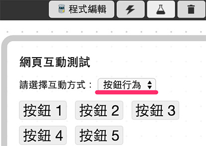
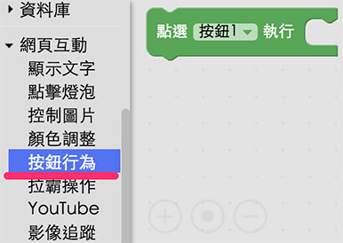
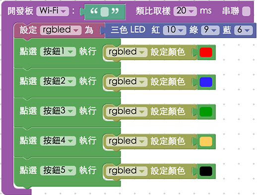

<!-- @@master  = ../../_layout.html-->

<!-- @@block  =  meta-->

<title>教學範例 3：控制 三色 LED :::: Webduino = Web × Arduino</title>

<meta name="description" content="三色 LED 是由紅色、綠色與藍色三種不同顏色的 LED 所組成，因此可以發出最少三種顏色的光，也由於三色 LED 內部含有三顆 LED 燈，所以它具有 VCC、R、B、G 四支針腳，我們也可以分別控制個個顏色的強弱，進一步達到混合顏色的效果。這個 webduino 的範例主要介紹如何設定與使用三色 LED，下一個章節會繼續介紹如何利用三色 LED 做調色盤。">

<meta itemprop="description" content="三色 LED 是由紅色、綠色與藍色三種不同顏色的 LED 所組成，因此可以發出最少三種顏色的光，也由於三色 LED 內部含有三顆 LED 燈，所以它具有 VCC、R、B、G 四支針腳，我們也可以分別控制個個顏色的強弱，進一步達到混合顏色的效果。這個 webduino 的範例主要介紹如何設定與使用三色 LED，下一個章節會繼續介紹如何利用三色 LED 做調色盤。">

<meta property="og:description" content="三色 LED 是由紅色、綠色與藍色三種不同顏色的 LED 所組成，因此可以發出最少三種顏色的光，也由於三色 LED 內部含有三顆 LED 燈，所以它具有 VCC、R、B、G 四支針腳，我們也可以分別控制個個顏色的強弱，進一步達到混合顏色的效果。這個 webduino 的範例主要介紹如何設定與使用三色 LED，下一個章節會繼續介紹如何利用三色 LED 做調色盤。">

<meta property="og:title" content="教學範例 3：控制 三色 LED" >

<meta property="og:url" content="https://webduino.io/tutorials/tutorial-03-rgbled.html">

<meta property="og:image" content="https://webduino.io/img/tutorials/tutorial-03-01s.jpg">

<meta itemprop="image" content="https://webduino.io/img/tutorials/tutorial-03-01s.jpg">

<include src="../_include-tutorials.html"></include>

<!-- @@close-->

<!-- @@block  =  tutorials-->
# 教學範例 3：控制三色 LED

三色 LED 是由紅、綠、藍，三種不同顏色的 LED 所組成，因此可以發出最少三種顏色的光，也由於三色 LED 內部含有三顆 LED 燈，所以它具有 VCC、R、B、G 四支針腳，我們也可以分別控制個個顏色的強弱，進一步達到混合顏色的效果。這個範例主要介紹如何設定與使用三色 LED，下一個章節會繼續介紹如何利用三色 LED 做調色盤。

## 教學影片

影片對應範例：[http://blockly.webduino.io/?page=tutorials/rgbled-2](http://blockly.webduino.io/?page=tutorials/rgbled-2)  

<iframe class="youtube" src="https://www.youtube.com/embed/VN4sKngbiGI" frameborder="0" allowfullscreen></iframe>

## 接線與實作

要控制三色 LED 燈，我們必須要使用 PWM 的腳位 ( Pulse Width Modulation，脈衝寬度調變 )，這是一種將類比信號轉換為波段並且輸出的腳位，可以改變輸出的信號大小，透過輸出信號的強弱，我們就可以做出各種不同顏色的混合，然而在 Webduino 裏，可以用的 PWM 腳位是 3、5、6、9、10、11 這幾個腳位，但因為開發板的不同，我們可以選擇對應的腳位來使用 ( 基本上在 Arduino 的開發板，有「~」記號的就是 PWM 腳位 )。

接線的方式就是將三色 LED 燈接上杜邦線 ( 一公一母 ) ，把 v 接在 3.3v 的位置 ( 避免電壓過高，造成三色 LED 燈會發出微弱的光線 )，R ( 紅色 ) 接在 10，B ( 藍色 ) 接在 6，G ( 綠色 ) 接在 9，如果沒有這些腳位，可以選擇其他有 PWM 的腳位來接 ( 3、5、11 )。

接線示意圖：

實際接線照片：

## Webduino Blockly 操作解析

打開 Webduino Blockly 編輯工具 ( [http://blockly.webduino.io](http://blockly.webduino.io) )，因為這個範例也會點選網頁「按鈕行為」來控制，所以要先點選右上方「網頁互動測試」的按鈕，打開內嵌測試的網頁，用下拉選單選擇「按鈕行為」，就會出現有五顆按鈕的網頁，我們就可以分別點擊這五顆按鈕，產生五種不同顏色。

因為要控制按鈕，所以左側選單也要選擇「按鈕行為」的程式積木。

首先我們一樣把開發板放到編輯畫面裡，填入對應的 Webduino 開發板名稱，開發板內放入三色 LED 的積木，名稱設定為 rgbled，腳位設定為紅色 10，綠色 9，藍色 6。( 三色 LED 積木腳位已經鎖定只能選擇 PWM 的數字 )

最後就是把點選哪個按鈕會出現哪種顏色的行為設定好，如果設定「黑色」，三色 LED 燈就會沒有顏色 ( 也就是關起來的意思 )

完成後，確認開發板上線 ( 點選「[檢查連線狀態](https://webduino.io/device.html)」查詢 )，點選紅色的執行按鈕後，選網頁裡不同的按鈕，就會看到三色 LED 出現不同的顏色。，然而我們也可以點選「JavaScript 頁籤」，就可以看到完整的程式碼邏輯，同時也可以複製這些代碼，貼到自己的網頁原始碼當中，就可以在自己的網頁裡實現一模一樣的行為囉！  
( 解答：[http://blockly.webduino.io/#-K4rh2jD43Y9VSEAC8fT](http://blockly.webduino.io/#-K4rh2jD43Y9VSEAC8fT) )

## 程式碼解析 ( [看完整程式碼](http://bin.webduino.io/rugu/edit?html,css,js,output)、[檢查連線狀態](https://webduino.io/device.html) )

HTML 的 header 引入 `webduino-all.min.js`，目的在讓瀏覽器可以支援 WebComponents 以及 Webduino 所有的元件，如果是用 Blockly 編輯工具產生的程式碼，則要額外引入 `webduino-blockly.js`。

	
	

HTML 的 body 裡頭有五個按鈕，名字就是按鈕 1 到 5，各自都有對應一個 HTML 標籤的 id，這樣我們才可以在 JavaScript 裡經由 id 來控制按鈕行為，class 則是讓這些按鈕有固定的樣式，當然如果要用預設的樣式也可以，就不需要設定 CSS。

	<button id="demo-area-05-btn1" class="db5">按鈕 1</button>
	<button id="demo-area-05-btn2" class="db5">按鈕 2</button>
	<button id="demo-area-05-btn3" class="db5">按鈕 3</button>
	<button id="demo-area-05-btn4" class="db5">按鈕 4</button>
	<button id="demo-area-05-btn5" class="db5">按鈕 5</button>

因為只是純粹的按鈕，所以就不看 CSS，直接來看 JavaScript 該怎麼寫，按鈕的點擊事件，使用 JavaScript 的 `addEventListener` 來監聽 `click` 事件，設定三色 LED 燈的顏色，則是交給 `setColor` 來進行，裡面放入 16 進位的色碼 ( 也支援十進位的格式 )，如此一來就會呈現對應的顏色。

	var rgbled;

	boardReady('', function (board) {
	  board.samplingInterval = 20;
	  rgbled = getRGBLed(board, 10, 9, 6);
	  document.getElementById("demo-area-05-btn1").addEventListener("click",function(){
	    rgbled.setColor('#ff0000');
	  });
	  document.getElementById("demo-area-05-btn2").addEventListener("click",function(){
	    rgbled.setColor('#3333ff');
	  });
	  document.getElementById("demo-area-05-btn3").addEventListener("click",function(){
	    rgbled.setColor('#009900');
	  });
	  document.getElementById("demo-area-05-btn4").addEventListener("click",function(){
	    rgbled.setColor('#ffcc66');
	  });
	  document.getElementById("demo-area-05-btn5").addEventListener("click",function(){
	    rgbled.setColor('#000000');
	  });
	});

以上就是點選不同的按鈕，由三色 LED 呈現不同顏色的範例。  
完整程式碼：[http://bin.webduino.io/rugu/edit?html,css,js,output](http://bin.webduino.io/rugu/edit?html,css,js,output)  
解答：[http://blockly.webduino.io/#-K4rh2jD43Y9VSEAC8fT](http://blockly.webduino.io/#-K4rh2jD43Y9VSEAC8fT)

## 三色 LED 的延伸教學：

[Webduino Blockly 課程 2-1：三色 LED 燈](http://blockly.webduino.io/?lang=zh-hant&page=tutorials/rgbled-1#-JvMrEKwwqW2P607oFz2)  
[Webduino Blockly 課程 2-2：三色 LED 燈切換顏色](http://blockly.webduino.io/?lang=zh-hant&page=tutorials/rgbled-2#-JvMroBFx1XYaMemJmOm)

<!-- @@close-->