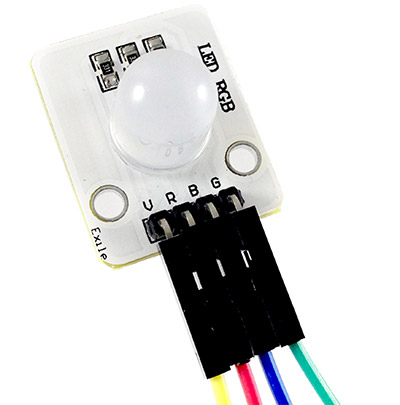

<!-- @@master  = ../../_layout.html-->

<!-- @@block  =  meta-->

<title>範例教學 4：三色 LED 調色盤 :::: Webduino = Web × Arduino</title>

<meta name="description" content="這一篇 Webduino 的範例，將要來更換部分接腳，並利用 Web 裡頭常見的 slider range ( 拉霸 )，來控制三色 LED 燈的顏色強弱，同時在網頁裡頭對應相同的色彩。">
<meta itemprop="description" content="這一篇 Webduino 的範例，將要來更換部分接腳，並利用 Web 裡頭常見的 slider range ( 拉霸 )，來控制三色 LED 燈的顏色強弱，同時在網頁裡頭對應相同的色彩。">
<meta property="og:description" content="這一篇 Webduino 的範例，將要來更換部分接腳，並利用 Web 裡頭常見的 slider range ( 拉霸 )，來控制三色 LED 燈的顏色強弱，同時在網頁裡頭對應相同的色彩。">

<meta property="og:title" content="範例教學 4：三色 LED 調色盤" >
<meta property="og:url" content="http://webduino.io/tutorials/tutorial-04-rgbled-palette.html">

<meta property="og:image" content="http://webduino.io/img/tutorials/tutorial-04-01s.jpg">
<meta itemprop="image" content="http://webduino.io/img/tutorials/tutorial-04-01s.jpg">

<!-- @@close-->

<!-- @@block  =  tutorials-->
#範例教學 4：三色 LED 調色盤

[上一篇](tutorial-03-rgbled.html) 介紹過三色 LED 的原理，不過由於部分接腳受限於 PWM 的限制 ( 脈衝寬度調變，**Webduino 開發板的 6、9、10、11 才有 PWM** )，所以上一篇只能控制顏色的亮暗，這一篇將要來更換部分接腳，並利用 Web 裡頭常見的 slider range ( 拉霸 )，來控制三色 LED 燈的顏色強弱，同時在網頁裡頭對應相同的色彩。

##範例影片展示

<iframe class="youtube" src="https://www.youtube.com/embed/QdzMDe0hIpQ" frameborder="0" allowfullscreen></iframe>

##接線與實作

- ###1. 接上三色 LED

	由於 Webduino 具有 PWM 的腳位是 6、9、10、11，所以這裡就必須利用麵包板和電線，將腳位引出到麵包板上頭，按照下圖，三色 LED 的 V 接在 3.3v 的腳位，紅色 R 接在 6，藍色 B 接在 9，綠色 G 接在 10。

	

- ###2. 完成後的實際長相

	

	

##範例解析 ([快速體驗](http://webduinoio.github.io/samples/content/rgbled-palette/index.html)、[jsbin 範例](http://jsbin.com/dasufu/5/edit?html,css,js,output)、[檢查連線狀態](http://webduino.io/device.html))

一開始要先引入相關的 js 與 WebComponents。

	
	<link rel='import' href='http://webduino.io/components/webduino/web-arduino.html' />
	<link rel='import' href='http://webduino.io/components/webduino/wa-rgbled.html'/>

在 body 裡頭利用 html5 的 input「range」類型，製作三個拉霸，並在拉霸的下方放一個名為 show 的 div，目的為了讓拉霸拉動的時候，不僅只有三色 LED 的顏色變化，連同畫面上的區塊顏色也會跟著改變，而拉霸的數值設定為 0 到 255，拉動的間隔為 5，預設值為 0。

	

	  <label>red:</label>
	  <input id='redBtn' type='range' min='0' max='255' step='5' value='0'>
	

	

	  <label>green: </label>
	  <input id='greenBtn' type='range' min='0' max='255' step='5' value='0'>
	

	

	  <label>blue: </label>
	  <input id='blueBtn' type='range' min='0' max='255' step='5' value='0'>
	

	

	<web-arduino id='board' device="你的 device 名稱">
	  <wa-rgbled id='rgb' red='6' blue='9' green='10'></wa-rgbled>
	</web-arduino>

接著稍微寫一點點 CSS 定義一下顏色區域的大小。

	#show{
	  width: 100%;
	  max-width: 250px;
	  height:100px;
	  border:1px solid #000;
	  background:#000;
	  margin-top: 15px;
	  margin-left: 5px;
	  }

最後就是關鍵的 javascript，這裏其實沒有用到什麼太特別的技巧，就是把拉霸當下的數值，同時傳給背景色以三色 LED 的顏色使用 ( 利用監聽 change 的事件 )

	window.addEventListener('WebComponentsReady', function () {
	  var board = document.getElementById('board');

	  board.on('ready',function() {
	    var redBtn = document.getElementById('redBtn'),
	      greenBtn = document.getElementById('greenBtn'),
	      blueBtn = document.getElementById('blueBtn'),
	      rgb = document.getElementById('rgb'),
	      show = document.getElementById('show'),
	      r = 0,
	      g = 0,
	      b = 0;

	    var handler = function(evt) {
	      var target = evt.target,
	        id = target.id;

	      switch (id) {
	        case 'redBtn':
	          r = target.value;
	          break;
	        case 'greenBtn':
	          g = target.value;
	          break;
	        case 'blueBtn':
	          b = target.value;
	          break;
	      }

	      show.style.backgroundColor = 'rgba(' + r + ',' + g + ',' + b + ',' + '255)';
	      rgb.setColor(r, g, b);
	    };

	    redBtn.addEventListener('change', handler, false);
	    greenBtn.addEventListener('change', handler, false);
	    blueBtn.addEventListener('change', handler, false);

	  });

	}, false);

如果還有不清楚的，不妨利用這個 [快速體驗範例](http://webduinoio.github.io/samples/content/rgbled-palette/index.html)，填入自己 Webduino 開發板的 device 名稱，按下設定，訊息處出現 ready 的話，就可以開始利用拉霸做調整顏色的動作，亦或是也可以參考這個 [jsbin 範例](http://jsbin.com/dasufu/5/edit?html,css,js,output)，實際在上面填入 device 名稱並且修改體驗相關效果。

<!-- @@close-->