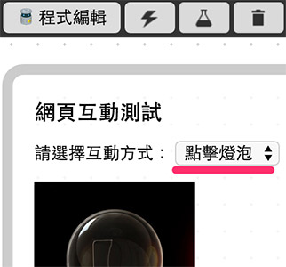

<!-- @@master  = ../../_layout.html-->

<!-- @@block  =  meta-->

<title>教學範例 7：超音波傳感器控制 LED 燈 :::: Webduino = Web × Arduino</title>

<meta name="description" content="對於直接寫 C/C++ 來控制 Arduino 的人來說，用超音波傳感器控制 LED 應該是小菜一碟，但對於要用 Web 技術來實現就沒那麼容易，不過在我們由前面幾個 webduino 範例了解相關傳感器運作原理之後，就可以很輕鬆的做出來用超音波傳感器控制 LED 燈的實例，也因為是透過 Web 的方式，所以當行為觸發時，網頁端同時也可以收到動作的發生 ( 圖片也會改變 )，相當的方便。">

<meta itemprop="description" content="對於直接寫 C/C++ 來控制 Arduino 的人來說，用超音波傳感器控制 LED 應該是小菜一碟，但對於要用 Web 技術來實現就沒那麼容易，不過在我們由前面幾個 webduino 範例了解相關傳感器運作原理之後，就可以很輕鬆的做出來用超音波傳感器控制 LED 燈的實例，也因為是透過 Web 的方式，所以當行為觸發時，網頁端同時也可以收到動作的發生 ( 圖片也會改變 )，相當的方便。">

<meta property="og:description" content="對於直接寫 C/C++ 來控制 Arduino 的人來說，用超音波傳感器控制 LED 應該是小菜一碟，但對於要用 Web 技術來實現就沒那麼容易，不過在我們由前面幾個 webduino 範例了解相關傳感器運作原理之後，就可以很輕鬆的做出來用超音波傳感器控制 LED 燈的實例，也因為是透過 Web 的方式，所以當行為觸發時，網頁端同時也可以收到動作的發生 ( 圖片也會改變 )，相當的方便。">

<meta property="og:title" content="教學範例 7：超音波傳感器控制 LED 燈" >

<meta property="og:url" content="https://webduino.io/tutorials/tutorial-07-ultrasonic-led.html">

<meta property="og:image" content="https://webduino.io/img/tutorials/tutorial-07-01s.jpg">

<meta itemprop="image" content="https://webduino.io/img/tutorials/tutorial-07-01s.jpg">

<include src="../_include-tutorials.html"></include>

<!-- @@close-->

<!-- @@block  =  tutorials-->
#教學範例 7：超音波傳感器控制 LED 燈

對於直接寫 C/C++ 來控制 Arduino 的人來說，用超音波傳感器控制 LED 應該是小菜一碟，但對於要用 Web 技術來實現就沒那麼容易，不過在我們由前面幾個範例了解相關傳感器運作原理之後，就可以很輕鬆的做出來用超音波傳感器控制 LED 燈的實例，也因為是透過 Web 的方式，所以當行為觸發時，網頁端同時也可以收到動作的發生 ( 圖片也會改變 )，相當的方便。

## 範例影片展示

<iframe class="youtube" src="https://www.youtube.com/embed/pRMjbzPXWvw" frameborder="0" allowfullscreen></iframe>

## 接線與實作

因為超音波傳感器與 LED 都必須用到 GND 的腳位，所以我們必須要用到麵包板和電線，同樣用電線引出腳位，把超音波傳感器的 VCC 接在 3.3v，Trig 接在 11，Echo 接在 10，GND 就接在 GND 的腳位，然後再用另外的電線將 LED 接在 9 的腳位上。( 因為超音波傳感器在實際的接線會朝外，所以實際的照片電線會有反轉的情形，不要接錯了。 )

接線示意圖：

實際接線照片：

## Webduino Blockly 操作解析

打開 Webduino Blockly 編輯工具 ( [http://blockly.webduino.io](http://blockly.webduino.io) )，因為這個範例會用網頁「點擊燈泡」，在 LED 燈亮起時，同時網頁燈泡也會亮起，所以要先點選右上方「網頁互動測試」的按鈕，打開內嵌測試的網頁，用下拉選單選擇「控制圖片」，就會出現一張圖片，我們會將超音波所測得的距離來控制這張圖片。

把開發板放到編輯畫面裡，填入對應的 Webduino 開發板名稱，開發板內放入超音波積木，名稱設定為 ultrasonic，腳位設定為 Trig 11，Echi 10，然後放入 LED 燈的積木，名稱設定 led，腳位設定為 9。

然後我們每 500 毫秒擷取一次距離，利用「邏輯」來判斷，當距離小於 15 公分時，同時點亮 LED 燈以及右側的燈泡圖片，反之距離大於 15 公分時，就熄滅 LED 燈還有右側燈泡圖片。

完成後，確認開發板上線 ( 點選「[檢查連線狀態](https://webduino.io/device.html)」查詢 )，點選紅色的執行按鈕，用手或是遮蔽物在超音波傳感器前後晃動，就會看到 LED 燈被點亮了。
( 解答：[http://blockly.webduino.io/#-K5LaeMqraW0_friFzcj](http://blockly.webduino.io/#-K5LaeMqraW0_friFzcj) )

## 程式碼解析 ( [jsbin 範例](http://bin.webduino.io/titu/edit?html,css,js,output)、[檢查連線狀態](https://webduino.io/device.html) )

HTML 的 header 引入 `webduino-all.min.js`，目的在讓瀏覽器可以支援 WebComponents 以及 Webduino 所有的元件，如果是用 Blockly 編輯工具產生的程式碼，則要額外引入 `webduino-blockly.js`。

	
	

HTML 裡就是兩張一明一暗的燈泡圖片，利用 CSS 來控制哪張出現。

	

	  
	  
	

CSS 就是設定 on 的時候燈泡圖片亮起，off 的時候燈泡圖片熄滅。

	#demo-area-02-light img {
	  height: 200px;
	  display: none;
	}

	#demo-area-02-light.on #demo-area-02-on {
	  display: inline-block;
	}

	#demo-area-02-light.off #demo-area-02-off {
	  display: inline-block;
	}

JavaScript 主要在 `ping` 的函示內，寫入 `if` 和 `else` 的判斷，判斷小於 15 時讓 `led.on()`。

	var ultrasonic;
	var led;

	boardReady('', function (board) {
	  board.samplingInterval = 20;
	  ultrasonic = getUltrasonic(board, 11, 10);
	  led = getLed(board, 9);
	  ultrasonic.ping(function(cm){
	    console.log(ultrasonic.distance);
	    if (ultrasonic.distance < 15) {
	      led.on();
	      document.getElementById("demo-area-02-light").className = "on";
	    } else {
	      led.off();
	      document.getElementById("demo-area-02-light").className = "off";
	    }
	  }, 500);
	});

以上就是利用超音波傳感器，偵測距離當在某距離範圍內時，LED 燈會亮起。  
完整程式碼：[http://bin.webduino.io/titu/edit?html,css,js,output](http://bin.webduino.io/titu/edit?html,css,js,output)  
解答：[http://blockly.webduino.io/#-K5LaeMqraW0_friFzcj](http://blockly.webduino.io/#-K5LaeMqraW0_friFzcj)

## 超音波傳感器的延伸教學：

[Webduino Blockly 課程 3-2：超音波傳感器改變圖片大小](http://blockly.webduino.io/?lang=zh-hant&page=tutorials/ultrasonic-2#-JvS-qZVOxcFtjlMhYlP)  
[Webduino Blockly 課程 3-3：超音波傳感器改變音量大小](http://blockly.webduino.io/?lang=zh-hant&page=tutorials/ultrasonic-3#-JvS09LhPCGEY4M1-juO) 

<!-- @@close-->