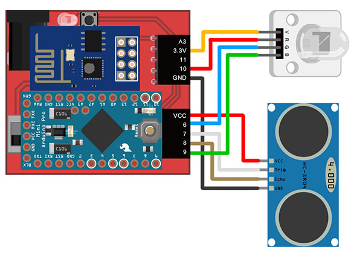
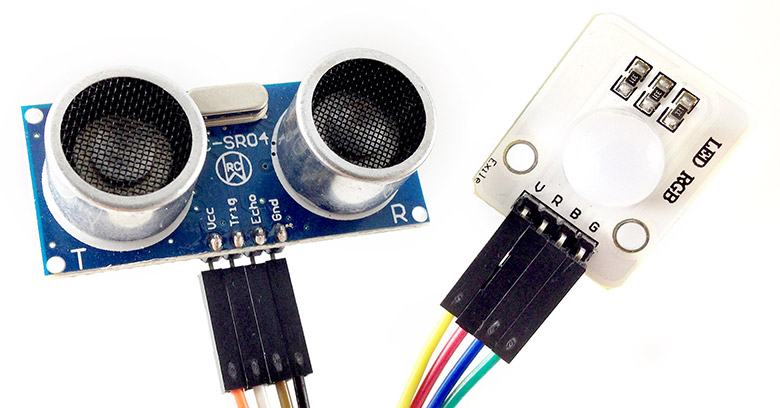
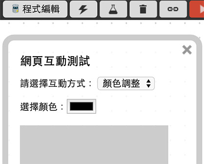
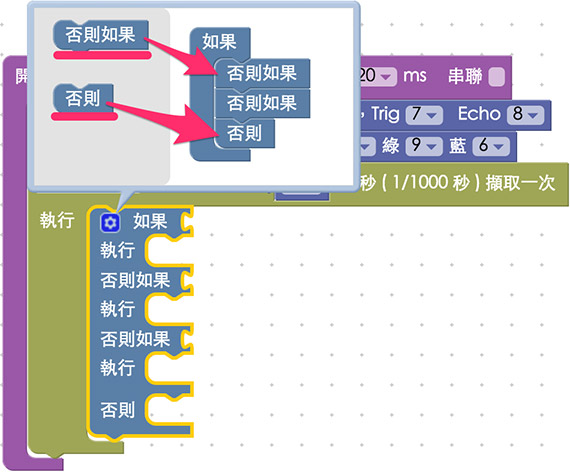
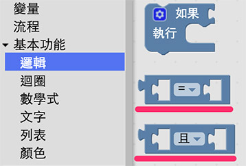
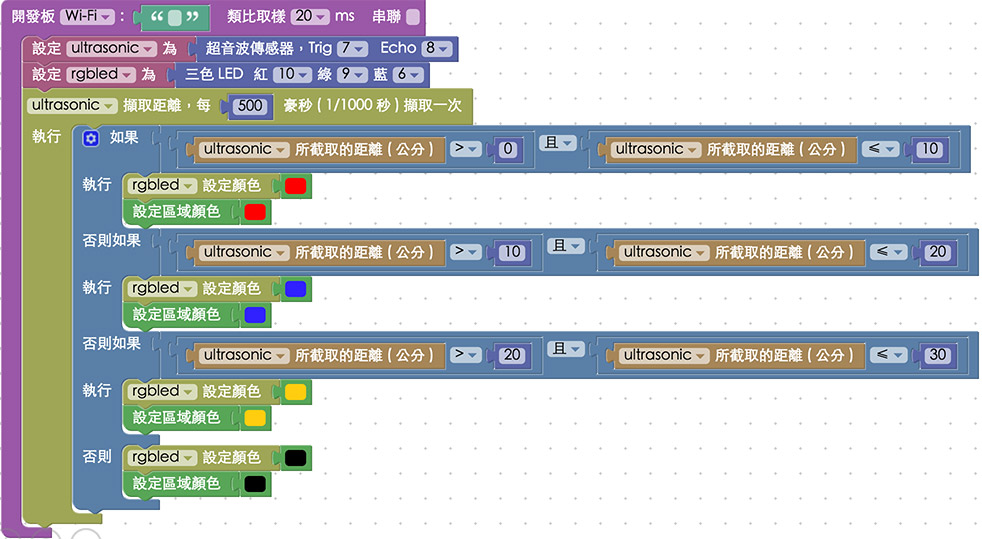

<!-- @@master  = ../../_layout.html-->

<!-- @@block  =  meta-->

<title>教學範例 8：超音波傳感器控制三色 LED 燈 :::: Webduino = Web × Arduino</title>

<meta name="description" content="當我們由上一個範例學會了用超音波傳感器控制 LED 燈之後，這個範例應該就輕鬆不少，這個 webduino 範例最主要是希望能藉由三色 LED 燈顏色上的變化，對應距離的改變，如此一來我們就可以藉由燈號來判斷距離。">

<meta itemprop="description" content="當我們由上一個範例學會了用超音波傳感器控制 LED 燈之後，這個範例應該就輕鬆不少，這個 webduino 範例最主要是希望能藉由三色 LED 燈顏色上的變化，對應距離的改變，如此一來我們就可以藉由燈號來判斷距離。">

<meta property="og:description" content="當我們由上一個範例學會了用超音波傳感器控制 LED 燈之後，這個範例應該就輕鬆不少，這個 webduino 範例最主要是希望能藉由三色 LED 燈顏色上的變化，對應距離的改變，如此一來我們就可以藉由燈號來判斷距離。">

<meta property="og:title" content="教學範例 8：超音波傳感器控制三色 LED 燈" >

<meta property="og:url" content="https://webduino.io/tutorials/tutorial-08-ultrasonic-rgbled.html">

<meta property="og:image" content="https://webduino.io/img/tutorials/tutorial-08-01s.jpg">

<meta itemprop="image" content="https://webduino.io/img/tutorials/tutorial-08-01s.jpg">

<include src="../_include-tutorials.html"></include>

<!-- @@close-->

<!-- @@block  =  preAndNext-->

<include src="../_include-tutorials-content.html"></include>

<!-- @@close-->

<!-- @@block  =  tutorials-->
# 教學範例 8：超音波傳感器控制三色 LED 燈

當我們由上一個範例學會了用超音波傳感器控制 LED 燈之後，這個範例應該就輕鬆不少，這個範例最主要是希望能藉由三色 LED 燈顏色上的變化，對應距離的改變，如此一來我們就可以藉由燈號來判斷距離。

## 範例影片展示

影片對應範例：[https://blockly.webduino.io/?page=tutorials/ultrasonic-4](https://blockly.webduino.io/?page=tutorials/ultrasonic-4) 

<iframe class="youtube" src="https://www.youtube.com/embed/8lDL6_2io1Y" frameborder="0" allowfullscreen></iframe>

##接線與實作

雖然超音波傳感器與三色 LED 可以分別用 webduino 的兩個排插來接，因為三色 LED 燈需要用到 PWM 腳位 ( 不能接在 7 和 8 )，所以我們必須要用到麵包板或杜邦線，用電線引出腳位，把超音波傳感器的 VCC 接在 VCC，Trig 接在 7，Echo 接在 8，GND 就接在 GND 的腳位，三色 LED 的 VCC 接在 3.3v 的腳位，紅色 R 接 10，藍色 B 接 6，綠色 G 接 9。

接線示意圖：

實際接線照片：

## Webduino Blockly 操作解析

打開 Webduino Blockly 編輯工具 ( [https://blockly.webduino.io](https://blockly.webduino.io) )，因為這個範例會用網頁「顏色調整」來將超音波不同距離的顏色顯示在出來，同時三色 LED 燈也會跟著變色，所以要先點選右上方「網頁互動測試」的按鈕，打開內嵌測試的網頁，用下拉選單選擇「顏色調整」，就會出現個顏色區域，我們會將超音波所測得的距離來顯示不同顏色在上面。

把開發板放到編輯畫面裡，填入對應的 Webduino 開發板名稱，開發板內放入超音波積木，名稱設定為 ultrasonic，腳位設定為 Trig 7，Echi 8，接著放入三色 LED 燈的積木，名稱為 rgbled，紅色腳位 10，綠色腳位 9，藍色腳位 8。

放入每 500 毫秒偵測一次的積木，裡面先放入「邏輯」的積木，不過因為我們有許多距離要判斷，因此除了「否則」，還要有一些「否則如果」的積木缺口。

接著要使用另外兩塊邏輯積木，「且」這個邏輯積木，表示「and」，也就是左右兩個條件都滿足時才會成立。

就這樣我們可以組合出 0 ~ 10、10 ~ 20、20 ~ 30 和大於 30 公分四種距離的顏色。

完成後，確認開發板上線 ( 點選「[檢查連線狀態](https://webduino.io/device.html)」查詢 )，點選紅色的執行按鈕，用手或是遮蔽物在超音波傳感器前後晃動，就會看到在不同的距離，三色 LED 燈出現不同的顏色。
( 解答：[https://blockly.webduino.io/#-K5Lw1ZXmFnLvA971IbJ](https://blockly.webduino.io/#-K5Lw1ZXmFnLvA971IbJ) )

## 程式碼解析 ( [完整程式碼](http://bin.webduino.io/coqub/edit?html,css,js,output)、[檢查連線狀態](https://webduino.io/device.html) )

HTML 的 header 引入 `webduino-all.min.js`，目的在讓瀏覽器可以支援 WebComponents 以及 Webduino 所有的元件，如果是用 Blockly 編輯工具產生的程式碼，則要額外引入 `webduino-blockly.js`。

	
	

HTML 裡頭有一個 div，負責顯示顏色。

	

CSS 也就是這個 div 的長寬尺寸和預設的顏色。

	#demo-area-04-area {
	  width: 90%;
	  height: 150px;
	  background: #ccc;
	}

JavaScript 用了許多的 `if`、`elseif` 和 `else`，「且」這個積木在程式碼裡就是 `&&` 的符號表示，由這些邏輯判斷，就可以在不同距離顯示不同顏色。

	var ultrasonic;
	var rgbled;

	boardReady('', function (board) {
	  board.samplingInterval = 20;
	  ultrasonic = getUltrasonic(board, 7, 8);
	  rgbled = getRGBLed(board, 10, 9, 6);
	  ultrasonic.ping(function(cm){
	    console.log(ultrasonic.distance);
	    if (ultrasonic.distance > 0 && ultrasonic.distance <= 10) {
	      rgbled.setColor('#ff0000');
	      document.getElementById("demo-area-04-area").style.background = '#ff0000';
	    } else if (ultrasonic.distance > 10 && ultrasonic.distance <= 20) {
	      rgbled.setColor('#3333ff');
	      document.getElementById("demo-area-04-area").style.background = '#3333ff';
	    } else if (ultrasonic.distance > 20 && ultrasonic.distance <= 30) {
	      rgbled.setColor('#ffcc33');
	      document.getElementById("demo-area-04-area").style.background = '#ffcc33';
	    } else {
	      rgbled.setColor('#000000');
	      document.getElementById("demo-area-04-area").style.background = '#000000';
	    }
	  }, 500);
	});

以上就是利用超音波傳感器，偵測並用距離來同時改變三色 LED 燈以及網頁區域的顏色。  
完整程式碼：[http://bin.webduino.io/coqub/edit?html,css,js,output](http://bin.webduino.io/coqub/edit?html,css,js,output)  
解答：[https://blockly.webduino.io/#-K5Lw1ZXmFnLvA971IbJ](https://blockly.webduino.io/#-K5Lw1ZXmFnLvA971IbJ)

## 超音波傳感器的延伸教學：

[Webduino Blockly 課程 3-4：超音波傳感器控制三色 LED 燈顏色](https://blockly.webduino.io/?lang=zh-hant&page=tutorials/ultrasonic-4#-JvS1HjBSLU7wbtmLxKB)  
[Webduino Blockly 課程 3-6：超音波傳感器控制 Youtube 播放速度](https://blockly.webduino.io/?lang=zh-hant&page=tutorials/ultrasonic-6#-JxEs_Z0dmBi0nu3Pylw)  
[Webduino Blockly 課程 3-5：超音波傳感器控制 youtube 的音量](https://blockly.webduino.io/?lang=zh-hant&page=tutorials/ultrasonic-5#-JwgqGd0PtGFPC8GNcfY) 

<!-- @@close-->