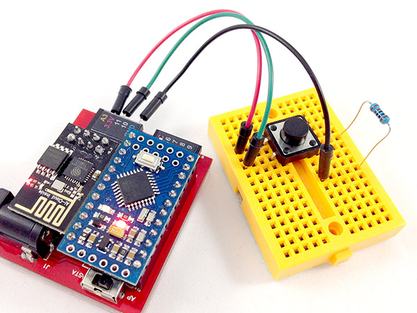
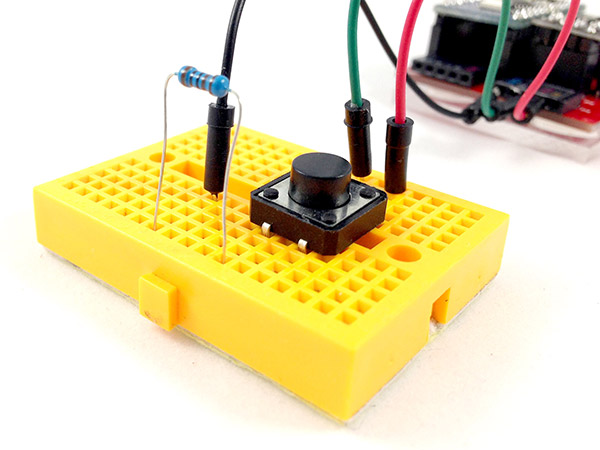

<!-- @@master  = ../../_layout.html-->

<!-- @@block  =  meta-->

<title>範例教學 9：利用按鈕控制 LED 燈 :::: Webduino = Web × Arduino</title>

<meta name="description" content="之前的範例提到的都只是控制單一台的 Webduino，這個範例將會展示，如何藉由 Webduino 開發板 ( A 板 ) 的按鈕，去觸發另外一台 Webduino 開發板 ( B 板 ) 的 LED 燈，同時你也可以藉由網頁上的按鈕模擬實際按鈕的動作。">

<meta itemprop="description" content="之前的範例提到的都只是控制單一台的 Webduino，這個範例將會展示，如何藉由 Webduino 開發板 ( A 板 ) 的按鈕，去觸發另外一台 Webduino 開發板 ( B 板 ) 的 LED 燈，同時你也可以藉由網頁上的按鈕模擬實際按鈕的動作。">

<meta property="og:description" content="之前的範例提到的都只是控制單一台的 Webduino，這個範例將會展示，如何藉由 Webduino 開發板 ( A 板 ) 的按鈕，去觸發另外一台 Webduino 開發板 ( B 板 ) 的 LED 燈，同時你也可以藉由網頁上的按鈕模擬實際按鈕的動作。">

<meta property="og:title" content="範例教學 9：利用按鈕控制 LED 燈" >

<meta property="og:url" content="http://webduino.io/tutorials/tutorial-09-button-led.html">

<meta property="og:image" content="http://webduino.io/img/tutorials/tutorial-09-01s.jpg">

<meta itemprop="image" content="http://webduino.io/img/tutorials/tutorial-09-01s.jpg">

<include src="../_include-tutorials.html"></include>

<!-- @@close-->

<!-- @@block  =  tutorials-->
#範例教學 9：利用按鈕控制 LED 燈

之前的範例提到的都只是控制單一台的 Webduino，這個範例將會展示，如何藉由 Webduino 開發板 ( A 板 ) 的按鈕，去觸發另外一台 Webduino 開發板 ( B 板 ) 的 LED 燈，同時你也可以藉由網頁上的按鈕模擬實際按鈕的動作。

##範例影片展示

<iframe class="youtube" src="https://www.youtube.com/embed/56DFEZ3hVaA" frameborder="0" allowfullscreen></iframe>

##接線與實作

- ###1. 接上按鈕與電阻

	按鈕是一個很常見的元件，當我們進行點壓的時候，按鈕上的四隻腳會呈現全部通路的情形，為了避免有短路的發生，所以我們要接一顆電阻進行保護，下圖是利用 webduino 開發板 ( A 板 ) 與麵包板所接出來的按鈕範例，這裏我們會用到腳位 3.3v、11 與 GND。

	

- ###2. 接上 LED

	在另外一塊 webduino 開發板 ( B 板 ) 接上 LED，長腳接在 11，短腳接在 GND。

	

- ###3. 完成後的實際長相

	

	

##範例解析 ( [jsbin 範例](http://jsbin.com/qihono/5/edit?html,js,output)、[檢查連線狀態](http://webduino.io/device.html) )

一開始要先引入相關的 js 與 WebComponents，因為這個範例會用到按鈕和 LED 這兩個傳感器，所以必須要引入這兩個元件的 WebComponent：`wa-ultrasonic`、`wa-rgbled`。

	
	<link rel='import' href='//webduino.io/components/webduino/web-arduino.html'></link>
	<link rel='import' href='//webduino.io/components/webduino/wa-button.html'></link>
	<link rel='import' href='//webduino.io/components/webduino/wa-led.html'></link>

因為我們有兩塊 webduino 開發板，所以必須要在 HTML 放入兩個 device，然後分別在一個 device 上插入按鈕，另外一個 device 裡頭插入 LED 燈，接著再放入一個網頁的按鈕，要讓這個網頁按鈕跟實體按鈕做一樣的事情。

	<!-- 放按鈕的 device -->
	<web-arduino id='board1' device='你的 device 名稱'>
	 <wa-button id='button' pin='11'></wa-button>
	</web-arduino>

	<!-- 放 LED 燈的 device -->
	<web-arduino id='board2' device='你的 device 名稱'>
	 <wa-led id='led' pin='11'></wa-led>
	</web-arduino>

	<button id='btn'>Click Me</button>

最後就是關鍵的 javascript 了，這裏一開始我們用了一個小技巧，就是判斷 board 是否 ready，因為我們接了兩個 webduino 開發板，所以必須要等待每個開發板都 ready 才可以正常運作，每個開發板都是一個 board ( 或 device )，每個 board ready 時數字就會加 1，當數字等於 2 的時候就表示 board ready 完成。
此外，我們這裡也用到按鈕的 api：`on`，當按鈕點選的時候就會觸發 LED 的 api：`toggle()`，就會呈現點一下亮，點一下暗的效果。

	window.addEventListener('WebComponentsReady', function() {
	 var board1 = document.getElementById('board1'),
	   board2 = document.getElementById('board2'),
	   boards = 0;

	 board1.on('ready', function() {
	   if (++boards === 2) {
	     boardsReady();
	    }
	  });

	 board2.on('ready', function() {
	   if (++boards === 2) {
	     boardsReady();
	    }
	  });
	}, false);

	function boardsReady() {
	 var button = document.getElementById('button'),
	   led = document.getElementById('led'),
	   btn = document.getElementById('btn');

	 button.on('pressed', function() {
	   led.toggle();
	  });

	 btn.addEventListener('click', function() {
	   led.toggle();
	 }, false);
	}

如果還有不清楚的，可以參考這個 [jsbin 範例](http://jsbin.com/qihono/5/edit?html,js,output)，實際在上面填入 device 名稱並且修改體驗相關效果

<!-- @@close-->