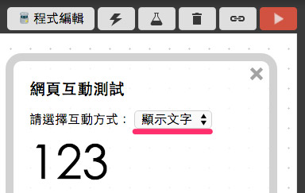
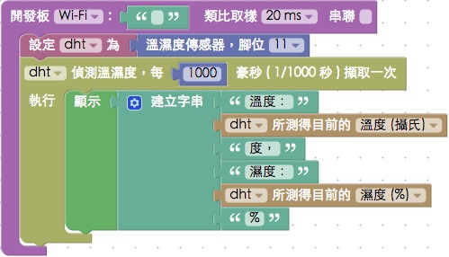
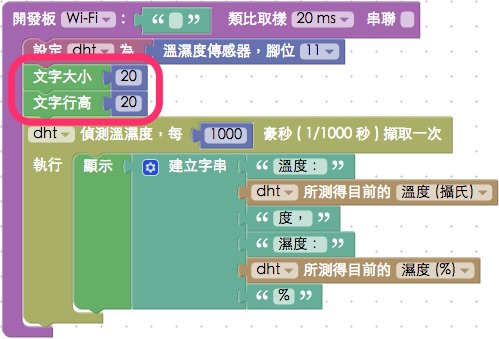
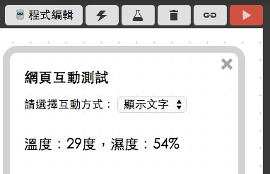

<!-- @@master  = ../../_layout.html-->

<!-- @@block  =  meta-->

<title>範例教學 10：溫濕度傳感器 :::: Webduino = Web × Arduino</title>

<meta name="description" content="溫濕度傳感器是接收外界環境變數最基本的傳感器，透過溫濕度傳感器，可以準確的偵測溫度與溼度的即時變化，若再搭配一些樣式表 ( CSS )、圖表工具 ( D3.js、Google Chart ) 或後端資料庫，就可以整合成為非常有用的數據收集應用。">

<meta itemprop="description" content="溫濕度傳感器是接收外界環境變數最基本的傳感器，透過溫濕度傳感器，可以準確的偵測溫度與溼度的即時變化，若再搭配一些樣式表 ( CSS )、圖表工具 ( D3.js、Google Chart ) 或後端資料庫，就可以整合成為非常有用的數據收集應用。">

<meta property="og:description" content="溫濕度傳感器是接收外界環境變數最基本的傳感器，透過溫濕度傳感器，可以準確的偵測溫度與溼度的即時變化，若再搭配一些樣式表 ( CSS )、圖表工具 ( D3.js、Google Chart ) 或後端資料庫，就可以整合成為非常有用的數據收集應用。">

<meta property="og:title" content="範例教學 10：溫濕度傳感器" >

<meta property="og:url" content="https://webduino.io/tutorials/tutorial-10-temperature-humidity-sensor.html">

<meta property="og:image" content="https://webduino.io/img/tutorials/tutorial-10-01s.jpg">

<meta itemprop="image" content="https://webduino.io/img/tutorials/tutorial-10-01s.jpg">

<include src="../_include-tutorials.html"></include>

<!-- @@close-->

<!-- @@block  =  tutorials-->
# 範例教學 10：溫濕度傳感器

溫濕度傳感器是接收外界環境變數最基本的傳感器，透過溫濕度傳感器，可以準確的偵測溫度與溼度的即時變化，若再搭配一些樣式表 ( CSS )、圖表工具 ( D3.js、Google Chart ) 或後端資料庫，就可以整合成為非常有用的數據收集應用。

## 範例影片展示

影片對應範例：[http://blockly.webduino.io/?page=tutorials/dht-1](http://blockly.webduino.io/?page=tutorials/dht-1) 

<iframe class="youtube" src="https://www.youtube.com/embed/T8sZL-UaUP0" frameborder="0" allowfullscreen></iframe>

## 接線與實作

溫濕度傳感器有四隻針腳，第一隻針腳為 v ( 接 3.3V )，第二隻為 data ( 接 10 )，第三隻沒有作用，為 N/C，第四隻為 GND。

可以直接將溫濕度傳感器接在馬克 1 號上，或利用麵包板接線出來。

實際接線照片：

## Webduino Blockly 操作解析

打開 Webduino Blockly 編輯工具 ( [http://blockly.webduino.io](http://blockly.webduino.io) )，因為這個範例會用網頁「顯示文字」來顯示溫度或濕度，所以要先點選右上方「網頁互動測試」的按鈕，打開內嵌測試的網頁，用下拉選單選擇「顯示文字」。

把開發板放到編輯畫面裡，填入對應的 Webduino 開發板名稱，開發板內放入溫濕度積木，名稱設定為 dht，腳位設定為 11，接著放入每多久偵測一次溫濕度的積木，時間設定為 1000 毫秒 ( 1 秒 )。

因為顯示文字只有一個，要同時顯示溫濕度的話就要使用「建立字串」的積木，建立字串積木預設只有一個缺口，我們可以點選藍色小齒輪，增加缺口的數量。

口了缺口後，在缺口內填入對應的文字以及偵測到的溫濕度。

如果顯示出來的文字太大，或者行高太窄，我們也可以利用文字樣式的積木來調整，這裏將文字和行高都設為 20。

完成後，確認開發板上線 ( 點選「[檢查連線狀態](https://webduino.io/device.html)」查詢 )，點選紅色的執行按鈕，就可以看到當下的溫濕度，如果用吹風機或嘴呼氣，就會看到溫濕度的變化了。

## 程式碼解析 ( [jsbin 範例](http://bin.webduino.io/xaxe/edit?html,js,output)、[檢查連線狀態](https://webduino.io/device.html) )

HTML 的 header 引入 `webduino-all.min.js`，目的在讓瀏覽器可以支援 WebComponents 以及 Webduino 所有的元件，如果是用 Blockly 編輯工具產生的程式碼，則要額外引入 `webduino-blockly.js`。

	
	

HTML 裡頭有一個 span，負責顯示文字。

	123

JavaScript 用了一個 `read` 的方法來讀取溫濕度，`read` 的第一個參數是做動作的函式，第二個參數是時間，可以看到這裡時間設定為 1000 ( 毫秒 )，然後顯示文字使用了 innerHTML 來呈現，字體大小與行高則是用 `style` 來修改。  

	var dht;

	boardReady('', function (board) {
	  board.samplingInterval = 20;
	  dht = getDht(board, 11);
	  document.getElementById("demo-area-01-show").style.fontSize = 20+"px";
	  document.getElementById("demo-area-01-show").style.lineHeight = 20+"px";
	  dht.read(function(evt){
	    document.getElementById("demo-area-01-show").innerHTML = (['溫度：',dht.temperature,'度，','濕度：',dht.humidity,'%'].join(''));
	  }, 1000);
	});

以上就是利用溫濕度傳感器，來偵測環境溫濕度的教學範例。  
完整程式碼：[http://bin.webduino.io/xaxe/edit?html,js,output](http://bin.webduino.io/xaxe/edit?html,js,output)  
解答：[http://blockly.webduino.io/#-K79kCuHvGneUStvVcye](http://blockly.webduino.io/#-K79kCuHvGneUStvVcye)

## 超音波傳感器的延伸教學：

[Webduino Blockly 課程 5-2：繪製溫濕度圖表](http://blockly.webduino.io/?lang=zh-hant&page=tutorials/dht-2#-Jvwiwd_Lr9F5j5Oz4-N)  
[Webduino Blockly 課程 5-3：使用 Firebase 紀錄溫濕度數值](http://blockly.webduino.io/?lang=zh-hant&page=tutorials/dht-3#-JxAbDN7TNVwWDlh85y4)

<!-- @@close-->