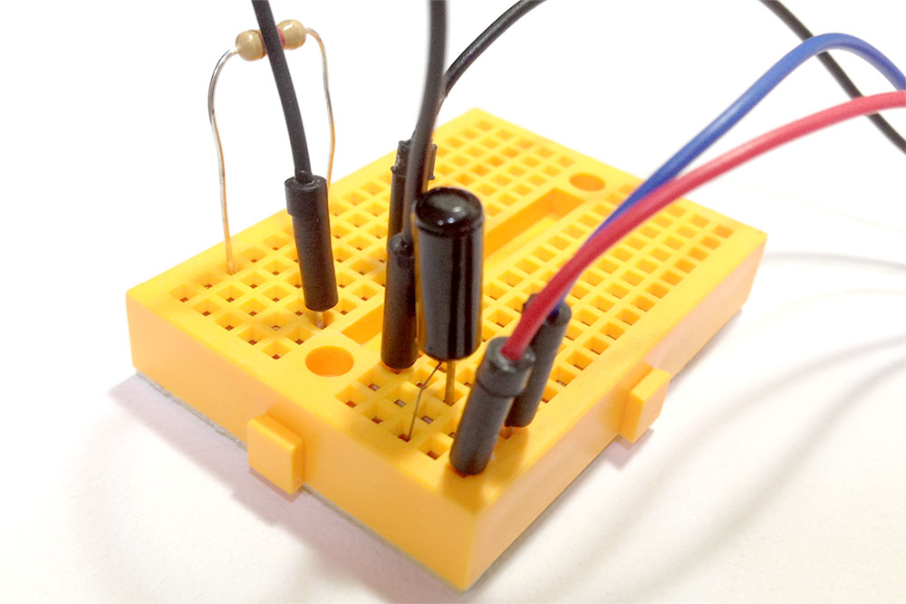
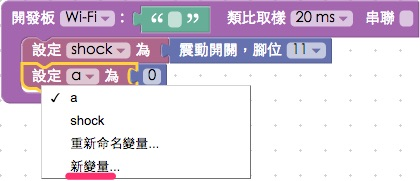
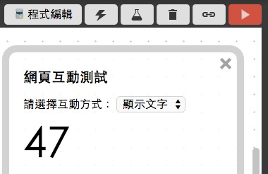

<!-- @@master  = ../../_layout.html-->

<!-- @@block  =  meta-->

<title>教學範例 11：震動開關改變網頁數值 :::: Webduino = Web × Arduino</title>

<meta name="description" content="震動開關裡頭有一個金屬導電彈簧以及金屬導電腳，金屬彈簧延伸到塑膠外殼外部是一條比較細的金屬線，因此在晃動的時候，內部互相接觸進而短路導電，原理和之前所提到的按鈕類似，只是震動開關利用震動的方式，控制電路的開或關。">

<meta itemprop="description" content="震動開關裡頭有一個金屬導電彈簧以及金屬導電腳，金屬彈簧延伸到塑膠外殼外部是一條比較細的金屬線，因此在晃動的時候，內部互相接觸進而短路導電，原理和之前所提到的按鈕類似，只是震動開關利用震動的方式，控制電路的開或關。">

<meta property="og:description" content="震動開關裡頭有一個金屬導電彈簧以及金屬導電腳，金屬彈簧延伸到塑膠外殼外部是一條比較細的金屬線，因此在晃動的時候，內部互相接觸進而短路導電，原理和之前所提到的按鈕類似，只是震動開關利用震動的方式，控制電路的開或關。">

<meta property="og:title" content="教學範例 11：震動開關改變網頁數值" >

<meta property="og:url" content="https://webduino.io/tutorials/ttutorial-11-shock-button.html">

<meta property="og:image" content="https://webduino.io/img/tutorials/tutorial-11-01s.jpg">

<meta itemprop="image" content="https://webduino.io/img/tutorials/tutorial-11-01s.jpg">

<include src="../_include-tutorials.html"></include>

<!-- @@close-->

<!-- @@block  =  tutorials-->
# 教學範例 11：震動開關改變網頁數值

震動開關的結構如下圖所示，裡頭有一個金屬導電彈簧以及金屬導電腳，金屬彈簧延伸到塑膠外殼外部是一條比較細的金屬線，因此在晃動的時候，內部互相接觸進而短路導電，原理和之前所提到的按鈕類似，只是震動開關利用震動的方式，控制電路的開或關。

## 範例影片展示

影片對應範例：[http://blockly.webduino.io/?page=tutorials/shock-1](http://blockly.webduino.io/?page=tutorials/shock-1) 

<iframe class="youtube" src="https://www.youtube.com/embed/Xv85frAw4uI" frameborder="0" allowfullscreen></iframe>

## 接線與實作

震動開關有一粗一細的針腳，粗的針腳接 11，細的針腳接 3.3V，為了避免開關開的時候瞬間短路，在電路裡頭加上一個電阻，按照下圖的接法與 GND 相連，在把震動開關放上麵包板時，可以清楚地看到一粗一細的針腳，不用擔心細的針腳無法感應，與粗的針腳同樣安插進入麵包板內即可。

實際接線照片：

## Webduino Blockly 操作解析

打開 Webduino Blockly 編輯工具 ( [http://blockly.webduino.io](http://blockly.webduino.io) )，因為這個範例會用網頁「顯示文字」來顯示按鈕開關當下數字，增加以後的數字也會不斷累加出來，所以要先點選右上方「網頁互動測試」的按鈕，打開內嵌測試的網頁，用下拉選單選擇「顯示文字」。

把開發板放到編輯畫面裡，填入對應的 Webduino 開發板名稱，開發板內放入震動開關積木，名稱設定為 shock，腳位設定為 11。

放入一個「變數」的積木，選擇「新變量」設定新的變量名稱，並且賦予這個變量數值 0 ( 使用數學式積木 )。

接著放入偵測到震動開關通路的積木，裡面擺入一個數學式，內容為「a = a + 1」，這表示每次偵測到震動開關通電時，a 的數值就會加 1，同時把 a 顯示在網頁裡。

完成後，確認開發板上線 ( 點選「[檢查連線狀態](https://webduino.io/device.html)」查詢 )，點選紅色的執行按鈕，輕觸震動開關，就會看到數字往上開始累加上去了。( 解答：[http://blockly.webduino.io/#-K7A61JY3A5XBRan10Kz](http://blockly.webduino.io/#-K7A61JY3A5XBRan10Kz) )

## 程式碼解析 ( [完整程式碼](http://bin.webduino.io/suyam/edit?html,css,js,output)、[檢查連線狀態](https://webduino.io/device.html) )

HTML 的 header 引入 `webduino-all.min.js`，目的在讓瀏覽器可以支援 WebComponents 以及 Webduino 所有的元件，如果是用 Blockly 編輯工具產生的程式碼，則要額外引入 `webduino-blockly.js`。

	
	

HTML 裡頭有一個 span，負責顯示文字。

	123

JavaScript 和按鈕開關類似，都是使用 `on` 的方法，只是裡面如果是 `high` 就是通電，`low` 就是斷電，通電時讓 a = a + 1，然後用 `innerHTML` 來顯示。

	var shock;
	var a;

	boardReady('', function (board) {
	  board.samplingInterval = 20;
	  shock = getShock(board, 11);
	  a = 0;
	  document.getElementById("demo-area-01-show").innerHTML = a;
	  shock.on("high",function(){
	    console.log("high");
	      a = a + 1;
	    document.getElementById("demo-area-01-show").innerHTML = a;

	  });
	});

以上就是利用震動開關，來增加數值並顯示在網頁上。  
完整程式碼：[http://bin.webduino.io/suyam/edit?html,css,js,output](http://bin.webduino.io/suyam/edit?html,css,js,output)  
解答：[http://blockly.webduino.io/#-K7A61JY3A5XBRan10Kz](http://blockly.webduino.io/#-K7A61JY3A5XBRan10Kz)

## 震動開關的延伸教學：

[Webduino Blockly 課程 10-2：震動按鈕開關改變圖片位置](http://blockly.webduino.io/?lang=zh-hant&page=tutorials/shock-2#-Jw1KUKUyvZIS_b4pQJ9)

<!-- @@close-->