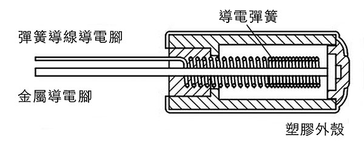
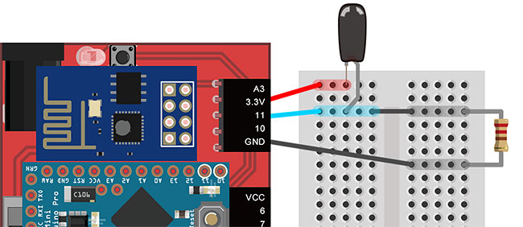
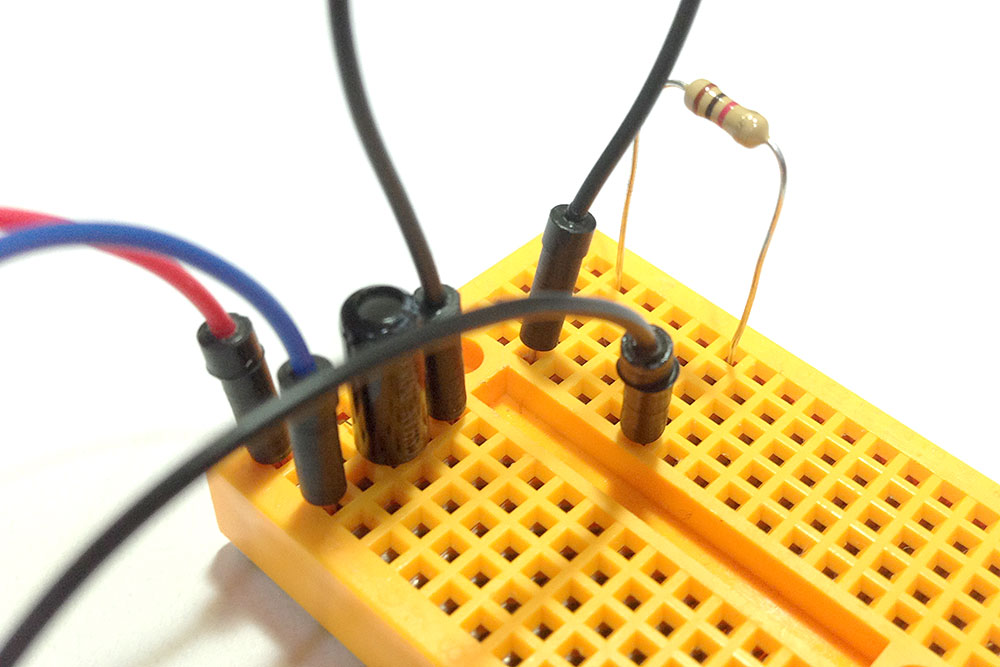

<!-- @@master  = ../../_layout.html-->

<!-- @@block  =  meta-->

<title>範例教學 11：震動開關改變網頁數值 :::: Webduino = Web × Arduino</title>

<meta name="description" content="震動開關裡頭有一個金屬導電彈簧以及金屬導電腳，金屬彈簧延伸到塑膠外殼外部是一條比較細的金屬線，因此在晃動的時候，內部互相接觸進而短路導電，原理和之前所提到的按鈕類似，只是震動開關利用震動的方式，控制電路的開或關。">

<meta itemprop="description" content="震動開關裡頭有一個金屬導電彈簧以及金屬導電腳，金屬彈簧延伸到塑膠外殼外部是一條比較細的金屬線，因此在晃動的時候，內部互相接觸進而短路導電，原理和之前所提到的按鈕類似，只是震動開關利用震動的方式，控制電路的開或關。">

<meta property="og:description" content="震動開關裡頭有一個金屬導電彈簧以及金屬導電腳，金屬彈簧延伸到塑膠外殼外部是一條比較細的金屬線，因此在晃動的時候，內部互相接觸進而短路導電，原理和之前所提到的按鈕類似，只是震動開關利用震動的方式，控制電路的開或關。">

<meta property="og:title" content="範例教學 11：震動開關改變網頁數值" >

<meta property="og:url" content="http://webduino.io/tutorials/ttutorial-11-shock-button.html">

<meta property="og:image" content="http://webduino.io/img/tutorials/tutorial-11-01s.jpg">

<meta itemprop="image" content="http://webduino.io/img/tutorials/tutorial-11-01s.jpg">

<include src="../_include-tutorials.html"></include>

<!-- @@close-->

<!-- @@block  =  tutorials-->
#範例教學 11：震動開關改變網頁數值

震動開關的結構如下圖所示，裡頭有一個金屬導電彈簧以及金屬導電腳，金屬彈簧延伸到塑膠外殼外部是一條比較細的金屬線，因此在晃動的時候，內部互相接觸進而短路導電，原理和之前所提到的按鈕類似，只是震動開關利用震動的方式，控制電路的開或關。

##範例影片展示

<iframe class="youtube" src="https://www.youtube.com/embed/poVfvirqHY8" frameborder="0" allowfullscreen></iframe>

##接線與實作

- ###1. 接上溫濕度傳感器

	震動開關有一粗一細的針腳，粗的針腳接 11，細的針腳接 3.3V，為了避免開關開的時候瞬間短路，在電路裡頭加上一個電阻，按照下圖的接法與 GND 相連。

	

- ###2. 完成後的實際長相

	

	在把震動開關放上麵包板時，可以清楚地看到一粗一細的針腳，不用擔心細的針腳無法感應，與粗的針腳同樣安插進入麵包板內即可。

	

	為了避免短路，安插上電阻進行保護的動作。

	

##範例解析 ([快速體驗](http://webduinoio.github.io/samples/content/shock-button/index.html)、[jsbin 範例](http://jsbin.com/pagoyi/8/edit?html,js,output)、[檢查連線狀態](http://webduino.io/device.html))

一開始我們只要在 head 引入震動開關的 WebComponents：`webduino/wa-shock.html`。

	
	<link rel='import' href='//webduino.io/components/webduino/web-arduino.html'></link>
	<link rel='import' href='//webduino.io/components/webduino/wa-shock.html'></link>

接著在 body 的地方放上 webduino 開發板，內容放上`wa-shock`的元件，下方並放入一個 id 為 show 的區域，作為顯示數值使用。

	<web-arduino id='board' device='你的 device 名稱'>
	  <wa-shock id='shock' pin='11'></wa-shock>
	</web-arduino>
	

完成之後就來寫 javascript，一如往常的先宣告 board，比較特別的是加上一個變數 a，利用震動開關的 API `on` 來判斷 high 還是 low ( 高電位或低電位 )，如果是 high 就讓 a 加 1，low 就維持不變，接著只要再把 a 用 show 顯示出來即可。

	window.addEventListener('WebComponentsReady', function() {
	    var board = document.getElementById('board');

	    board.on('ready', function() {
	        boardsReady();
	    });
	  }, false);

	function boardsReady() {
	    var shock = document.getElementById('shock'),
	        a=0;
	document.getElementById('show').innerHTML=a;
	    shock.on('high', function() {
	      a=a+1; document.getElementById('show').innerHTML=a;
	    });
	    shock.on('low', function() {
	      a=a; document.getElementById('show').innerHTML=a;
	    });

	}

如果還有不清楚的，不妨利用這個 [快速體驗](http://webduinoio.github.io/samples/content/shock-button/index.html)，輸入 device 號碼，搖搖看震動開關，就會發現數字跟著變化囉。

<!-- @@close-->