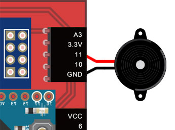
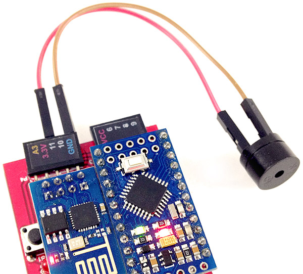

<!-- @@master  = ../../_layout.html-->

<!-- @@block  =  meta-->

<title>範例教學 13：蜂鳴器播放自製音樂 :::: Webduino = Web × Arduino</title>

<meta name="description" content="蜂鳴器是一個可以產生聲音信號的裝置，使用直流電供電，接通訊號源之後，音訊信號電流通過電磁線圈，使電磁線圈產生磁場，造成 振動膜片週期性地振動發聲，而 Webduino 更可以藉由 HTML5 Attribute 來填入音符代碼，每個代碼都會對應到一個數值，這個數值相對應蜂鳴器聲音的頻率，因此藉由純粹的 HTML5 或 javascript 就可以編輯音樂，透過蜂鳴器發聲。">

<meta itemprop="description" content="蜂鳴器是一個可以產生聲音信號的裝置，使用直流電供電，接通訊號源之後，音訊信號電流通過電磁線圈，使電磁線圈產生磁場，造成 振動膜片週期性地振動發聲，而 Webduino 更可以藉由 HTML5 Attribute 來填入音符代碼，每個代碼都會對應到一個數值，這個數值相對應蜂鳴器聲音的頻率，因此藉由純粹的 HTML5 或 javascript 就可以編輯音樂，透過蜂鳴器發聲。">

<meta property="og:description" content="蜂鳴器是一個可以產生聲音信號的裝置，使用直流電供電，接通訊號源之後，音訊信號電流通過電磁線圈，使電磁線圈產生磁場，造成 振動膜片週期性地振動發聲，而 Webduino 更可以藉由 HTML5 Attribute 來填入音符代碼，每個代碼都會對應到一個數值，這個數值相對應蜂鳴器聲音的頻率，因此藉由純粹的 HTML5 或 javascript 就可以編輯音樂，透過蜂鳴器發聲。">

<meta property="og:title" content="範例教學 13：蜂鳴器播放自製音樂" >

<meta property="og:url" content="http://webduino.io/tutorials/tutorial-13-buzzer.html">

<meta property="og:image" content="http://webduino.io/img/tutorials/tutorial-13-01s.jpg">

<meta itemprop="image" content="http://webduino.io/img/tutorials/tutorial-13-01s.jpg">

<include src="../_include-tutorials.html"></include>

<!-- @@close-->

<!-- @@block  =  tutorials-->

#範例教學 13：蜂鳴器播放自製音樂

蜂鳴器是一個可以產生聲音信號的裝置，使用直流電供電，接通訊號源之後，音訊信號電流通過電磁線圈，使電磁線圈產生磁場，造成 振動膜片週期性地振動發聲，而 Webduino 更可以藉由 HTML5 Attribute 來填入音符代碼，每個代碼都會對應到一個數值，這個數值相對應蜂鳴器聲音的頻率，因此藉由純粹的 HTML5 或 javascript 就可以編輯音樂，透過蜂鳴器發聲。

##範例影片展示 ( 請開聲音 )

<iframe class="youtube" src="https://www.youtube.com/embed/jB3GvT4q0k4" frameborder="0" allowfullscreen></iframe>

##接線與實作

- ###1. 接上蜂鳴器

	蜂鳴器在電路板的附近，有標示「+」和「-」的符號，「-」接在開發板的 GND，「+」接在 11 的腳位。

	

- ###2. 完成後的實際長相

	

	

##範例解析 ([快速體驗](http://webduinoio.github.io/samples/content/buzzer/index.html)、[jsbin 範例](http://bin.webduino.io/hud/5/edit?html,js,output)、[檢查連線狀態](http://webduino.io/device.html))

在 head 的地方引入相關的 WebComponents，主要是要引入蜂鳴器的 WebComponent：`wa-buzzer.html`。

	
	<link rel='import' href='http://webduino.io/components/webduino/web-arduino.html'></link>
	<link rel='import' href='http://webduino.io/components/webduino/wa-buzzer.html'></link>

蜂鳴器的重點在 HTML 的部分，在 body 部分先放入蜂鳴器，接著就是要撰寫相關的 HTML5 Attribute，這裏最重要的屬性有兩個：`notes` 和 `tempos`，notes 是要填入對應的音符陣列 ( 可參考這篇[介紹文章](http://wiki.micropython.org/Play-Tone) )，而 tempos 是填入每個音符的時間數值陣列，如果填寫 1 則是 1/1 秒，填入 10 則是 1/10 秒，如果都不填寫的話則會預設 1/10 秒。此外，也可以填入 `autoplay` 的屬性，只要頁面載入之後就會自動播放。

	<web-arduino id='board' device='你的 device 名稱'>
	  <wa-buzzer id='buzzer' pin='11' notes='E7,E7,0,E7,0,C7,E7,0,G7,0,0,0,G6,0,0,0,C7,0,0,G6,0,0,E6,0,0,A6,0,B6,0,AS6,A6,0,G6,E7,0,G7,A7,0,F7,G7,0,E7,0,C7,D7,B6,0,0,C7,0,0,G6,0,0,E6,0,0,A6,0,B6,0,AS6,A6,0,G6,E7,0,G7,A7,0,F7,G7,0,E7,0,C7,D7,B6,0,0' tempos='' ></wa-buzzer>
	</web-arduino>

	<button id="play">play</button>

上面的 HTML 是只填寫 notes 而已，下面的範例是有填寫 tempos，基本上 notes 長度多少 tempos 長度也要設為多少，下面的 HTML 可以展示不同聲音長度的效果。( [jsbin 範例](http://bin.webduino.io/qiq/4/edit?html,js,output) )

	<web-arduino id='board' device='你的 device 名稱'>
	  <wa-buzzer id='buzzer' pin='11' notes='c4,d4,e4,f4,g4,a4,b4,c5' tempos='1,2,3,4,5,6,7,8' ></wa-buzzer>
	</web-arduino>

	<button id="play">play</button>

了解 HTML 之後，javascript 就簡單多了，因為是 HTML5 Attribute，所以我們可以用 javascript 的 setAttribute 來設定屬性，或是使用 buzzer 的 API `play()` 來進行播放。

	window.addEventListener('WebComponentsReady', function () {
	  var board = document.getElementById('board');
	  
	  board.on('ready',function ready() {
	    var  buzzer = document.getElementById('buzzer');
	           
	    
	    play.addEventListener('click', function(){
	      buzzer.play();
	    }); 
	      
	    
	  });
	   
	}, false);

如果還有不清楚的，不妨利用這個 [快速體驗](http://webduinoio.github.io/samples/content/buzzer/index.html)，輸入 device 號碼，點選 play 就會開始播放馬力歐的音樂囉。

<!-- @@close-->