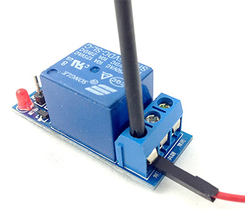
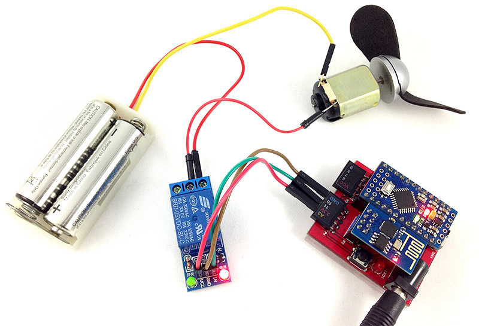

<!-- @@master  = ../../_layout.html-->

<!-- @@block  =  meta-->

<title>範例教學 14：繼電器控制風扇旋轉 :::: Webduino = Web × Arduino</title>

<meta name="description" content="繼電器是一種電子控制器件，它具有控制系統和被控制系統，通常應用於自動控制電路中，是用較小的電流去控制較大電流的一種「自動開關」，在電路中起著自動調節、安全保護、轉換電路等作用，當我們開始用 Webduino 控制繼電器，就可以非常簡單的做出利用網頁控制的智慧插座或自動開關。">

<meta itemprop="description" content="繼電器是一種電子控制器件，它具有控制系統和被控制系統，通常應用於自動控制電路中，是用較小的電流去控制較大電流的一種「自動開關」，在電路中起著自動調節、安全保護、轉換電路等作用，當我們開始用 Webduino 控制繼電器，就可以非常簡單的做出利用網頁控制的智慧插座或自動開關。">

<meta property="og:description" content="繼電器是一種電子控制器件，它具有控制系統和被控制系統，通常應用於自動控制電路中，是用較小的電流去控制較大電流的一種「自動開關」，在電路中起著自動調節、安全保護、轉換電路等作用，當我們開始用 Webduino 控制繼電器，就可以非常簡單的做出利用網頁控制的智慧插座或自動開關。">

<meta property="og:title" content="範例教學 14：繼電器控制風扇旋轉" >

<meta property="og:url" content="https://webduino.io/tutorials/tutorial-14-relay.html">

<meta property="og:image" content="https://webduino.io/img/tutorials/tutorial-14-01s.jpg">

<meta itemprop="image" content="https://webduino.io/img/tutorials/tutorial-14-01s.jpg">

<include src="../_include-tutorials.html"></include>

<!-- @@close-->

<!-- @@block  =  tutorials-->

#範例教學 14：繼電器控制風扇旋轉

繼電器是一種電子控制器件，它具有控制系統和被控制系統，通常應用於自動控制電路中，是用較小的電流去控制較大電流的一種「自動開關」，在電路中起著自動調節、安全保護、轉換電路等作用，當我們開始用 Webduino 控制繼電器，就可以非常簡單的做出利用網頁控制的智慧插座或自動開關。

##範例影片展示

<iframe class="youtube" src="https://www.youtube.com/embed/Z3x_qW7fXzM" frameborder="0" allowfullscreen></iframe>

##接線與實作

- ###1. 接上繼電器與風扇

	這個範例會用到兩組電源，其中一組電源提供 Webduino 開發板使用，另外一組電源則是供應繼電器使用，在繼電器上頭有紅燈綠燈的一側，具有三個腳位，將 VCC 接在 Webduino 3.3V 的腳位，GND 接在 GND 的腳位，IN 接在 9 的位置，繼電器的另外一側需要用十字螺絲起子來接線 ( 因為這一側通常會接大電流的電器 )，將風扇的其中一條電線接在繼電器的「常開」，另外一條電線和電源接上，而電源的另外一條線則接在繼電器的「共用」。

	 

	

- ###2. 完成後的實際長相

	

	利用十字螺絲起子，將電線旋緊。

	

	斷路時繼電器會亮紅色的燈，通路時會亮綠色的燈。

	

	

##範例解析 ([快速體驗](http://webduinoio.github.io/samples/content/relay/index.html)、[jsbin 範例](http://bin.webduino.io/qab/edit?html,js,output)、[檢查連線狀態](https://webduino.io/device.html))

在 head 的地方引入相關的 WebComponents，主要是要引入繼電器的 WebComponent：`wa-relay.html`。

	
	<link rel='import' href='https://webduino.io/components/webduino/web-arduino.html'></link>
	<link rel='import' href='https://webduino.io/components/webduino/wa-relay.html'></link>

body 的部分就滿簡單的，先放入 Webduino 開發板，裡頭放入繼電器。

	

	  </img>
	  </img>
	

	<web-arduino id="board" device='你的 Device 名稱'>
	  <wa-relay id='relay' pin='9'></wa-led>
	</web-arduino>

再來寫寫 CSS ，作用是來控制電燈明暗，電燈亮表示通電，電扇就會轉動。

	#light img{
	  width:100%;
	  display:none;
	}
	#light.off img:first-child{
	  display:inline-block;
	}
	#light.on img:last-child{
	  display:inline-block;
	}

javascript 也滿好上手的，跟控制 LED 大同小異，都是用 `on` 和 `off` 來進行控制。

	window.addEventListener('WebComponentsReady', function () {
	  var board = document.getElementById('board'),
	      light = document.getElementById('light');
	  
	  board.on('ready',function ready() {
	    var relay = document.getElementById('relay');

	    light.addEventListener('click', function() {
	      if(light.className == 'on'){
	        relay.off();
	        light.className = 'off';
	      }else{
	        relay.on();
	        light.className = 'on';
	      }
	    }, false);
	  });
	   
	}, false);

如果還有不清楚的，不妨利用這個 [快速體驗](http://webduinoio.github.io/samples/content/relay/index.html)，輸入 device 號碼，點選燈泡，風扇就會轉動，其實控制繼電器的程式並不難，主要都難在電路的接線上，學會之後就可以去控制家裡的電器囉。

<!-- @@close-->