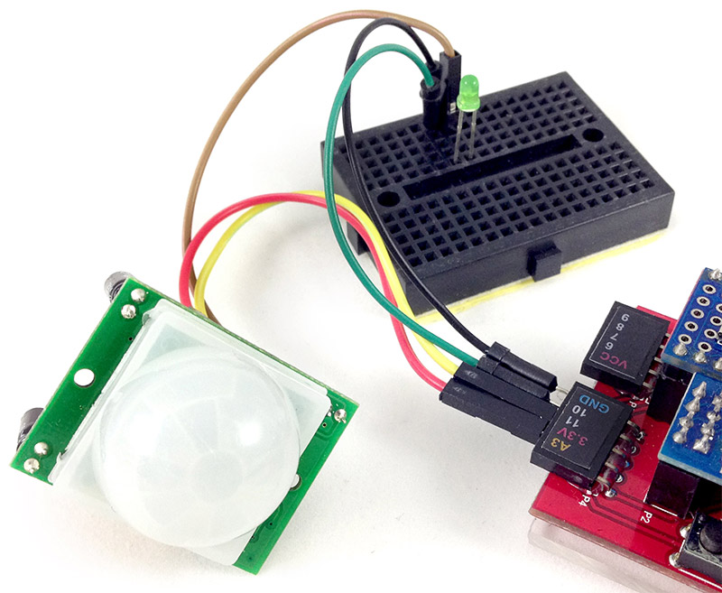
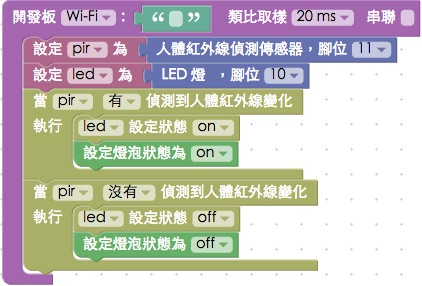

<!-- @@master  = ../../_layout.html-->

<!-- @@block  =  meta-->

<title>教學範例 15：人體紅外線偵測控制 LED :::: Webduino = Web × Arduino</title>

<meta name="description" content="人體紅外線偵測傳感器 ( PIR ) 可以偵測紅外線的反應變化，當接收到人體發射的紅外線，就會觸發相對應的動作，這個範例利用 Webduino，在人體紅外線傳感器接收到訊號時，觸發網頁的燈泡亮起，同時也讓 LED 燈發光。">

<meta itemprop="description" content="人體紅外線偵測傳感器 ( PIR ) 可以偵測紅外線的反應變化，當接收到人體發射的紅外線，就會觸發相對應的動作，這個範例利用 Webduino，在人體紅外線傳感器接收到訊號時，觸發網頁的燈泡亮起，同時也讓 LED 燈發光。">

<meta property="og:description" content="人體紅外線偵測傳感器 ( PIR ) 可以偵測紅外線的反應變化，當接收到人體發射的紅外線，就會觸發相對應的動作，這個範例利用 Webduino，在人體紅外線傳感器接收到訊號時，觸發網頁的燈泡亮起，同時也讓 LED 燈發光。">

<meta property="og:title" content="教學範例 15：人體紅外線偵測控制 LED" >

<meta property="og:url" content="https://webduino.io/tutorials/tutorial-15-pir-led.html">

<meta property="og:image" content="https://webduino.io/img/tutorials/tutorial-15-01s.jpg">

<meta itemprop="image" content="https://webduino.io/img/tutorials/tutorial-15-01s.jpg">

<include src="../_include-tutorials.html"></include>

<!-- @@close-->

<!-- @@block  =  tutorials-->

# 教學範例 15：人體紅外線偵測控制 LED

人體紅外線偵測傳感器 ( PIR ) 可以偵測紅外線的反應變化，當接收到人體發射的紅外線，就會觸發相對應的動作，這個範例利用 Webduino，在人體紅外線傳感器接收到訊號時，觸發網頁的燈泡亮起，同時也讓 LED 燈發光。

## 範例影片展示

影片對應範例：[http://blockly.webduino.io/?page=tutorials/pir-2](http://blockly.webduino.io/?page=tutorials/pir-2) 

<iframe class="youtube" src="https://www.youtube.com/embed/3873nza-ywo" frameborder="0" allowfullscreen></iframe>

## 接線與實作

我們將人體紅外線偵測傳感器的 VCC 接在 Webduino 開發板 VCC 的位置，GND 接在 GND 的位置，訊號源接在 11 號腳位，LED 燈與人體紅外線偵測傳感器共用 GND，長腳則接在 10 的位置，人體紅外線偵測傳感器上頭有兩顆旋鈕，SX 是靈敏度，TX 是偵測到訊號後延遲的時間，可用十字螺絲起子或用手指進行調整。

實際接線照片：

## Webduino Blockly 操作解析

打開 Webduino Blockly 編輯工具 ( [http://blockly.webduino.io](http://blockly.webduino.io) )，因為這個範例會用網頁「點擊燈泡」來跟 LED 燈互相搭配，所以要先點選右上方「網頁互動測試」的按鈕，打開內嵌測試的網頁，用下拉選單選擇「點擊燈泡」。

把開發板放到編輯畫面裡，填入對應的 Webduino 開發板名稱，開發板內放入人體紅外線偵測積木，名稱設定為 pir，腳位設定為 11，LED 的積木名稱設定為 led，腳位設定 10。

接著放入「有」偵測到人體紅外線的積木，裡面放入點亮 LED 和燈泡的積木，反之「沒有」偵測到人體紅外線的積木，就是熄滅 LED 燈和燈泡圖案。

完成後，確認開發板上線 ( 點選「[檢查連線狀態](https://webduino.io/device.html)」查詢 )，點選紅色的執行按鈕，就可以用遮蔽物遮住人體紅外線傳感器，把遮蔽物移開並用手在傳感器前面晃呀晃，就可以看到 LED 燈和燈泡圖片被點亮。

## 程式碼解析 ( [jsbin 範例](http://bin.webduino.io/poti/edit?html,js,output)、[檢查連線狀態](https://webduino.io/device.html) )

HTML 的 header 引入 `webduino-all.min.js`，目的在讓瀏覽器可以支援 WebComponents 以及 Webduino 所有的元件，如果是用 Blockly 編輯工具產生的程式碼，則要額外引入 `webduino-blockly.js`。

	
	

接著看到 HTML 的 body 裡頭，放入一個 id 為 demo-area-02-light 的圖片區域，裡面含有兩張分別是亮起的燈泡與不亮的燈泡圖片，目的在於點選的時候，圖片也會從不亮的燈泡轉變為亮起的燈泡。

	

	  
	  
	

控制燈泡圖片亮暗的是使用 CSS 的方式，用圖片顯示的切換 display:none; 來達到相關效果，下面是 CSS 的程式碼。

	#demo-area-02-light img{
	  height:200px;
	  display:none;
	}
	#demo-area-02-light.on #demo-area-02-on{
	  display:inline-block;
	}
	#demo-area-02-light.off #demo-area-02-off{
	  display:inline-block;
	}

JavaScript 主要用到兩個人體紅外線偵測的 API：`detected`、`ended`，分別表示偵測到紅外線以及結束偵測，內容放上對應的事件即可。

	var pir;
	var led;

	boardReady('', function (board) {
	  board.samplingInterval = 20;
	  pir = getPir(board, 11);
	  led = getLed(board, 10);
	  pir.on("detected",function(){
	    led.on();
	    document.getElementById("demo-area-02-light").className = "on";

	  });
	  pir.on("ended",function(){
	    led.off();
	    document.getElementById("demo-area-02-light").className = "off";

	  });
	});

以上就是利用人體紅外線偵測傳感器，來偵測有無人體紅外線變化並且點亮 LED 燈。   
完整程式碼：[http://bin.webduino.io/poti/edit?html,js,output](http://bin.webduino.io/poti/edit?html,js,output)  
解答：[http://blockly.webduino.io/#-K7AzpcgHb2gua5SK_N8](http://blockly.webduino.io/#-K7AzpcgHb2gua5SK_N8)

## 人體紅外線偵測傳感器的延伸教學：

[Webduino Blockly 課程 6-1：偵測人體紅外線](http://blockly.webduino.io/?lang=zh-hant&page=tutorials/pir-1#-JvxRwAXj4ccyigeuI8o)  

<!-- @@close-->