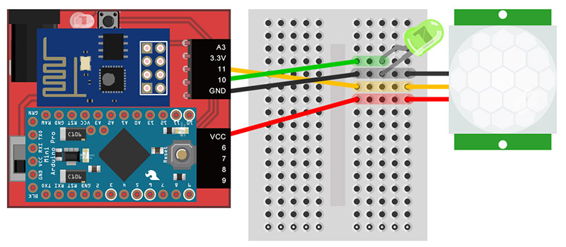
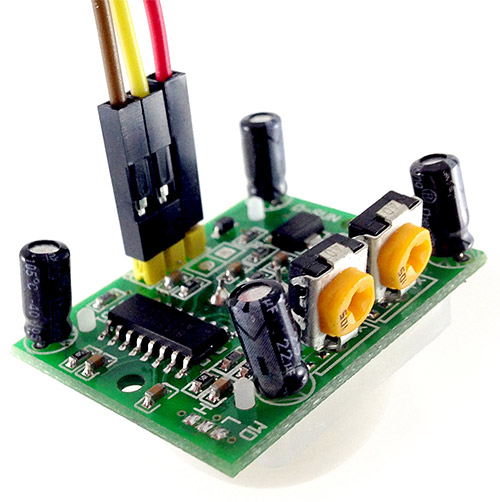
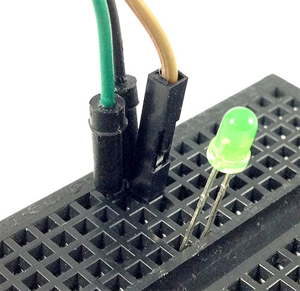

<!-- @@master  = ../../_layout.html-->

<!-- @@block  =  meta-->

<title>範例教學 15：人體紅外線偵測控制 LED :::: Webduino = Web × Arduino</title>

<meta name="description" content="人體紅外線偵測傳感器 ( PIR ) 可以偵測紅外線的反應變化，當接收到人體發射的紅外線，就會觸發相對應的動作，這個範例利用 Webduino，在人體紅外線傳感器接收到訊號時，觸發網頁的燈泡亮起，同時也讓 LED 燈發光。">

<meta itemprop="description" content="人體紅外線偵測傳感器 ( PIR ) 可以偵測紅外線的反應變化，當接收到人體發射的紅外線，就會觸發相對應的動作，這個範例利用 Webduino，在人體紅外線傳感器接收到訊號時，觸發網頁的燈泡亮起，同時也讓 LED 燈發光。">

<meta property="og:description" content="人體紅外線偵測傳感器 ( PIR ) 可以偵測紅外線的反應變化，當接收到人體發射的紅外線，就會觸發相對應的動作，這個範例利用 Webduino，在人體紅外線傳感器接收到訊號時，觸發網頁的燈泡亮起，同時也讓 LED 燈發光。">

<meta property="og:title" content="範例教學 15：人體紅外線偵測控制 LED" >

<meta property="og:url" content="https://webduino.io/tutorials/tutorial-15-pir-led.html">

<meta property="og:image" content="https://webduino.io/img/tutorials/tutorial-15-01s.jpg">

<meta itemprop="image" content="https://webduino.io/img/tutorials/tutorial-15-01s.jpg">

<include src="../_include-tutorials.html"></include>

<!-- @@close-->

<!-- @@block  =  tutorials-->

#範例教學 15：人體紅外線偵測控制 LED

人體紅外線偵測傳感器 ( PIR ) 可以偵測紅外線的反應變化，當接收到人體發射的紅外線，就會觸發相對應的動作，這個範例利用 Webduino，在人體紅外線傳感器接收到訊號時，觸發網頁的燈泡亮起，同時也讓 LED 燈發光。

##範例影片展示

<iframe class="youtube" src="https://www.youtube.com/embed/3z5tNTgeVxc" frameborder="0" allowfullscreen></iframe>

##接線與實作

- ###1. 接上人體紅外線傳感器與 LED

	我們將人體紅外線偵測傳感器的 VCC 接在 Webduino 開發板 VCC 的位置，注意不要接在 3.3V 的腳位，避免電壓不足 ( VCC 腳位提供 5V 電壓，3.3V 腳位提供 3.3V 電壓 )，GND 接在 GND 的位置，訊號源接在 10 號腳位，LED 燈與人體紅外線偵測傳感器共用 GND，長腳則接在 9 的位置。

	 

	

- ###2. 完成後的實際長相

	

	LED 和傳感器共用 GND ( 共地 )。

	

	

	人體紅外線偵測傳感器上頭有兩顆旋鈕，SX 是靈敏度，TX 是偵測到訊號後延遲的時間，可用十字螺絲起子進行調整。

	

	

##範例解析 ([快速體驗](http://webduinoio.github.io/samples/content/pir-led/index.html)、[jsbin 範例](http://bin.webduino.io/hor/9/edit?html,js,output)、[檢查連線狀態](https://webduino.io/device.html))

在 head 的地方引入相關的 WebComponents，主要是要引入人體紅外線偵測的 WebComponent：`wa-pir.html`。

	
	<link rel='import' href='https://webduino.io/components/webduino/web-arduino.html' />
	<link rel='import' href='https://webduino.io/components/webduino/wa-led.html' />
	<link rel='import' href='https://webduino.io/components/webduino/wa-pir.html' />

body 放入 Webduino 開發板，裡頭放入繼電器和 LED 燈，當然還有網頁圖片。

	

	  </img>
	  </img>
	

	<web-arduino id="board" device='你的 device 名稱'>
	  <wa-pir id='pir' pin='10'></wa-pir>
	  <wa-led id='led' pin='9'></wa-led>
	</web-arduino>

再來寫寫 CSS ，作用是來控制電燈明暗，電燈亮表示有偵測到人體紅外線。

	#light img{
	  width:100%;
	  display:none;
	}
	#light.off img:first-child{
	  display:inline-block;
	}
	#light.on img:last-child{
	  display:inline-block;
	}

javascript 主要用到兩個人體紅外線偵測的 API：`detected`、`ended`，分別表示偵測到紅外線以及結束偵測，內容放上對應的事件即可。

	window.addEventListener('WebComponentsReady', function () {
	  var board = document.getElementById('board'),
	      light = document.getElementById('light');
	  
	  board.on('ready',function ready() {
	    var pir = document.getElementById('pir'),
	      led = document.getElementById('led'),
	      light = document.getElementById('light');

	      pir.on('detected', function () {
	        led.on();
	        light.className = "on";
	      });

	      pir.on('ended', function () {
	        led.off();
	        light.className = "off";
	      });
	  });
	   
	}, false);

如果還有不清楚的，不妨利用這個 [快速體驗](http://webduinoio.github.io/samples/content/pir-led/index.html)，輸入 device 號碼，就可以偵測人體紅外線讓 LED 燈發光囉！

<!-- @@close-->