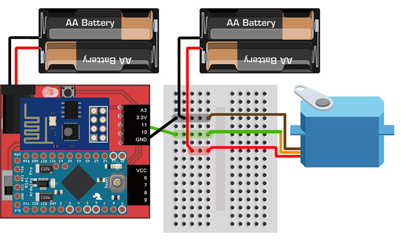
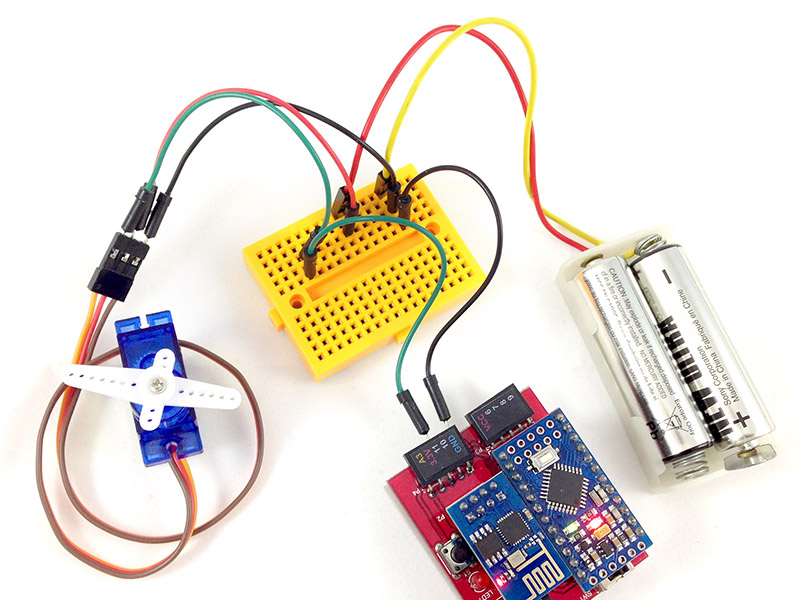
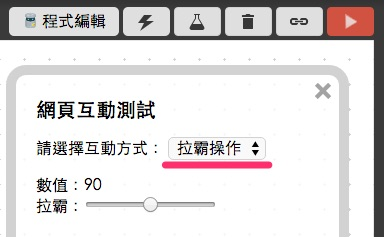
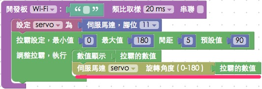

<!-- @@master  = ../../_layout.html-->

<!-- @@block  =  meta-->

<title>教學範例 16：控制伺服馬達轉動角度 :::: Webduino = Web × Arduino</title>

<meta name="description" content="人體紅外線偵測傳感器 ( PIR ) 可以偵測紅外線的反應變化，當接收到人體發射的紅外線，就會觸發相對應的動作，這個範例利用 Webduino，在人體紅外線傳感器接收到訊號時，觸發網頁的燈泡亮起，同時也讓 LED 燈發光。">

<meta itemprop="description" content="人體紅外線偵測傳感器 ( PIR ) 可以偵測紅外線的反應變化，當接收到人體發射的紅外線，就會觸發相對應的動作，這個範例利用 Webduino，在人體紅外線傳感器接收到訊號時，觸發網頁的燈泡亮起，同時也讓 LED 燈發光。">

<meta property="og:description" content="人體紅外線偵測傳感器 ( PIR ) 可以偵測紅外線的反應變化，當接收到人體發射的紅外線，就會觸發相對應的動作，這個範例利用 Webduino，在人體紅外線傳感器接收到訊號時，觸發網頁的燈泡亮起，同時也讓 LED 燈發光。">

<meta property="og:title" content="教學範例 16：控制伺服馬達轉動角度" >

<meta property="og:url" content="https://webduino.io/tutorials/tutorial-16-servo.html">

<meta property="og:image" content="https://webduino.io/img/tutorials/tutorial-16-01s.jpg">

<meta itemprop="image" content="https://webduino.io/img/tutorials/tutorial-16-01s.jpg">

<include src="../_include-tutorials.html"></include>

<!-- @@close-->

<!-- @@block  =  tutorials-->

# 教學範例 16：控制伺服馬達轉動角度

伺服馬達之所以叫做「伺服」馬達，是因為「伺服 servo」表示馬達會依照指示命令動作，由程式要馬達轉幾度，馬達就會轉幾度，但伺服馬達有機械結構上的限制，旋轉的角度是 180 度，但並非完全的 180 度，可能是 1 度到 180 度，或是 -2 度到 177 度都有可能，不過這些誤差都不影響這個範例的實作，這個範例將會介紹如何用 Blockly、HTML 與 javascript 去控制伺服馬達。

## 範例影片展示

影片對應範例：[http://blockly.webduino.io/?page=tutorials/servo-1](http://blockly.webduino.io/?page=tutorials/servo-1) 

<iframe class="youtube" src="https://www.youtube.com/embed/Dar2pSWCSL8" frameborder="0" allowfullscreen></iframe>

## 接線與實作

由於伺服馬達需要的電流量較大，因此我們必須採用獨立電源，才能供應伺服馬達足夠的電流量 ( 其實也可以用電晶體的方式，但還是用獨立電源比較容易上手 )，伺服馬達具有三條電線。紅色的為正電，深咖啡色是接地 GND，橘色的則是訊號線，我們利用麵包板，將獨立電源、Webduino 開發板和伺服馬達共地 ( GND 接在一起 )，伺服馬達的訊號源接在 11 的腳位即可。

實際接線照片：

## Webduino Blockly 操作解析

打開 Webduino Blockly 編輯工具 ( [http://blockly.webduino.io](http://blockly.webduino.io) )，因為這個範例會用網頁「拉霸滑桿」來控制伺服馬達旋轉角度，所以要先點選右上方「網頁互動測試」的按鈕，打開內嵌測試的網頁，用下拉選單選擇「拉霸操作」。

把開發板放到編輯畫面裡，填入對應的 Webduino 開發板名稱，開發板內放入伺服馬達積木，名稱設定為 servo，腳位設定為 11。

接著放入「拉霸設定」的積木，裡面可以設定最小值、最大值、每次拖拉的間距以及預設值，因為伺服馬達最多不會超過 180 度，所以最大值和最小值就用 0 到 180 度，設定完成後就放入「顯示數值」以及「伺服馬達旋轉角度」的積木。

完成後，確認開發板上線 ( 點選「[檢查連線狀態](https://webduino.io/device.html)」查詢 )，點選紅色的執行按鈕，用滑鼠拖動拉霸滑桿，就會看到伺服馬達的旋轉角度跟著變化。( 解答：[http://blockly.webduino.io/#-K7B3_Wn1LxGIYcrhejk](http://blockly.webduino.io/#-K7B3_Wn1LxGIYcrhejk )

##範例解析 ( [完整程式碼](http://bin.webduino.io/xisa/edit?html,css,js,output)、[檢查連線狀態](https://webduino.io/device.html) )

HTML 的 header 引入 `webduino-all.min.js`，目的在讓瀏覽器可以支援 WebComponents 以及 Webduino 所有的元件，如果是用 Blockly 編輯工具產生的程式碼，則要額外引入 `webduino-blockly.js`。

	
	

HTML 放入一個 span 來顯示當前角度，並放入一個 type 為 range 的 input，這也就是我們的拉霸滑桿，裡面可以設定最大值 max、最小值 min、間距 step 和預設值 value。

	數值：90 
	拉霸：<input type="range" min="0" max="180" step="5" value="90" id="demo-area-06-input">

JavaScript 利用`oninput`把拉霸改變的的數值 value 輸入給n伺服馬達的 angle，如此一來伺服馬達就會在拉霸改變的當下，一起旋轉角度。

	var servo;

	boardReady('', function (board) {
	  board.samplingInterval = 20;
	  servo = getServo(board, 11);
	  document.getElementById("demo-area-06-input").setAttribute("min",0);
	  document.getElementById("demo-area-06-input").setAttribute("max",180);
	  document.getElementById("demo-area-06-input").setAttribute("step",5);
	  document.getElementById("demo-area-06-input").setAttribute("value",90);
	  document.getElementById("demo-area-06-input").oninput = function(_value){
	    _value = this.value;
	    document.getElementById("demo-area-06-input-value").innerHTML = _value;
	    servo.angle = _value;
	  };
	});

以上就是利用網頁拉霸滑桿，來控制伺服馬達的旋轉角度。   
完整程式碼：[http://bin.webduino.io/xisa/edit?html,css,js,output](http://bin.webduino.io/xisa/edit?html,css,js,output)  
解答：[http://blockly.webduino.io/#-K7B3_Wn1LxGIYcrhejk](http://blockly.webduino.io/#-K7B3_Wn1LxGIYcrhejk)

## 人體紅外線偵測傳感器的延伸教學：

[Webduino Blockly 課程 8-2：使用按鈕開關控制伺服馬達](http://blockly.webduino.io/?lang=zh-hant&page=tutorials/servo-2#-Jw01xYLefgu_1IvUaVM)  

<!-- @@close-->