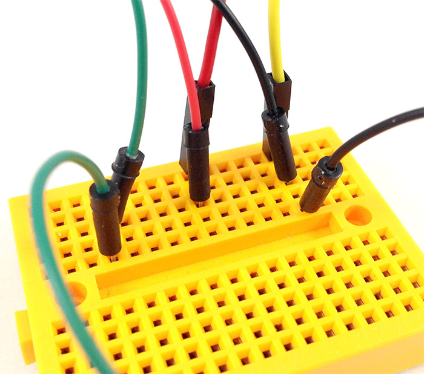

<!-- @@master  = ../../_layout.html-->

<!-- @@block  =  meta-->

<title>範例教學 16：控制伺服馬達轉動角度 :::: Webduino = Web × Arduino</title>

<meta name="description" content="人體紅外線偵測傳感器 ( PIR ) 可以偵測紅外線的反應變化，當接收到人體發射的紅外線，就會觸發相對應的動作，這個範例利用 Webduino，在人體紅外線傳感器接收到訊號時，觸發網頁的燈泡亮起，同時也讓 LED 燈發光。">

<meta itemprop="description" content="人體紅外線偵測傳感器 ( PIR ) 可以偵測紅外線的反應變化，當接收到人體發射的紅外線，就會觸發相對應的動作，這個範例利用 Webduino，在人體紅外線傳感器接收到訊號時，觸發網頁的燈泡亮起，同時也讓 LED 燈發光。">

<meta property="og:description" content="人體紅外線偵測傳感器 ( PIR ) 可以偵測紅外線的反應變化，當接收到人體發射的紅外線，就會觸發相對應的動作，這個範例利用 Webduino，在人體紅外線傳感器接收到訊號時，觸發網頁的燈泡亮起，同時也讓 LED 燈發光。">

<meta property="og:title" content="範例教學 16：控制伺服馬達轉動角度" >

<meta property="og:url" content="https://webduino.io/tutorials/tutorial-16-servo.html">

<meta property="og:image" content="https://webduino.io/img/tutorials/tutorial-16-01s.jpg">

<meta itemprop="image" content="https://webduino.io/img/tutorials/tutorial-16-01s.jpg">

<include src="../_include-tutorials.html"></include>

<!-- @@close-->

<!-- @@block  =  tutorials-->

#範例教學 16：控制伺服馬達轉動角度

伺服馬達之所以叫做「伺服」馬達，是因為「伺服 servo」表示馬達會依照指示命令動作，由程式要馬達轉幾度，馬達就會轉幾度，但伺服馬達有機械結構上的限制，旋轉的角度是 180 度，但並非完全的 180 度，可能是 1 度到 180 度，或是 -2 度到 177 度都有可能，不過這些誤差都不影響這個範例的實作，這個範例將會介紹如何用 HTML 與 javascript 去控制伺服馬達。

##範例影片展示

<iframe class="youtube" src="https://www.youtube.com/embed/_M1_T8hs74k" frameborder="0" allowfullscreen></iframe>

##接線與實作

- ###1. 接上伺服馬達

	由於伺服馬達需要的電流量較大，因此我們必須採用獨立電源，才能供應伺服馬達足夠的電流量 ( 其實也可以用電晶體的方式，但還是用獨立電源比較容易上手 )，伺服馬達具有三條電線。紅色的為正電，深咖啡色是接地 GND，橘色的則是訊號線，我們利用麵包板，將獨立電源、Webduino 開發板和伺服馬達共地 ( GND 接在一起 )，伺服馬達的訊號源接在 11 的腳位即可。

	 

	

- ###2. 完成後的實際長相

	

	獨立電源、Webduino 開發板和伺服馬達共地。

	

	紅色的為正電，深咖啡色是接地 GND，橘色的則是訊號線。

	

##範例解析 ([快速體驗](http://webduinoio.github.io/samples/content/servo/index.html)、[jsbin 範例](http://jsbin.com/lecahi/4/edit?html,js,output)、[檢查連線狀態](https://webduino.io/device.html))

在 head 的地方引入相關的 WebComponents，主要是要引入伺服馬達的 WebComponent：`wa-servo.html`。

	
	<link rel='import' href='https://webduino.io/components/webduino/web-arduino.html' />
	<link rel='import' href='https://webduino.io/components/webduino/wa-servo.html' />

body 放入 range 以及一個 id 為 show 的 div 來呈現轉動的角度，當然不要忘記放入`web-arduino`和`wa-servo`，而 range 的最小值和最大值分別設定 -80 到 80，目的在於避免一些伺服馬達本身無法旋轉到 90 度的誤差，間距設為 10，預設值為 0。

	

	<input id="r" type="range"  min='-80' max='80' step='10' value='0'></input> 
	  <web-arduino id="board" device='你的 device 名稱'>
	  <wa-servo id='servo' pin='11'></wa-servo>
	</web-arduino>

javascript 主要用到伺服馬達的 API：`angle`，顧名思義就是角度，設定多少馬達就會旋轉多少，但因為 angle 的數值為 0 到 180，range 只設定 -80 到 80 是為了讓左邊為負右邊為正，所以程式上要做點轉換，也就是傳送給伺服馬達的角度會先把數值變成負的，再加 90 就可以。

	window.addEventListener('WebComponentsReady', function () {
	  var board = document.getElementById('board'),
	      r = document.getElementById('r'),
	      show = document.getElementById('show');
	  
	  board.on('ready',function ready() {
	    var servo = document.getElementById('servo'),
	        a = 0;
	     
	    servo.angle= -a + 90;  // 讓 angle 不會有負的
	    show.innerText = a;
	    
	    r.addEventListener('change',function(e){
	      var t = e.target;
	      a = t.value;
	      servo.angle= -a + 90;  // 	讓 angle 不會有負的
	      show.innerText = a;
	      
	    });   
	    
	  },false);
	   
	}, false);

按照上述的步驟進行，應該就可以讓馬達輕鬆轉動，如果還有不清楚的，不妨利用這個 [快速體驗](http://webduinoio.github.io/samples/content/servo/index.html)，輸入 device 號碼，就可以用 ragne 控制伺服馬達了！

<!-- @@close-->