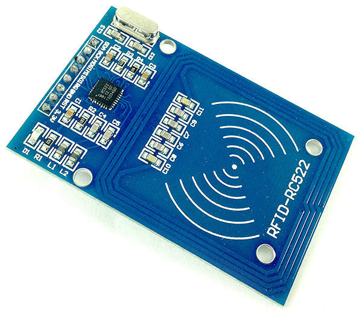
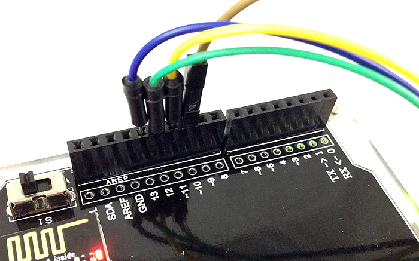
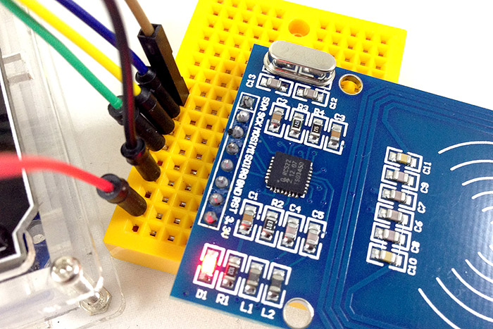
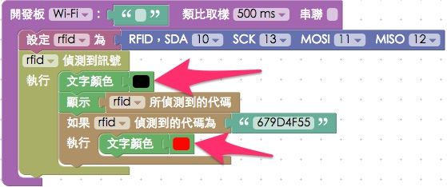
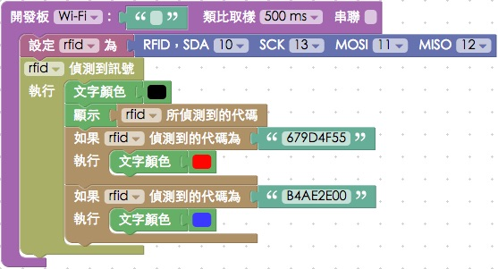
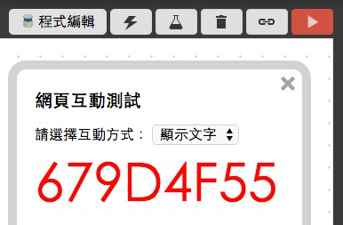

<!-- @@master  = ../../_layout.html-->

<!-- @@block  =  meta-->

<title>教學範例 19：RFID :::: Webduino = Web × Arduino</title>

<meta name="description" content="RFID 是 Radio Frequency IDentification 的縮寫，中文翻譯為「無線射頻辨識」，是一種常見的無線通訊技術，透過 RFID 識別裝置 ( 讀卡器 ) 所產生的「電磁場」，能讓附著在物品上的「電子標籤」獲得能量進而發送無線電頻率的訊號，RFID 在今日相當的普及，常見於庫存、資產、人員等的追蹤與管理，甚至許多的防偽、畜產管理也都有 RFID 的身影存在。">

<meta itemprop="description" content="RFID 是 Radio Frequency IDentification 的縮寫，中文翻譯為「無線射頻辨識」，是一種常見的無線通訊技術，透過 RFID 識別裝置 ( 讀卡器 ) 所產生的「電磁場」，能讓附著在物品上的「電子標籤」獲得能量進而發送無線電頻率的訊號，RFID 在今日相當的普及，常見於庫存、資產、人員等的追蹤與管理，甚至許多的防偽、畜產管理也都有 RFID 的身影存在。">

<meta property="og:description" content="RFID 是 Radio Frequency IDentification 的縮寫，中文翻譯為「無線射頻辨識」，是一種常見的無線通訊技術，透過 RFID 識別裝置 ( 讀卡器 ) 所產生的「電磁場」，能讓附著在物品上的「電子標籤」獲得能量進而發送無線電頻率的訊號，RFID 在今日相當的普及，常見於庫存、資產、人員等的追蹤與管理，甚至許多的防偽、畜產管理也都有 RFID 的身影存在。">

<meta property="og:title" content="教學範例 19：RFID" >

<meta property="og:url" content="https://webduino.io/tutorials/tutorial-19-rfid.html">

<meta property="og:image" content="https://webduino.io/img/tutorials/tutorial-19-01s.jpg">

<meta itemprop="image" content="https://webduino.io/img/tutorials/tutorial-19-01s.jpg">

<include src="../_include-tutorials.html"></include>

<!-- @@close-->

<!-- @@block  =  preAndNext-->

<include src="../_include-tutorials-content.html"></include>

<!-- @@close-->

<!-- @@block  =  tutorials-->

# 教學範例 19：RFID

RFID 是 Radio Frequency IDentification 的縮寫，中文翻譯為「無線射頻辨識」，是一種常見的無線通訊技術，透過 RFID 識別裝置 ( 讀卡器 ) 所產生的「電磁場」，能讓附著在物品上的「電子標籤」獲得能量進而發送無線電頻率的訊號，RFID 在今日相當的普及，常見於庫存、資產、人員等的追蹤與管理，甚至許多的防偽、畜產管理也都有 RFID 的身影存在。

## 範例影片展示

<iframe class="youtube" src="https://www.youtube.com/embed/RrCAOgtPHdo" frameborder="0" allowfullscreen></iframe>

## 接線與實作

這裏我們使用的 RFID 識別裝置的型號為 RC522，RC522 主要針對 13.56MHZ 的無線電頻率識別，工作電壓為 3.3V ，上頭共有八支接腳，分別是 SDA、SCK、MOSI、MISO、IRQ、GND、RST、VCC，其中 SDA、SCK、MOSI、MISO 負責訊號的輸入和輸出。

由於 Arduino UNO 本身的數位腳各自有各自的功能，13 對應 Serial Clock ( SCK )，12 對應 Master-in slave-out ( MISO )，11 是 Master-out slave-in ( MOSI )，10 是 Slave select ( SS )，因此我們將 SDA 接 10，SCK 接 13，MOSI 接 11，MISO 接 12。

IRQ 是中斷的腳位，RST 是重置的腳位，因為在本範例中不會用到，所以這裡就不需要接這兩個接腳，GND 接在 GND，VCC 接在 3.3V 的位置，此外因為腳位限制，所以在這個範例**必須使用 Arudino UNO 和 Webduino UNO 雲端擴充板搭配進行**。

實際接線照片：

## Webduino Blockly 操作解析

打開 Webduino Blockly 編輯工具 ( [https://blockly.webduino.io](https://blockly.webduino.io) )，因為這個範例會用網頁「顯示文字」來顯示 RFID 磁卡或磁扣的識別碼，所以要先點選右上方「網頁互動測試」的按鈕，打開內嵌測試的網頁，用下拉選單選擇「顯示文字」，此外，記得要先燒錄 RFID 的韌體檔喔！ ( 請參考：[韌體檔案燒錄教學](https://webduino.io/tutorials/info-07-arduino-ino.html)，選擇有 MFRC522 檔名的韌體 )

把開發板放到編輯畫面裡，填入對應的 Webduino 開發板名稱，開發板內放入 RFID 的積木，名稱設定為 rfid，腳位設定為 10、13、11、12，因為腳位限定，所以下拉選單也無法改變腳位。

放入「偵測訊號」的積木，在我們拿 RFID 磁卡或磁扣去感應讀卡器的時候，右邊的網頁就會顯示對應的識別碼。

完成後，確認開發板上線 ( 點選「[檢查連線狀態](https://webduino.io/device.html)」查詢 )，點選紅色的執行按鈕，用不同的磁卡或磁扣去感應讀卡器，就會出現識別碼，如果你發現某些磁卡或磁扣無法出現識別碼，最大的可能性是頻率和 RFID-RC522 讀卡器不同所導致的。( 解答：[https://blockly.webduino.io/#-K7zNrV4FojmGdLfbhmM](https://blockly.webduino.io/#-K7zNrV4FojmGdLfbhmM)

不過只有有點太乏味，我們可以加入一些識別，再來我們會用不同的磁卡，讓文字的顏色變色，我們先加入「文字顏色」的積木，在感應的當下把文字變成黑色 ( 這樣其他卡片感應時才會呈現黑色 )，然後加入「判斷」的積木，當出現對應的識別碼，就把文字變成紅色。

同樣的方式，我們可以偵測第二張磁卡或磁扣，感應到之後把文字變成藍色。

完成後，確認開發板上線 ( 點選「[檢查連線狀態](https://webduino.io/device.html)」查詢 )，點選紅色的執行按鈕，用不同的磁卡或磁扣去感應讀卡器，就會看到文字呈現對應的顏色了。( 解答：[https://blockly.webduino.io/#-K7zPzNNag4ggJ_7qp96](https://blockly.webduino.io/#-K7zPzNNag4ggJ_7qp96)

##範例解析 ( [完整程式碼](http://bin.webduino.io/xoma/7/edit?html,css,js,output)、[檢查連線狀態](https://webduino.io/device.html) )

HTML 的 header 引入 `webduino-all.min.js`，目的在讓瀏覽器可以支援 WebComponents 以及 Webduino 所有的元件，如果是用 Blockly 編輯工具產生的程式碼，則要額外引入 `webduino-blockly.js`。

	
	

HTML 裏頭只有一個 span，用來顯示 RFID 磁卡或磁扣的識別碼。

	123

JavaScript 使用`on`的方法，回呼函式裡面會有一個變數，回傳值就是 RFID 的識別碼，在裡面可以寫上判斷式，判斷對應的字串就執行對應的動作，這裏的動作除了用`innerHTML`顯示識別碼之外，也用`style`來改變顏色。

	var rfid;

	boardReady('', function (board) {
	  board.samplingInterval = 500;
	  rfid = getRFID(board);
	  rfid.read();
	  rfid.on("enter",function(_uid){
	    rfid._uid = _uid;
	    document.getElementById("demo-area-01-show").style.color = '#000000';
	    document.getElementById("demo-area-01-show").innerHTML = rfid._uid;
	    if(rfid._uid == '679D4F55'){
	      document.getElementById("demo-area-01-show").style.color = '#ff0000';
	    }
	    if(rfid._uid == 'B4AE2E00'){
	      document.getElementById("demo-area-01-show").style.color = '#3333ff';
	    }
	  });
	});

以上就是利用 RFID-RC522 來讀取 RFID 磁卡或磁扣，並將識別碼顯示在網頁裡，而且還會根據不同的磁卡或磁扣變色。   
完整程式碼：[http://bin.webduino.io/xoma/7/edit?html,css,js,output](http://bin.webduino.io/xoma/7/edit?html,css,js,output)  
解答：[https://blockly.webduino.io/#-K7zPzNNag4ggJ_7qp96](https://blockly.webduino.io/#-K7zPzNNag4ggJ_7qp96)

## RFID 的延伸教學：

[Webduino Blockly 課程 16-1：偵測 RFID](https://blockly.webduino.io/?lang=zh-hant&page=tutorials/rfid-1#-K45oDB4TmzOFSNMPGGG)  
[Webduino Blockly 課程 16-2：RFID 紅綠燈](https://blockly.webduino.io/?lang=zh-hant&page=tutorials/rfid-2#-K45qdjcmCYGz9YaNcUp)  
[Webduino Blockly 課程 16-3：RFID 控制 Youtube](https://blockly.webduino.io/?lang=zh-hant&page=tutorials/rfid-3#-K462IpY3cfK91yLDK3M)     

<!-- @@close-->