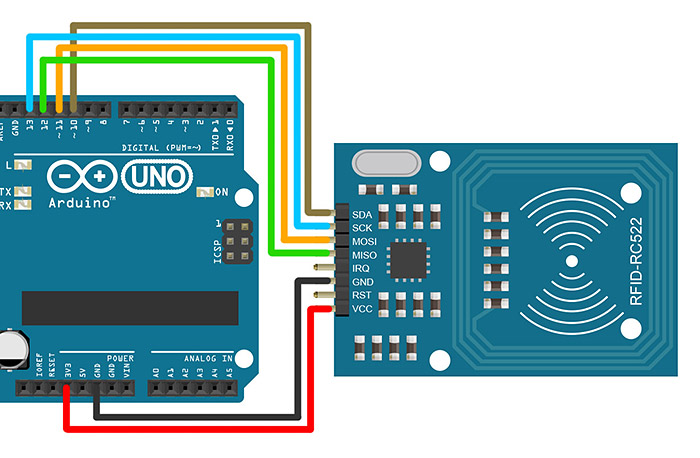
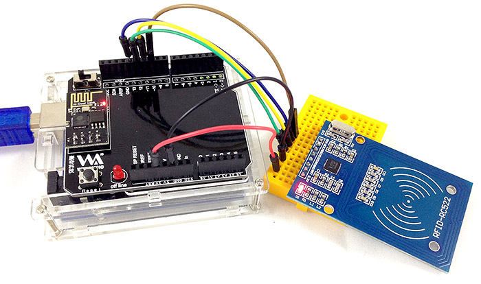
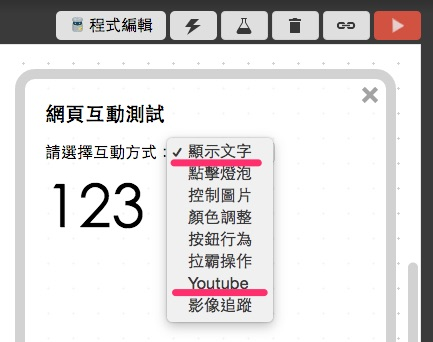
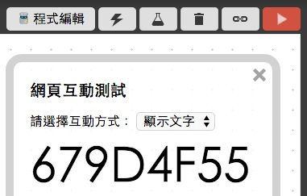
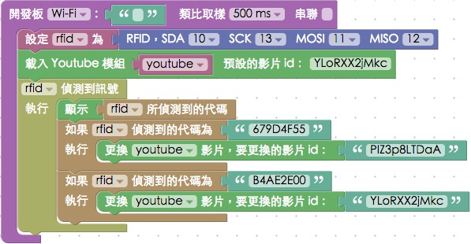
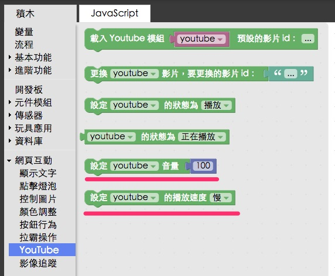
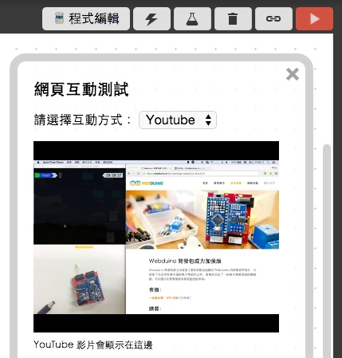

<!-- @@master  = ../../_layout.html-->

<!-- @@block  =  meta-->

<title>教學範例 20：RFID 控制 Youtube :::: Webduino = Web × Arduino</title>

<meta name="description" content="上一篇我們介紹過 RFID 的基本原理還有可以根據不同的磁卡或磁扣切換顏色，這一篇範例要來實作更進階的 RFID：控制 Youtube，利用不同的磁卡或磁扣，來切換不同的 Youtube 影片。">

<meta itemprop="description" content="上一篇我們介紹過 RFID 的基本原理還有可以根據不同的磁卡或磁扣切換顏色，這一篇範例要來實作更進階的 RFID：控制 Youtube，利用不同的磁卡或磁扣，來切換不同的 Youtube 影片。">

<meta property="og:description" content="上一篇我們介紹過 RFID 的基本原理還有可以根據不同的磁卡或磁扣切換顏色，這一篇範例要來實作更進階的 RFID：控制 Youtube，利用不同的磁卡或磁扣，來切換不同的 Youtube 影片。">

<meta property="og:title" content="教學範例 20：RFID 控制 Youtube" >

<meta property="og:url" content="https://webduino.io/tutorials/tutorial-20-rfid-youtube.html">

<meta property="og:image" content="https://webduino.io/img/tutorials/tutorial-20-01s.jpg">

<meta itemprop="image" content="https://webduino.io/img/tutorials/tutorial-20-01s.jpg">

<include src="../_include-tutorials.html"></include>

<!-- @@close-->

<!-- @@block  =  preAndNext-->

<include src="../_include-tutorials-content.html"></include>

<!-- @@close-->

<!-- @@block  =  tutorials-->

# 教學範例 20：RFID 控制 Youtube

上一篇我們介紹過 RFID 的基本原理還有可以根據不同的磁卡或磁扣切換顏色，這一篇範例要來實作更進階的 RFID：控制 Youtube，利用不同的磁卡或磁扣，來切換不同的 Youtube 影片。

## 範例影片展示

<iframe class="youtube" src="https://www.youtube.com/embed/RrCAOgtPHdo" frameborder="0" allowfullscreen></iframe>

## 接線與實作

接線方式和上一篇範例一模一樣，將 SDA 接 10，SCK 接 13，MOSI 接 11，MISO 接 12，GND 接在 GND，VCC 接在 3.3V 的位置，此外因為腳位限制，所以在這個範例**必須使用 Arudino UNO 和 Webduino UNO 雲端擴充板搭配進行**。

實際接線照片：

## Webduino Blockly 操作解析

打開 Webduino Blockly 編輯工具 ( [http://blockly.webduino.io](http://blockly.webduino.io) )，因為這個範例會「先」用網頁「顯示文字」來顯示 RFID 磁卡或磁扣的識別碼，記下識別碼之後，就要使用「Youtube」來播放，所以要先點選右上方「網頁互動測試」的按鈕，打開內嵌測試的網頁，用下拉選單選擇「顯示文字」，待會會用到「Youtube」。 ( 請參考：[韌體檔案燒錄教學](https://webduino.io/tutorials/info-07-arduino-ino.html)，選擇有 MFRC522 檔名的韌體 )

把開發板放到編輯畫面裡，填入對應的 Webduino 開發板名稱，開發板內放入 RFID 的積木，名稱設定為 rfid，腳位設定為 10、13、11、12，因為腳位限定，所以下拉選單也無法改變腳位，放入「偵測訊號」的積木，在我們拿 RFID 磁卡或磁扣去感應讀卡器的時候，右邊的網頁就會顯示對應的識別碼。

這邊完成後，確認開發板上線 ( 點選「[檢查連線狀態](https://webduino.io/device.html)」查詢 )，點選紅色的執行按鈕，用不同的磁卡或磁扣去感應讀卡器，就會出現識別碼，這時我們先把這些對應的代碼記下來，待會就要用這些代碼來判斷。

Youtube 的積木都在左邊網頁互動裡面，一開始我們要先載入 Youtube 模組，**注意！模組只需要載入一次**，因此該積木不要放到 RFID 偵測到訊號的肚子裡，不然會變成每次偵測都會載入一次模組，就會出錯了。

影片的 id 只要打開 Youtube，從網址列就可以看到這段 id，複製下來貼進去就可以。

如果說我們想要利用磁扣切換播放的影片，只要放入「更換 Youtube 影片 id」的積木，把要更換的 id 填進去就可以切換。

如果不是想要切換影片，想要更改音量大小或是播放速度，只要選擇對應的 Youtube 積木就可以完成。

做好之後，確認開發板上線 ( 點選「[檢查連線狀態](https://webduino.io/device.html)」查詢 )，點選紅色的執行按鈕，用不同的磁卡或磁扣去感應讀卡器，就會看到 Youtube 的影片開始切換，或是音量、播放速度的變化了。( 解答：[http://blockly.webduino.io/#-K7zgePAA41wamJK4U-w](http://blockly.webduino.io/#-K7zgePAA41wamJK4U-w) )

##範例解析 ( [完整程式碼](http://bin.webduino.io/tihah/edit?html,js,output)、[檢查連線狀態](https://webduino.io/device.html) )

HTML 的 header 引入 `webduino-all.min.js`，目的在讓瀏覽器可以支援 WebComponents 以及 Webduino 所有的元件，如果是用 Blockly 編輯工具產生的程式碼，則要額外引入 `webduino-blockly.js`，比較特別的是因為要控制 Youtube ，所以要額外載入`iframe_api`這支程式。

	
	
	

HTML 裏頭只有一個 div，也就是 Youtube 影片會顯示的區域。

	

JavaScript 雖然比較長，但是大部分都是 Youtube 的程式 ( 如果看不懂可以先不用理它，或是到 Youtube API 的網站閱讀詳細文件：[https://www.youtube.com/yt/dev/zh-TW/api-resources.html](https://www.youtube.com/yt/dev/zh-TW/api-resources.html) )，除此之外，RFID 的控制方式純粹用`on`來開始偵測，然後判斷磁卡或磁扣的識別碼，接著再呼叫 Youtube 的程式就可以了。

	var rfid;
	var youtube;

	boardReady('', function (board) {
	  board.samplingInterval = 500;
	  rfid = getRFID(board);
	  var checkYoutubeLoad=0;
	  onYouTubeIframeAPIReady();
	  function onYouTubeIframeAPIReady() {
	    youtube = new YT.Player("player", {
	      height: "240",
	      width: "96%",
	      videoId: "YLoRXX2jMkc",
	      playerVars: {
	        "autoplay": 1,
	        "controls": 1},
	      events: {
	        "onReady": onPlayerReady,
	        "onStateChange": onPlayerStateChange
	      }
	    });
	  }
	  function onPlayerReady(event) {
	    event.target.playVideo();
	    checkYoutubeLoad=1;
	  }
	  var done = false;
	  function onPlayerStateChange(event) {
	    if (event.data == YT.PlayerState.PLAYING && !done) {
	      done = true;
	    }
	  }
	  function stopVideo() {
	    youtube.stopVideo();
	  }
	  rfid.read();
	  rfid.on("enter",function(_uid){
	    rfid._uid = _uid;
	    document.getElementById("demo-area-01-show").innerHTML = rfid._uid;
	    if(rfid._uid == '679D4F55'){
	      youtube.loadVideoById('PIZ3p8LTDaA');
	    }
	    if(rfid._uid == 'B4AE2E00'){
	      youtube.loadVideoById('YLoRXX2jMkc');
	    }
	  });
	});

以上就是利用 RFID-RC522 來讀取 RFID 磁卡或磁扣，進一步控制 Youtube 的播放。   
完整程式碼：[http://bin.webduino.io/tihah/edit?html,js,output](http://bin.webduino.io/tihah/edit?html,js,output)  
解答：[http://blockly.webduino.io/#-K7zgePAA41wamJK4U-w](http://blockly.webduino.io/#-K7zgePAA41wamJK4U-w)

## RFID 的延伸教學：

[Webduino Blockly 課程 16-1：偵測 RFID](http://blockly.webduino.io/?lang=zh-hant&page=tutorials/rfid-1#-K45oDB4TmzOFSNMPGGG)  
[Webduino Blockly 課程 16-2：RFID 紅綠燈](http://blockly.webduino.io/?lang=zh-hant&page=tutorials/rfid-2#-K45qdjcmCYGz9YaNcUp)  
[Webduino Blockly 課程 16-3：RFID 控制 Youtube](http://blockly.webduino.io/?lang=zh-hant&page=tutorials/rfid-3#-K462IpY3cfK91yLDK3M)     

<!-- @@close-->