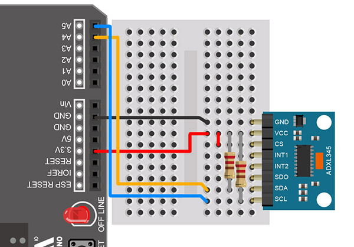
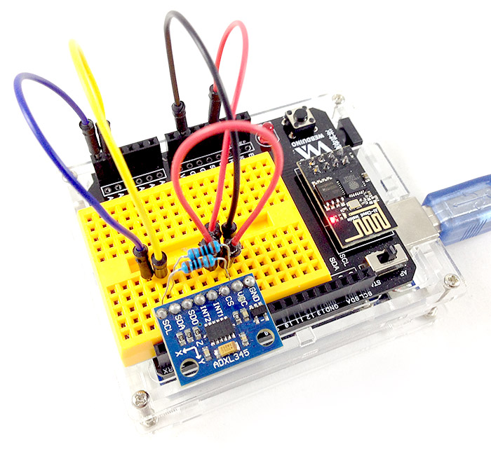
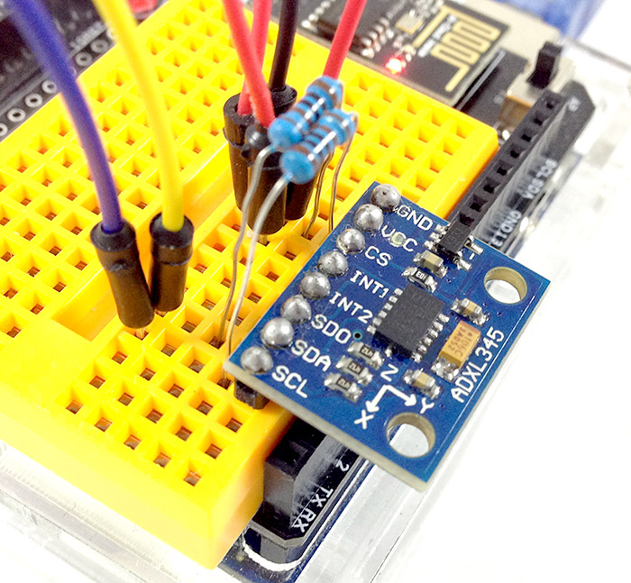
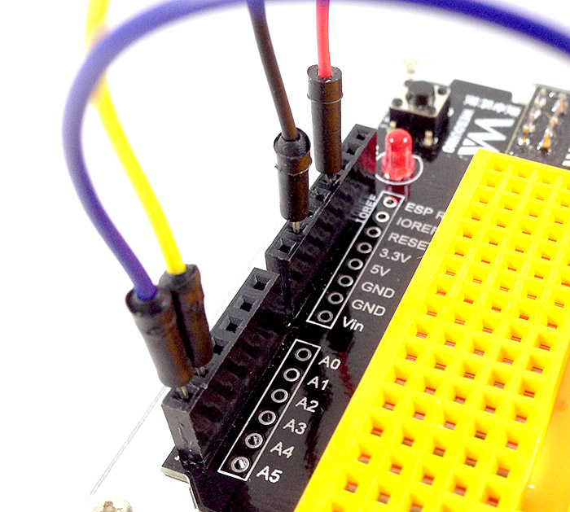
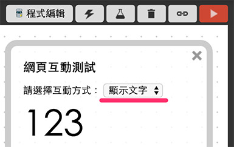
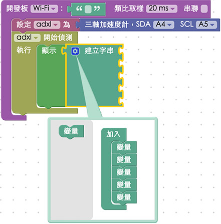
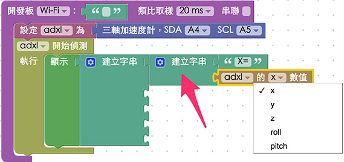
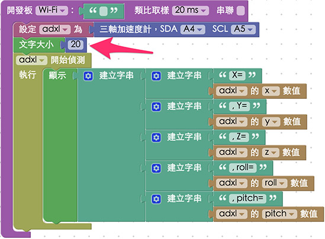
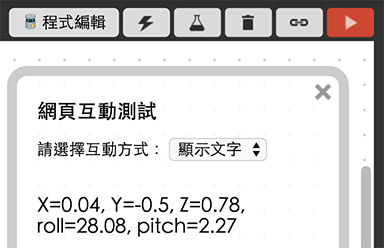

<!-- @@master  = ../../_layout.html-->

<!-- @@block  =  meta-->

<title>教學範例 23：三軸加速度計 :::: Webduino = Web × Arduino</title>

<meta name="description" content="三軸加速度感應器是利用三個軸向移動的加速度，來算出旋轉的角度，在這個篇教學將使用 Webduino 來控制 ADXL345 這個型號的三軸加速度感應器，ADXL345 可以選擇使用 I2C 或 SPI 協定來傳遞資料，而 Arduino 的類比腳使用 I2C，所以這裏我們會使用到的腳位是 GND、VCC、CS、SDA 和 SCL。">

<meta itemprop="description" content="三軸加速度感應器是利用三個軸向移動的加速度，來算出旋轉的角度，在這個篇教學將使用 Webduino 來控制 ADXL345 這個型號的三軸加速度感應器，ADXL345 可以選擇使用 I2C 或 SPI 協定來傳遞資料，而 Arduino 的類比腳使用 I2C，所以這裏我們會使用到的腳位是 GND、VCC、CS、SDA 和 SCL。">

<meta property="og:description" content="三軸加速度感應器是利用三個軸向移動的加速度，來算出旋轉的角度，在這個篇教學將使用 Webduino 來控制 ADXL345 這個型號的三軸加速度感應器，ADXL345 可以選擇使用 I2C 或 SPI 協定來傳遞資料，而 Arduino 的類比腳使用 I2C，所以這裏我們會使用到的腳位是 GND、VCC、CS、SDA 和 SCL。">

<meta property="og:title" content="教學範例 23：三軸加速度計" >

<meta property="og:url" content="https://webduino.io/tutorials/tutorial-23-adxl345.html">

<meta property="og:image" content="https://webduino.io/img/tutorials/tutorial-23-01s.jpg">

<meta itemprop="image" content="https://webduino.io/img/tutorials/tutorial-23-01s.jpg">

<include src="../_include-tutorials.html"></include>

<!-- @@close-->

<!-- @@block  =  preAndNext-->

<include src="../_include-tutorials-content.html"></include>

<!-- @@close-->

<!-- @@block  =  tutorials-->

# 教學範例 23：三軸加速度計

三軸加速度感應器是利用三個軸向移動的加速度，來算出旋轉的角度，在這個篇教學將使用 Webduino 來控制 ADXL345 這個型號的三軸加速度感應器，ADXL345 可以選擇使用 I2C 或 SPI 協定來傳遞資料，而 Arduino 的類比腳使用 I2C，所以這裏我們會使用到的腳位是 GND、VCC、CS、SDA 和 SCL。

## 範例影片展示

影片對應範例：[https://blockly.webduino.io/?&page=tutorials/adxl345-1](https://blockly.webduino.io/?&page=tutorials/adxl345-1)  

<iframe class="youtube" src="https://www.youtube.com/embed/SH4-Z7E1DZc" frameborder="0" allowfullscreen></iframe>

## 接線與實作

VCC 接在 3.3V 的位置 ( 電壓高於 3.6V 會導致晶片燒毀 )，GND 接 GND，CS 和 VCC 接在一起，把  CS 的電位拉高和 VCC 相同，目的在告訴晶片是走 I2C 的協定，IN1 和 IN2 是負責驅動中斷的兩個輸出引腳，在這邊實作的過程不會用到，所以不用接，SDO 屬於 SPI 協定使用因此在這個範例也用不到所以不用接。

因為要走 I2C 的協定，所以要在訊號端加入「上拉電阻」，在線路裡分別加入兩顆 10K 的電阻來作為上拉電阻 ( Arduino 官方網站建議使用 10K 的電阻作為上拉或下拉的電阻值 ) 。

接線示意圖：

實際接線照片：

## Webduino Blockly 操作解析

打開 Webduino Blockly 編輯工具 ( [https://blockly.webduino.io](https://blockly.webduino.io) )，因為這個範例會「先」用網頁「顯示文字」來顯示三軸加速度計的數值，所以要先點選右上方「網頁互動測試」的按鈕，打開內嵌測試的網頁，用下拉選單選擇「顯示文字」，此外，記得要先燒錄三軸加速度計的韌體檔喔！ ( 請參考：[韌體檔案燒錄教學](https://webduino.io/tutorials/info-07-arduino-ino.html)，選擇有 GY291 或 ADXL 檔名的韌體 )

把開發板放到編輯畫面裡，填入對應的 Webduino 開發板名稱，開發板內放入三軸加速度計的積木，名稱設定為 adxl345，SDA 腳位設定 A4，SCL 腳位設定 A5。

放入「開始偵測」以及「顯示」的積木，在偵測的時候將數值顯示在網頁裡。

因為三軸加速度計會回傳五個數值 ( X、Y、Z、Roll、Pitch )，但文字顯示欄位只有一個，為了可以一次將所有數值顯示出來，這裏我們**使用「建立字串」的積木**，利用藍色小齒輪，增加五個缺口，這樣就可以一次顯示五個數值。

當然只有數值不夠，還要標示這個數值代表什麼，所以這邊要用到二層的「建立字串」積木，裡面放入數值名稱，以及三軸加速度計所偵測到的數值，至於要取出何種數值，可以透過下拉選單選擇。

依序放入各個數值的積木，然後為了避免文字太大，這邊也可以利用文字大小的積木，來調整文字大小。

確認開發板上線 ( 點選「[檢查連線狀態](https://webduino.io/device.html)」查詢 )，點選紅色的執行按鈕，轉動三軸加速度計，就可以看到數值出現在右側的網頁裡。  
( 解答：[https://blockly.webduino.io/#-KAxVJzMEpjTODr4q4k1](https://blockly.webduino.io/#-KAxVJzMEpjTODr4q4k1) )

##範例解析 ( [完整程式碼](http://bin.webduino.io/lizuv/edit?html,css,js,output)、[檢查連線狀態](https://webduino.io/device.html) )

HTML 的 header 引入 `webduino-all.min.js`，目的在讓瀏覽器可以支援 WebComponents 以及 Webduino 所有的元件，如果是用 Blockly 編輯工具產生的程式碼，則要額外引入 `webduino-blockly.js`。

	
	

HTML 裏頭只有一個 span，用來顯示三軸加速度計的數值，也因為只有一個 span，我們才需要使用「建立字串」的積木 ( 如果會寫程式，這部分也可以用五個 span 來取代 )。

	123

JavaScript 最主要用了`on`這個方法，裡面會有一個函式，帶有五個參數，這五個參數就是三軸加速度計的五個數值，利用`innerHTML`與字串的相加，我們就可以把這五個數值，顯示在 span 裏頭了。

	var adxl;

	boardReady('', function (board) {
	  board.samplingInterval = 20;
	  adxl = getADXL345(board);
	  document.getElementById("demo-area-01-show").style.fontSize = 20+"px";
	  adxl.setSensitivity = 0;
	  adxl.setBaseAxis = "x";
	  adxl.on(function(_x,_y,_z,_r,_p){
	    adxl._x = _x;
	    adxl._y = _y;
	    adxl._z = _z;
	    adxl._r = _r;
	    adxl._p = _p;
	    document.getElementById("demo-area-01-show").innerHTML = ([String('X=') + String(adxl._x),String(', Y=') + String(adxl._y),String(', Z=') + String(adxl._z),String(', roll=') + String(adxl._r),String(', pitch=') + String(adxl._p)].join(''));
	  });
	});

以上就是控制三軸加速度計 ADXL345 和程式碼簡介。   
完整程式碼：[http://bin.webduino.io/lizuv/edit?html,css,js,output](http://bin.webduino.io/lizuv/edit?html,css,js,output)  
解答：[https://blockly.webduino.io/#-KAxVJzMEpjTODr4q4k1](https://blockly.webduino.io/#-KAxVJzMEpjTODr4q4k1)

## 三軸加速度計的延伸教學：

[Webduino Blockly 課程 14-1：控制三軸加速度計](https://blockly.webduino.io/?lang=zh-hant&page=tutorials/adxl345-1#-K0pl9rB2TohBuBnorit)  
[Webduino Blockly 課程 14-2：旋轉角度旋轉圖片](https://blockly.webduino.io/?lang=zh-hant&page=tutorials/adxl345-2#-K0q9iZQIPc-9eLg9k2f)  
[Webduino Blockly 課程 14-3：旋轉角度點亮 LED 燈](https://blockly.webduino.io/?lang=zh-hant&page=tutorials/adxl345-3#-K0qEX3wukvZgtnn817T)  
[Webduino Blockly 課程 14-4：旋轉角度改變點矩陣圖形](https://blockly.webduino.io/?lang=zh-hant&page=tutorials/adxl345-4#-K0qKebEHBdfd19FzAvZ)

<!-- @@close-->