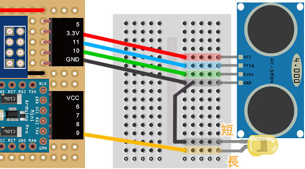
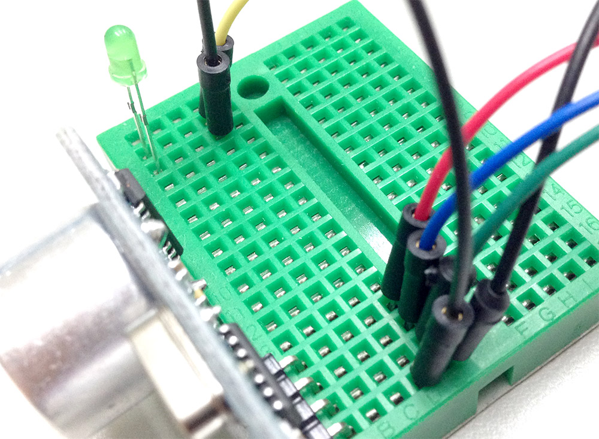

<!-- @@master  = ../../_layout.html-->

<!-- @@block  =  meta-->

<title>範例教學 7：超音波傳感器控制 LED 燈 :::: Webduino = Web × Arduino</title>

<meta property="og:description" content="對於直接寫 C/C++ 來控制 Arduino 的人來說，用超音波傳感器控制 LED 應該是小菜一碟，但對於要用 Web 技術來實現就沒那麼容易，不過在我們由前面幾個範例了解相關傳感器運作原理之後，就可以很輕鬆的做出來用超音波傳感器控制 LED 燈的實例，也因為是透過 Web 的方式，所以當行為觸發時，網頁端同時也可以收到動作的發生 ( 圖片也會改變 )，相當的方便。">

<!-- @@close-->

<!-- @@block  =  tutorials-->
#範例教學 7：超音波傳感器控制 LED 燈

對於直接寫 C/C++ 來控制 Arduino 的人來說，用超音波傳感器控制 LED 應該是小菜一碟，但對於要用 Web 技術來實現就沒那麼容易，不過在我們由前面幾個範例了解相關傳感器運作原理之後，就可以很輕鬆的做出來用超音波傳感器控制 LED 燈的實例，也因為是透過 Web 的方式，所以當行為觸發時，網頁端同時也可以收到動作的發生 ( 圖片也會改變 )，相當的方便。

##範例影片展示

<iframe class="youtube" src="https://www.youtube.com/embed/7ED9YSy7EjA" frameborder="0" allowfullscreen></iframe>

##接線與實作

- ###1. 接上超音波傳感器與 LED 燈

	因為超音波傳感器與 LED 都必須用到 GND 的腳位，所以我們必須要用到麵包板和電線，同樣用電線引出腳位，把超音波傳感器的 VCC 接在 3.3v，Trig 接在 11，Echo 接在 10，GND 就接在 GND 的腳位，然後再用另外的電線將 LED 接在 9 的腳位上。

	

- ###2. 完成後的實際長相

	因為超音波傳感器在實際的接線會朝外，所以實際的照片電線會有反轉的情形，不要接錯了。

	

	

##範例解析 ([快速體驗](http://webduinoio.github.io/samples/content/ultrasonic-led/index.html)、[jsbin 範例](http://jsbin.com/kucaru/5/edit?html,css,js,output)、[檢查連線狀態](http://webduino.io/device.html))

一開始要先引入相關的 js 與 WebComponents，因為這個範例會用到超音波傳感器和 LED 這兩個傳感器，所以必須要引入這兩個元件的 WebComponent：`wa-ultrasonic`、`wa-led`。

	
	<link rel='import' href='//webduino.io/components/webduino/web-arduino.html' />
	<link rel='import' href='//webduino.io/components/webduino/wa-ultrasonic.html' />
	<link rel='import' href='//webduino.io/components/webduino/wa-led.html' />

再來我們先在 body 裡頭放上一張燈泡的圖片，目的在於超音波傳感器讓 LED 燈亮起時，這張圖片也會變成發亮的圖片，然後從 HTML 的架構可以看出我們把超音波傳感器已及 LED 安插在 webduino 開發板上頭。

	

	  </img>
	  </img>
	

	<web-arduino id='board' device="你的 device 名稱">
	  <wa-ultrasonic id='ultrasonic' trig='11' echo='10'></wa-ultrasonic>
	  <wa-led id='led' pin='9'></wa-led>
	</web-arduino>

稍微寫點 CSS。

	img {
	  width: 100%;
	  max-width: 480px;
	  }
	.off img:last-child, .on img:first-child {
	  display: none;
	  }

javascript 裡頭要運用到兩個元件的 api，首先藉由超音波傳感器的 `ping` 回傳公分數值，接著判斷在 20 公分以內時，LED 燈就會熄滅，超過 20 公分 LED 燈就會亮起 ( 網頁裡頭的燈泡也會變化 )。

	window.addEventListener('WebComponentsReady', function () {
	  var board = document.getElementById('board');

	  board.on('ready',function() {
	    var ultrasonic = document.getElementById('ultrasonic'),
	      led = document.getElementById('led'),
	      light = document.getElementById('light');

	    ultrasonic.ping(function (cm) {
	      if (cm > 20) {
	        led.on();
	        light.className = "on";
	      } else {
	        led.off();
	        light.className = "off";
	      }
	    }, 1000);
	  });

	}, false);

如果還有不清楚的，不妨利用這個 [快速體驗範例](http://webduinoio.github.io/samples/content/ultrasonic-led/index.html)，填入自己 Webduino 開發板的 device 名稱，按下設定，訊息處出現 ready 的話，就可以開始利用超音波傳感器讓 LED 發光囉，亦或是也可以參考這個 [jsbin 範例](http://jsbin.com/kucaru/5/edit?html,css,js,output)，實際在上面填入 device 名稱並且修改體驗相關效果。

<!-- @@close-->