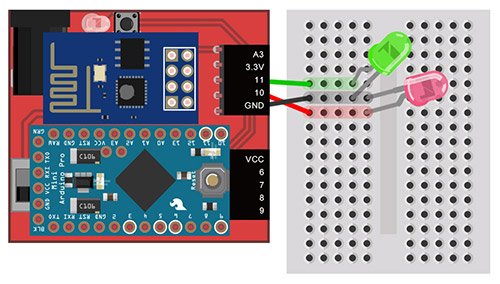
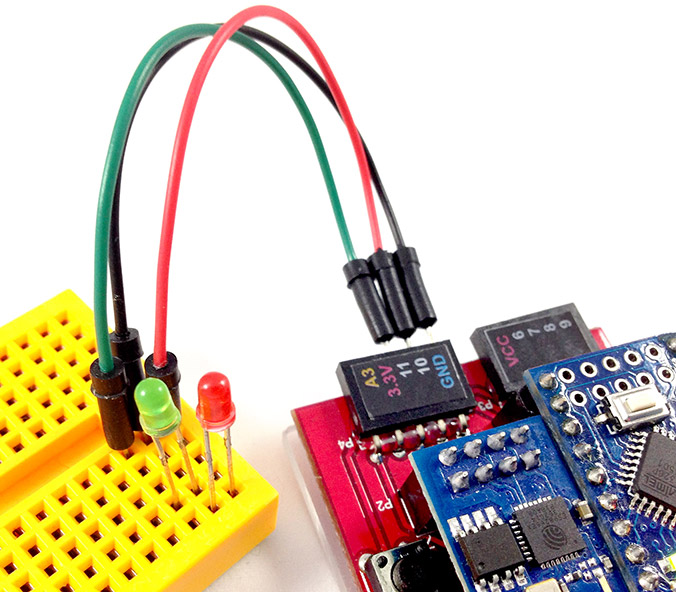

<!-- @@master  = ../../_layout.html-->

<!-- @@block  =  meta-->

<title>範例教學 2：兩顆 LED 交互閃爍 :::: Webduino = Web × Arduino</title>

<meta property="og:description" content="熟悉了第一個範例之後，接下來就要做點延伸的應用，在這個範例裡頭，將會利用按鈕的方式，同時操控兩顆 LED 燈，做出兩顆 LED 燈交互閃動的效果。">

<!-- @@close-->

<!-- @@block  =  tutorials-->
#範例教學 2：兩顆 LED 交互閃爍

熟悉了 [第一個範例](tutorial-01-led.html) 之後，接下來就要做點延伸的應用，在這個範例裡頭，將會利用按鈕的方式，同時操控兩顆 LED 燈，做出兩顆 LED 燈交互閃動的效果。

##範例影片展示

<iframe class="youtube" src="https://www.youtube.com/embed/DywZXJP20yk" frameborder="0" allowfullscreen></iframe>

##接線與實作

- ###1. 接上 LED

	因為我們這次有使用到兩顆 LED 燈，所以必須要使用麵包板來進行，將黃色 LED 燈長腳接在 11，紅色 LED 燈長腳接在 10，兩顆 LED 燈共用一個 GND ( 地線 )。

	

- ###2. 完成後的實際長相

	

	

##範例解析 ([快速體驗](http://webduinoio.github.io/samples/content/led-two/index.html)、[jsbin 範例](http://jsbin.com/raniwi/11/edit?html,js,output)、[檢查連線狀態](http://webduino.io/device.html))

跟第一個範例一樣，一開始先引入相關的 js 以及 WebComponents。

	
	<link rel='import' href='//webduino.io/components/webduino/web-arduino.html' />
	<link rel='import' href='//webduino.io/components/webduino/wa-led.html' />

接著我們只要用第一個範例來修改，多一顆 LED 燈接在 11 的腳位即可。

	

	  </img>
	  </img>
	

	<web-arduino id="board" device='你的 device 名稱'>
	   <wa-led id='led1' pin='10'></wa-led>
	   <wa-led id='led2' pin='11'></wa-led>
	</web-arduino>

CSS 跟範例 1 比起來幾乎是沒已有變化，主要也只是負責圖片的切換而已。

	#light{
	  width:80%;
	}
	img{
	  width:100%;
	  display:none;
	}
	.off img:first-child{
	  display:inline-block;
	}
	.on img:last-child{
	  display:inline-block;
	}

關鍵仍舊是 javascript 的部分，這裏我們將範例 1 的程式進行改良，加入了兩個時間的元素，分別是 `setInterval` 以及 `setTimeout`，當我們點選燈泡圖片的時候，就利用這時間的切換讓 LED 燈交互閃爍，當再度點選圖片時，就讓計時器歸零 ( 清空計時器 `clearTimeout` )，同時將 LED 利用 `led.off()` 的 api 關起來。

	window.addEventListener('WebComponentsReady', function () {
	  var board = document.getElementById('board'),
	      light = document.getElementById('light');

	  board.on('ready',function ready() {
	    var led1 = document.getElementById('led1'),
	        led2 = document.getElementById('led2'),
	        timer1,timer2;
	    light.addEventListener('click', function() {
	      if(light.className == 'on'){
	        clearTimeout(timer1);
	        clearTimeout(timer2);
	        led1.off();   // 紅燈關起來
	        led2.off();   // 黃燈關起來
	        light.className = 'off';
	      }else{
	        timer1 = setInterval(function(){
	          led1.on();       // 紅燈打開
	          led2.off();       // 黃燈關起來
	          timer2 = setTimeout(function(){
	            led1.off();       // 紅燈關起來
	            led2.on();       // 黃燈打開
	          },300);     // 延遲 0.3 秒發生

	        },600);    //每 0.6 秒一次
	        light.className = 'on';
	      }
	    }, false);
	  });

	}, false);

如果還有不清楚的，不妨利用這個 [快速體驗範例](http://webduinoio.github.io/samples/content/led-two/index.html)，填入自己 Webduino 開發板的 device 名稱，按下設定，訊息處出現 ready 的話，就可以點選圖片讓不同的 LED 亮起，亦或是也可以參考這個 [jsbin 範例](http://jsbin.com/raniwi/11/edit?html,js,output)，實際在上面填入 device 名稱並且修改體驗相關效果。

<!-- @@close-->