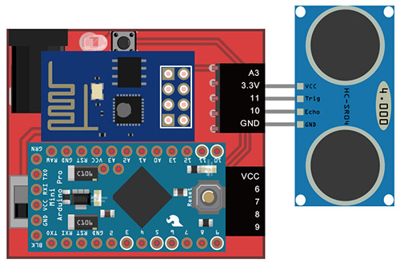
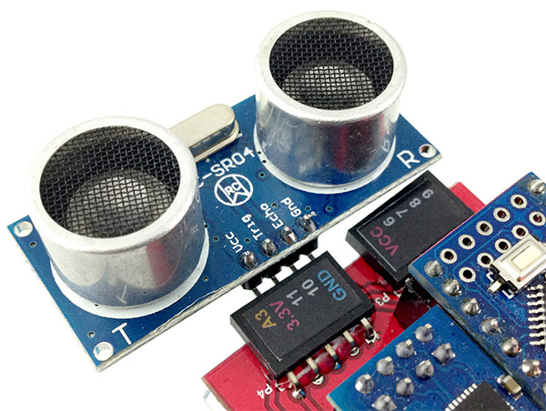

<!-- @@master  = ../../_layout.html-->

<!-- @@block  =  meta-->

<title>範例教學 5：控制超音波傳感器 :::: Webduino = Web + Arduino</title>

<meta property="og:description" content="超音波傳感器顧名思義就是會發送超音波，藉由超音波碰撞到物體之後反射回來的時間差，就可以計算超音波傳感器與相對應物體之間的距離，在這個範例裡頭使用的超音波傳感器 HC-SR04 上頭有兩個類似喇叭的裝置，其中一個是 Trig，負責發送超音波，另外一個是 Echo，負責接收反射回來的超音波，最後會得到一個單位為「公分」的數值，就是超音波傳感器與待測物體之間的距離。">

<!-- @@close-->

<!-- @@block  =  tutorials-->
#範例教學 5：控制超音波傳感器

超音波傳感器顧名思義就是會發送超音波，藉由超音波碰撞到物體之後反射回來的時間差，就可以計算超音波傳感器與相對應物體之間的距離，在這個範例裡頭使用的超音波傳感器 HC-SR04 上頭有兩個類似喇叭的裝置，其中一個是 Trig，負責發送超音波，另外一個是 Echo，負責接收反射回來的超音波，最後會得到一個單位為「公分」的數值，就是超音波傳感器與待測物體之間的距離，不過因為超音波有指向性，如果今天受測的物體是傾斜的，超音波可能就會被反彈到別的地方，或是今天待測物會吸收聲波，可能測出來的距離就會有不準確的情形發生。

##範例影片展示

<iframe class="youtube" src="https://www.youtube.com/embed/8BTArcDVYJ8" frameborder="0" allowfullscreen></iframe>

##接線與實作

- ###1. 接上超音波傳感器

	這裏我們要把超音波傳感器的 VCC 接在 3.3v，Trig 接在 11，Echo 接在 10，GND 就接在 GND 的腳位，你可以用麵包板接出來，也可以直接就把超音波傳感器跟 Webduino 開發板組合即可。

	

- ###2. 完成後的實際長相

	

##範例解析 ([快速體驗](http://webduinoio.github.io/samples/content/ultrasonic/index.html)、[jsbin 範例](http://jsbin.com/cagora/4/edit?html,css,js,output)、[檢查連線狀態](http://webduino.io/device.html))

一開始要先引入相關的 js 與 WebComponents，特別是超音波傳感器的 WebComponent：`wa-ultrasonic.html`。

	
	<link rel='import' href='//webduino.io/components/webduino/web-arduino.html' />
	<link rel='import' href='//webduino.io/components/webduino/wa-ultrasonic.html' />

接著在畫面上放上一個名為 show 的區域，目的只是在顯示數值，然後再放入 `web-arduino`，裡頭擺上超音波傳感器 `wa-ultrasonic`。

	

	<web-arduino id='board' device="你的 device 名稱">
	  <wa-ultrasonic id='ultrasonic' trig='11' echo='10'></wa-ultrasonic>
	</web-arduino>

因為我們之後是要直接取代 show 內容，所以這裡用了一個 CSS 偽元素的小技巧來塞入一些文字，同時利用 CSS 來讓字體大一點。
		
	#show {
	  font-size: 30px;
	  }
	#show::before {
	  content: '距離: ';
	  }
	#show::after {
	  content: ' cm';
	  }

javascript 的部分利用 ping 的 api，可以回傳一個單位是公分的數值，代表由超音波傳感器到待測物體之間的距離，然後我們就把這個數值寫入 show 裡頭，這個 api 跟 `setTimeout` 有點像，後方會接一個以毫秒為單位的數字，以下面的範例而言，1000 就代表 1 秒的意思。

	window.addEventListener('WebComponentsReady', function () {
	  var board = document.getElementById('board');

	  board.on('ready',function() {
	    var ultrasonic = document.getElementById('ultrasonic'),
	      show = document.getElementById('show');

	    ultrasonic.ping(function(cm) {
	      show.innerHTML = cm;
	    }, 1000);
	  });

	}, false);

如果還有不清楚的，不妨利用這個 [快速體驗範例](http://webduinoio.github.io/samples/content/ultrasonic/index.html)，填入自己 Webduino 開發板的 device 名稱，按下設定，訊息處出現 ready 的話，就可以用超音波傳感器到處測測看距離，亦或是也可以參考這個 [jsbin 範例](http://jsbin.com/cagora/4/edit?html,css,js,output)，實際在上面填入 device 名稱並且修改體驗相關效果。

<!-- @@close-->