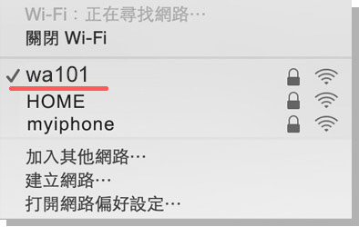
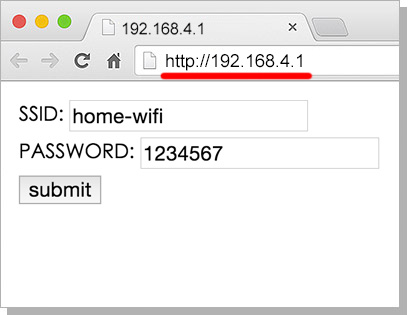
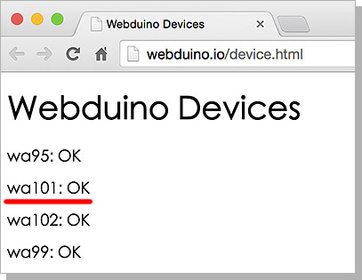

<!-- @@master  = ../../_layout.html-->

<!-- @@block  =  meta-->

<title>Webduino 的基本介紹與初始化設定 :::: Webduino = Web × Arduino</title>

<meta property="og:description" content="Webduino 這個名稱的由來，就是 Web 與 Arduino 這兩個單字的結合，也正式宣告了可以用 Web 控制 Arduino 的時代來臨，雖然目前市面上也有一些類似的技術或解決方案，但千篇一律的都是寫 C/C++ 讓 Arduino 可以連上網，或是透過網路的方式將 C/C++ 寫入 Arduino，幾乎沒有能夠純粹利用 Web 技術去控制 Arduino 的方式。">

<!-- @@close-->

<!-- @@block  =  tutorials-->
#Webduino 的基本介紹與初始化設定

Webduino 這個名稱的由來，就是 Web 與 Arduino 這兩個單字的結合，也正式宣告了可以用 Web 控制 Arduino 的時代來臨，雖然目前市面上也有一些類似的技術或解決方案，但千篇一律的都是寫 C/C++ 讓 Arduino 可以連上網，或是透過網路的方式將 C/C++ 寫入 Arduino，幾乎沒有能夠純粹利用 Web 技術去控制 Arduino 的方式。

 

Webduino 有別於傳統要寫 C 或 C++ 才能控制 Arduino 的傳感器，Webduino 利用了 WebComponents 的方法，讓使用者可以在完全不用接觸 C 或 C++ 的情形下，只需要撰寫簡單的網頁程式 ( HTML 與 Javascript )，就可以串接 Arduino，大幅降低開發的門檻，讓創造力不受技術門檻的拘束，利用各式各樣形形色色的傳感器，創造與眾不同的物聯網應用。

##Webduino 與 Arduino 的差異

<table>
<tr>
<th></th>
<th>Arduino</th>
<th>Webduino</th>
</tr>
<tr>
<th>開發語言</th>
<td>C / C++</td>
<td>HTML / JavaScript</td>
</tr>
<tr>
<th>開發環境</th>
<td>Arduino IDE</td>
<td>瀏覽器 / ...</td>
</tr>
<tr>
<th>連接方式</th>
<td>USB</td>
<td>WiFi</td>
</tr>
<tr>
<th>更新程式</th>
<td>連接燒錄</td>
<td>立即更新</td>
</tr>
</table>

##Webduino 初始化設定

- ###1. 組合 Webduino 開發板

	將「Arduino Pro Mini 晶片」與「ESP8266 Wifi 晶片」組合至底板，就成為「Webduino 開發板」。

	

- ###2. 讓 Webduino 開發板連線網路基地台

	接著要讓 Webduino 開發板可以自行連上家裡、公司場所或行動裝置分享的網路基地台，並自動連結上雲端的伺服器，如此一來我們就能透過 wifi 去控制 Webduino 開發板。

	

- ###3. 接上 LED 開始進行初始化

	首先把單色 LED 燈的「長腳接在 3.3V」，「短腳接在 11」，完成後接上電源，**當 LED 亮起，表示可以開始進行初始化**，若 LED 遲遲沒有亮起，移除電源與 LED，重新進行此步驟，若使用電阻代替 LED，則可直接進行步驟 4。

	

- ###4. 使用 wifi 搜尋 Webduino 開發板

	使用電腦或行動裝置，打開 wifi 搜尋對應的 Webduino 開發板 SSID 名稱，點選之後輸入密碼，即可讓電腦或行動裝置與 Webduino 開發板連線。( 範例名稱為 wa101 )

	

- ###5. 連線 Webduino 開發板進行設定

	打開 Chrome 或 Safari 瀏覽器，於網址列輸入「<b>http://192.168.4.1</b>」，即可打開 Webduino 開發板的設定頁面，在設定頁面輸入家裡、公司場所或行動裝置分享的網路基地台 SSID 與 PASSWORD。( **此處的 SSID 為網路基地台的 SSID，並非 Webduino 開發板，且 SSID 與 PASSWORD 有限制 14 個字元，只能大小寫的英文字母與數字的組合**，要特別注意！ )

	

- ###6. 重啟 Webduino 開發板

	輸入完 SSID 與 PASSWORD 之後，點選送出，若出現「OK」的字樣，表示 Webduino 開發板已經初始化成功，並且可以和家裡、公司場所或行動裝置分享的網路基地台連線，此時**移除 Webduino 開發板的電源以及 LED**，重新再接上電源即可進行重啟。( 若遲遲沒有出現「OK」字樣，表示初始化設定不成功，返回步驟 3 重新開始 )

	

- ###7. 確認連線是否成功

	Webduino 開發板重啟後，可以連結 [http://webduino.io/device.html](http://webduino.io/device.html) 確認是否連線成功，**連線成功後即可開始玩轉 Webduino**。( 若在網頁上沒有對應 Webduino 開發板，則需重啟 Webduino 開發板或返回步驟 3 重新初始化設定 )

	

<!-- @@close-->